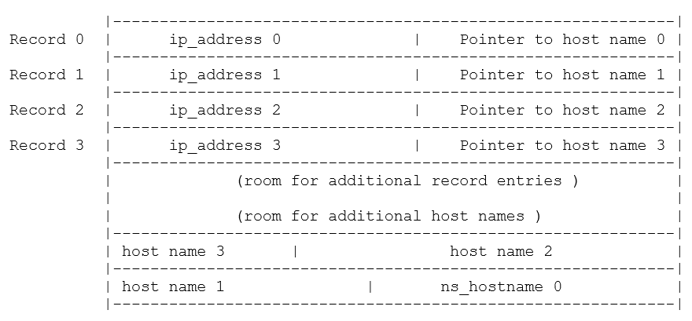
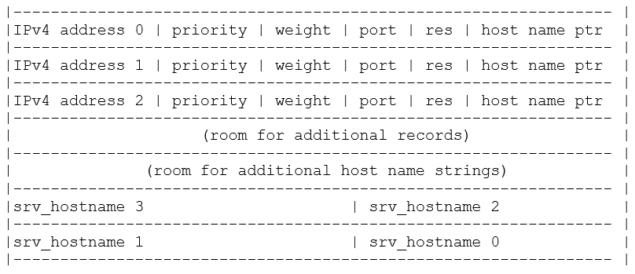
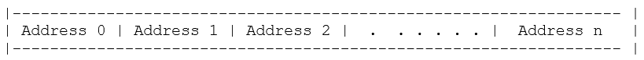
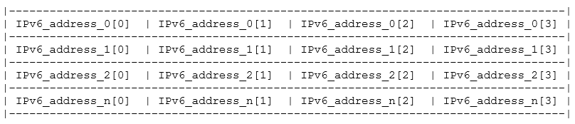

This chapter contains a description of all NetX Duo DNS services (listed below) in alphabetic order.

In the **Return Values** section in the following API descriptions, values in **BOLD** are not affected by the **NX_DISABLE_ERROR_CHECKING** define that is used to disable API error checking, while non-bold values are completely disabled.

## nx_dns_authority_zone_start_get

Look up the start of the zone of authority for the input host

### Prototype
```C
UINT nx_dns_authority_zone_start_get (
    NX_DNS *dns_ptr, UCHAR *host_name, 
    VOID *record_buffer,                                        
    UINT buffer_size, 
    UINT *record_count, 
    ULONG wait_option);
```
### Description

If **NX_DNS_ENABLE_EXTENDED_RR_TYPES** is defined, this service sends a query of type SOA with the specified domain name to obtain the start of the zone of authority for the input domain name. The DNS Client copies the SOA record(s) returned in the DNS Server response into the *record_buffer* memory location.

> **Note:** The *record_buffer* must be 4-byte aligned to receive the data.

In NetX Duo DNS Client, the SOA record type, NX_DNS_SOA_ENTRY, is saved as seven 4 byte parameters, totaling 28 bytes:

- *nx_dns_soa_host_mname_ptr*: Pointer to primary source of data for this zone.
- *nx_dns_soa_host_rname_ptr*: Pointer to mailbox responsible for this zone
- *nx_dns_soa_serial*: Zone version number
- *nx_dns_soa_refresh*: Refresh interval
- *nx_dns_soa_retry*: Interval between SOA query retries
- *nx_dns_soa_expire*: Time duration when SOA expires
- *nx_dns_soa_minmum*: Minimum TTL field in SOA hostname DNS reply messages

The storage of a two SOA records is shown below. The SOA records containing fixed length data are entered starting at the top of the buffer. The pointers MNAME and RNAME point to the variable length data (host names) which are stored at the bottom of the buffer. Additional SOA records are entered after the first record ("additional SOA records…") and their variable length data is stored above the last entry's variable length data ("additional SOA variable length data"):


If the input *record_buffer* cannot hold all the SOA data in the server reply, the the *record_buffer* holds as many records as will fit and returns the number of records in the buffer.

With the number of SOA records returned in **record_count,* the application can parse the data from *record_buffer* and extract the start of zone authority host name strings.

### Input Parameters

- *dns_ptr*: Pointer to DNS Client.  
- *host_name*: Pointer to host name to obtain SOA data for
- *record_buffer*: Pointer to location to extract SOA data into
- *buffer_size*: Size of buffer to hold SOA data
- *record_count*: Pointer to the number of SOA records retrieved
- *wait_option*: Wait option to receive DNS Server response

### Return Values

- **NX_SUCCESS** (0x00) Successfully obtained SOA data
- **NX_DNS_NO_SERVER** (0xA1) Client server list is empty
- **NX_DNS_QUERY_FAILED** (0xA3) No valid DNS response received
- NX_PTR_ERROR (0x07) Invalid IP or DNS pointer
- NX_CALLER_ERROR (0x11) Invalid caller of this service
- NX_DNS_PARAM_ERROR (0xA8) Invalid non pointer input

### Allowed From

Threads

### Example
```C
UCHAR  record_buffer[50];
UINT   record_count;   
NX_DNS_SOA_ENTRY *nx_dns_soa_entry_ptr;

/* Request the start of authority zone(s) for the specified host. */
status =  nx_dns_authority_zone_start_get(&client_dns, (UCHAR *)"www.my_example.com",  
										  record _buffer, sizeof(record_buffer), 
										  &record_count, 500);

/* Check for DNS query error. */
if (status != NX_SUCCESS)
{
         error_counter++;
}
else 
{
	/* If status is NX_SUCCESS a DNS query was successfully completed and SOA data 
	   is returned in soa_buffer. */

	/* Set a local pointer to the SOA buffer. */
	nx_dns_soa_entry_ptr = (NX_DNS_SOA_ENTRY *) record_buffer;

	printf("------------------------------------------------------\n");
	printf("Test SOA: \n");
	printf("serial = %d\n", nx_dns_soa_entry_ptr -> nx_dns_soa_serial );
	printf("refresh = %d\n", nx_dns_soa_entry_ptr -> nx_dns_soa_refresh );
	printf("retry = %d\n", nx_dns_soa_entry_ptr -> nx_dns_soa_retry );
	printf("expire = %d\n", nx_dns_soa_entry_ptr -> nx_dns_soa_expire );
	printf("minmum = %d\n", nx_dns_soa_entry_ptr -> nx_dns_soa_minmum );

	if(nx_dns_soa_entry_ptr -> nx_dns_soa_host_mname_ptr)
	{
		printf("host mname = %s\n", 
			   nx_dns_soa_entry_ptr -> nx_dns_soa_host_mname_ptr);
	}
	else
	{
		printf("host mame is not set\n");
	}

	if(nx_dns_soa_entry_ptr -> nx_dns_soa_host_rname_ptr)
	{
		printf("host rname = %s\n", 
			   nx_dns_soa_entry_ptr -> nx_dns_soa_host_rname_ptr);
	}
	else
	{
	 
		printf("host rname is not set\n");
	}
}

[Output]
----------------------------------------------------
Test SOA: 
serial = 2012111212
refresh = 7200
retry = 1800
expire = 1209600
minmum = 300
host mname = ns1.www.my_example.com
host rname = dns-admin.www.my_example.com
```

## nx_dns_cache_initialize

Initialize the DNS Cache

### Prototype
```C
UINT nx_dns_cache_initialize(
    NX_DNS *dns_ptr,
    VOID *cache_ptr,
    UINT cache_size);
```

### Description

This service creates and initializes a DNS Cache.

### Input Parameters

- *dns_ptr*: Pointer to DNS control block.
- *cache_ptr*: Pointer to DNS Cache.
- *cache_size*: Size of DNS Cache, in bytes.

### Return Values

- **NX_SUCCESS** (0x00) DNS Cache successfully initialized
- NX_DNS_PARAM_ERROR (0xA8) Invalid non pointer input
- NX_DNS_CACHE_ERROR (0xB7) Invalid Cache pointer.
- NX_PTR_ERROR (0x07) Invalid DNS pointer.
- NX_DNS_ERROR (0xA0) Cache is not 4-byte aligned.

### Allowed From

Threads

### Example
```C
/* Initialize the DNS Cache.  */
status =  nx_dns_cache_initialize(&my_dns, &dns_cache, 2048);

/* If status is NX_SUCCESS DNS Cache was successfully initialized.  */
```

## nx_dns_cache_notify_clear

Clear the DNS Cache full notify function

### Prototype
```C
UINT nx_dns_cache_notify_clear(NX_DNS *dns_ptr);
```

### Description

This service clears the cache full notify function.

### Input Parameters

- *dns_ptr*: Pointer to DNS control block.

### Return Values

- **NX_SUCCESS** (0x00) DNS cache notify successfully set
- NX_DNS_PARAM_ERROR (0xA8) Invalid non-pointer input
- NX_PTR_ERROR (0x07) Invalid DNS pointer.

### Allowed From

Threads

### Example
```C
/* Clear the DNS Cache full notify function. */
status =  nx_dns_cache_notify_clear(&my_dns);

/* If status is NX_SUCCESS DNS Cache full notify function was successfully cleared. */
```

## nx_dns_cache_notify_set

Set the DNS Cache full notify function

### Prototype
```C
UINT nx_dns_cache_notify_set(
    NX_DNS *dns_ptr,
    VOID (*cache_full_notify_cb)(NX_DNS *dns_ptr));
```

### Description

This service sets the cache full notify function.

### Input Parameters

- *dns_ptr*: Pointer to DNS control block.
- *cache_full_notify_cb*: The callback function to be invoked when cache become full.

### Return Values

- **NX_SUCCESS** (0x00) DNS cache notify successfully set
- NX_DNS_PARAM_ERROR (0xA8) Invalid non-pointer input
- NX_PTR_ERROR (0x07) Invalid DNS pointer.

### Allowed From

Threads

### Example
```C
/* Set the DNS Cache full notify function. */
status =  nx_dns_cache_notify_set(&my_dns, cache_full_notify_cb);

/* If status is NX_SUCCESS DNS Cache full notify function was successfully set. */
```

## nx_dns_cname_get

Look up the canonical name for the input hostname

### Prototype
```C
UINT nx_dns_cname_get(
    NX_DNS *dns_ptr,
    UCHAR *host_name, 
    UCHAR *record_buffer,
    UINT buffer_size, 
    ULONG wait_option);
```

### Description

If **NX_DNS_ENABLE_EXTENDED_RR_TYPES** is defined in *nxd_dns.h*, this service sends a query of type CNAME with the specified domain name to obtain the canonical domain name. The DNS Client copies the CNAME string returned in the DNS Server response into the *record_buffer* memory location.

### Input Parameters

- *dns_ptr*: Pointer to DNS Client.  
- *host_name*: Pointer to host name to obtain CNAME data for
- *record_buffer*: Pointer to location to extract CNAME data into
- *buffer_size*: Size of buffer to hold CNAME data
- *wait_option*: Wait option to receive DNS Server response

### Return Values

- **NX_SUCCESS** (0x00) Successfully obtained CNAME data
- **NX_DNS_NO_SERVER** (0xA1) Client server list is empty
- **NX_DNS_QUERY_FAILED** (0xA3) No valid DNS response received
- NX_PTR_ERROR (0x07) Invalid IP or DNS pointer
- NX_CALLER_ERROR (0x11) Invalid caller of this service
- NX_DNS_PARAM_ERROR (0xA8) Invalid non-pointer input

### Allowed From

Threads

### Example
```C
CHAR            record _buffer[50];

/* Request the canonical name for the specified host. */
status =  nx_dns_cname_get(&client_dns, (UCHAR *)"www.my_example.com ", 
                                   record_buffer, sizeof(record_buffer), 500);

/* Check for DNS query error. */
if (status != NX_SUCCESS)
{
    error_counter++;
}
else     
{
/* If status is NX_SUCCESS a DNS query was successfully completed and 
   the canonical host name is returned in record_buffer. */

    printf("------------------------------------------------------\n");
    printf("Test CNAME: %s\n", record_buffer);
} 

[Output]
----------------------------------------------------
Test CNAME: my_example.com
```

##  nx_dns_create

Create a DNS Client instance

### Prototype
```C
UINT nx_dns_create(
    NX_DNS *dns_ptr,
    NX_IP *ip_ptr,
    CHAR *domain_name);
```
### Description

This service creates a DNS Client instance for the previously created IP instance.

> **Important:** The application must ensure that the packet payload of the packet pool used by the DNS Client is large enough for the maximum 512 byte DNS message, plus UDP, IP and Ethernet headers. If the DNS Client creates its own packet pool, this is defined by **NX_DNS_PACKET_PAYLOAD** and **NX_DNS_PACKET_POOL_SIZE**.

If the DNS Client application prefers to supply a previously created packet pool, the payload for IPv4 DNS Client should be 512 bytes for the maximum DNS plus 20 bytes for the IP header, 8 bytes for the UDP header and 14 bytes for the Ethernet header. For IPv6 the only difference is the IP header is 40 bytes, therefore the packet needs to accommodate the IPv6 header of 40 bytes.

### Input Parameters

- *dns_ptr*: Pointer to DNS Client.  
- *ip_ptr*: Pointer to previously created IP instance.  
- *domain_name*: Pointer to domain name for DNS instance.

### Return Values

- **NX_SUCCESS** (0x00) Successful DNS create
- **NX_DNS_ERROR** (0xA0) DNS create error
- NX_PTR_ERROR (0x07) Invalid IP or DNS pointer
- NX_CALLER_ERROR (0x11) Invalid caller of this service

### Allowed From

Threads

### Example
```C
/* Create a DNS Client instance. */
status =  nx_dns_create(&my_dns, &my_ip, "My DNS");

/* If status is NX_SUCCESS a DNS Client instance was successfully
   created. */
```

## nx_dns_delete

Delete a DNS Client instance

### Prototype
```C
UINT nx_dns_delete(NX_DNS *dns_ptr);
```
### Description

This service deletes a previously created DNS Client instance and frees up its resources.

> **Note:** If NX_DNS_CLIENT_USER_CREATE_PACKET_POOL is defined and the DNS Client was assigned a user defined packet pool, it is up to the application to delete the DNS Client packet pool if it no longer needs it.

### Input Parameters

- *dns_ptr*: Pointer to previously created DNS Client instance.

### Return Values

- **NX_SUCCESS** (0x00) Successful DNS Client delete.
- NX_PTR_ERROR (0x07) Invalid IP or DNS Client pointer.
- NX_CALLER_ERROR (0x11) Invalid caller of this service.

### Allowed From

Threads

### Example
```C
/* Delete a DNS Client instance. */
status =  nx_dns_delete(&my_dns);

/* If status is NX_SUCCESS the DNS Client instance was successfully
   deleted. */
```

## nx_dns_domain_name_server_get

Look up the authoritative name servers for the input domain zone

### Prototype
```C
UINT nx_dns_domain_name_server_get(
    NX_DNS *dns_ptr,
    UCHAR *host_name, 
    VOID *record_buffer,
    UINT buffer_size, 
    UINT *record_count,
    ULONG wait_option);
```

### Description

If NX_DNS_ENABLE_EXTENDED_RR_TYPES is defined, this service sends a query of type NS with the specified domain name to obtain the name servers for the input domain name. The DNS Client copies the NS record(s) returned in the DNS Server response into the *record_buffer* memory location.

> **Note:** The *record_buffer* must be 4-byte aligned to receive the data.

In NetX Duo DNS Client the NS data type, NX_DNS_NS_ENTRY, is saved as two 4-byte parameters:

- *nx_dns_ns_ipv4_address*: Name server's IPv4 address
- *nx_dns_ns_hostname_ptr*: Pointer to the name server's hostname

The buffer shown below contains four NX_DNS_NS_ENTRY records. The pointer to host name string in each entry points to the corresponding host name string in the bottom half of the buffer:



If the input *record_buffer* cannot hold all the NS data in the server reply, the the *record_buffer* holds as many records as will fit and returns the number of records in the buffer.

With the number of NS records returned in **record_count,* the application can parse the IP address and host name of each record in the *record_buffer*.

### Input Parameters

- *dns_ptr*: Pointer to DNS Client.  
- *host_name*: Pointer to host name to obtain NS data for
- *record_buffer*: Pointer to location to extract NS data into
- *buffer_size*: Size of buffer to hold NS data
- *record_count*: Pointer to the number of NS records retrieved
- *wait_option*: Wait option to receive DNS Server response

### Return Values

- **NX_SUCCESS** (0x00) Successfully obtained NS data
- **NX_DNS_NO_SERVER** (0xA1) Client server list is empty
- **NX_DNS_QUERY_FAILED** (0xA3) No valid DNS response received
- NX_DNS_PARAM_ERROR (0xA8) Invalid non-pointer input
- NX_PTR_ERROR (0x07) Invalid IP or DNS pointer
- NX_CALLER_ERROR (0x11) Invalid caller of this service

### Allowed From

Threads

### Example
```C
#define RECORD_COUNT    10

ULONG  record_buffer[50];
UINT   record_count;          
NX_DNS_NS_ENTRY  *nx_dns_ns_entry_ptr[RECORD_COUNT];

/* Request the name server(s) for the specified host. */
status =  nx_dns_domain_name_server_get(&client_dns, (UCHAR *)" www.my_example.com ",  
									    record_buffer, sizeof(record_buffer),  
									    &record_count, 500);

/* Check for DNS query error. */
if (status != NX_SUCCESS)
{
    error_counter++;
}

else     
{
/* If status is NX_SUCCESS a DNS query was successfully completed and NS data
   is returned in record_buffer. */

    printf("------------------------------------------------------\n");
    printf("Test NS: ");
    printf("record_count = %d \n", record_count);      

    /* Get the name server. */
    for(i =0; i< record_count; i++)
    {
        nx_dns_ns_entry_ptr[i] = (NX_DNS_NS_ENTRY *)
							   (record_buffer + i * sizeof(NX_DNS_NS_ENTRY)); 

        printf("record %d: IP address: %d.%d.%d.%d\n", i, 
                      nx_dns_ns_entry_ptr[i] -> nx_dns_ns_ipv4_address  >> 24,
                      nx_dns_ns_entry_ptr[i] -> nx_dns_ns_ipv4_address >> 16 & 0xFF,                   
                      nx_dns_ns_entry_ptr[i] -> nx_dns_ns_ipv4_address >> 8 & 0xFF,
                     nx_dns_ns_entry_ptr[i] -> nx_dns_ns_ipv4_address & 0xFF);
        if(nx_dns_ns_entry_ptr[i] -> nx_dns_ns_hostname_ptr)
        {
            printf("hostname = %s\n", 
                    nx_dns_ns_entry_ptr[i] -> nx_dns_ns_hostname_ptr);
                }
        else
            printf("hostname is not set\n");
    }
}

[Output]
------------------------------------------------------
Test NS: record_count = 4 
record 0: IP address: 192.2.2.10
hostname = ns2.www.my_example.com
record 1: IP address: 192.2.2.11
hostname = ns1.www.my_example.com
record 2: IP address: 192.2.2.12
hostname = ns3.www.my_example.com
record 3: IP address: 192.2.2.13
hostname = ns4.www.my_example.com
```

## nx_dns_domain_mail_exchange_get

Look up the mail exchange(s) for the input host name

### Prototype
```C
UINT nx_dns_domain_mail_exchange_get(
    NX_DNS *dns_ptr,
    UCHAR *host_name, 
    VOID *record_buffer,                                        
    UINT buffer_size, 
    UINT *record_count, 
    ULONG wait_option);
```

### Description

If **NX_DNS_ENABLE_EXTENDED_RR_TYPES** is defined, this service sends a query of type MX with the specified domain name to obtain the mail exchange for the input domain name. The DNS Client copies the MX record(s) returned in the DNS Server response into the *record_buffer* memory location. 

> **Note:** The *record_buffer* must be 4-byte aligned to receive the data.

In NetX Duo DNS Client, the mail exchange record type, NX_DNS_MAIL_EXCHANGE_ENTRY, is saved as four parameters, totaling 12 bytes:

- *nx_dns_mx_ipv4_address*: Mail exchange IPv4 address 4 bytes
- *nx_dns_mx_preference*: Preference 2 bytes
- *nx_dns_mx_reserved0*: Reserved 2 bytes
- *nx_dns_mx_hostname_ptr*: Pointer to mail exchange server host name 4 bytes

A buffer containing four MX records is shown below. Each record contains the fixed length data from the list above. The pointer to the mail exchange server host name points to the corresponding host name at the bottom of the buffer.


If the input *record_buffer* cannot hold all the MX data in the server reply, the the *record_buffer* holds as many records as will fit and returns the number of records in the buffer.

With the number of MX records returned in **record_count,* the application can parse the MX parameters, including the mail host name of each record in the *record_buffer*.

### Input Parameters

- *dns_ptr*: Pointer to DNS Client.  
- *host_name*: Pointer to host name to obtain MX data for
- *record_buffer*: Pointer to location to extract MX data into
- *buffer_size*: Size of buffer to hold MX data
- *record_count*: Pointer to the number of MX records retrieved
- *wait_option*: Wait option to receive DNS Server response

### Return Values

- **NX_SUCCESS** (0x00) Successfully obtained MX data
- **NX_DNS_NO_SERVER** (0xA1) Client server list is empty
- **NX_DNS_QUERY_FAILED** (0xA3) No valid DNS response received
- NX_DNS_PARAM_ERROR (0xA8) Invalid non-pointer input
- NX_PTR_ERROR (0x07) Invalid IP or DNS pointer
- NX_CALLER_ERROR (0x11) Invalid caller of this service

### Allowed From

Threads

### Example
```C
#define MAX_RECORD_COUNT 10

ULONG  record_buffer[50];
UINT   record_count;  
NX_DNS_MX_ENTRY  *nx_dns_mx_entry_ptr[MAX_RECORD_COUNT];        

/* Request the mail exchange data for the specified host. */
status =  nx_dns_domain_mail_exchange_get(&client_dns, (UCHAR *)" www.my_example.com ", 
 										  record_buffer, sizeof(record_buffer),   
										  &record_count, 500);

/* Check for DNS query error. */
if (status != NX_SUCCESS)
{
    error_counter++;
}
       
else     
{
/* If status is NX_SUCCESS a DNS query was successfully completed and MX
   data is returned in record_buffer. */

    printf("------------------------------------------------------\n");
    printf("Test MX: ");
    printf("record_count = %d \n", record_count);      


    /* Get the mail exchange. */
    for(i =0; i< record_count; i++)
    {
        nx_dns_mx_entry_ptr[i] = (NX_DNS_MX_ENTRY *)
			   (record_buffer + i * sizeof(NX_DNS_MX_ENTRY));   

        printf("record %d: IP address: %d.%d.%d.%d\n", i, 
        	nx_dns_mx_entry_ptr[i] -> nx_dns_mx_ipv4_address >> 24,
			nx_dns_mx_entry_ptr[i] -> nx_dns_mx_ipv4_address >> 16 & 0xFF,                   
        	nx_dns_mx_entry_ptr[i] -> nx_dns_mx_ipv4_address >> 8 & 0xFF,
			nx_dns_mx_entry_ptr[i] -> nx_dns_mx_ipv4_address & 0xFF);

        printf("preference = %d \n ", 
			nx_dns_mx_entry_ptr[i] -> nx_dns_mx_preference);

		if(nx_dns_mx_entry_ptr[i] -> nx_dns_mx_hostname_ptr)
        	printf("hostname = %s\n", 
					nx_dns_mx_entry_ptr[i] -> nx_dns_mx_hostname_ptr);
		else
        	printf("hostname is not set\n");
}


[Output]

-----------------------------------------------------
Test MX: record_count = 5 
record 0: IP address: 192.2.2.10
preference = 40 
hostname = alt3.aspmx.l.www.my_example.com
record 1: IP address: 192.2.2.11
preference = 50 
hostname = alt4.aspmx.l.www.my_example.com
record 2: IP address: 192.2.2.12
preference = 10 
hostname = aspmx.l.www.my_example.com
record 3: IP address: 192.2.2.13
preference = 20 
hostname = alt1.aspmx.l.www.my_example.com
record 4: IP address: 192.2.2.14
preference = 30 
hostname = alt2.aspmx.l.www.my_example.com
```

## nx_dns_domain_service_get

Look up the service(s) provided by the input host name

### Prototype
```C
UINT nx_dns_domain_service_get (
    NX_DNS *dns_ptr,
    UCHAR *host_name, 
    VOID *record_buffer,
    UINT buffer_size, 
    UINT *record_count,
    ULONG wait_option);
```

### Description

If **NX_DNS_ENABLE_EXTENDED_RR_TYPES** is defined, this service sends a query of type SRV with the specified domain name to look up the service(s) and their port number associated with the specified domain. The DNS Client copies the SRV record(s) returned in the DNS Server response into the *record_buffer* memory location.

> **Note:** The *record_buffer* must be 4-byte aligned to receive the data.

In NetX Duo DNS Client, the service record type, **NX_DNS_SRV_ENTRY**, is saved as six parameters, totaling 16 bytes. This enables variable length SRV data to be stored in a memory efficient manner:

- *Server IPv4 address*: nx_dns_srv_ipv4_address 4 bytes
- *Server priority*: nx_dns_srv_priority 2 bytes
- *Server weight*: nx_dns_srv_weight 2 bytes
- *Service port number*: nx_dns_srv_port_number 2 bytes
- *Reserved for 4-byte alignment*: nx_dns_srv_reserved0 2 bytes
- *Pointer to server host name*: *nx_dns_srv_hostname_ptr 4 bytes

Four SRV records are stored in the supplied buffer. Each NX_DNS_SRV_ENTRY record contains a pointer, *nx_dns_srv_hostname_ptr*, that points to the corresponding host name string in the bottom of the record buffer:



If the input *record_buffer* cannot hold all the SRV data in the server reply, the the *record_buffer* holds as many records as will fit and returns the number of records in the buffer.

With the number of SRV records returned in **record_count,* the application can parse the SRV parameters, including the server host name of each record in the *record_buffer*.

### Input Parameters

- *dns_ptr*: Pointer to DNS Client.  
- *host_name*: Pointer to host name to obtain SRV data for
- *record_buffer*: Pointer to location to extract SRV data into
- *buffer_size*: Size of buffer to hold SRV data
- *record_count*: Pointer to the number of SRV records retrieved
- *wait_option*: Wait option to receive DNS Server response

### Return Values

- **NX_SUCCESS** (0x00) Successfully obtained SRV data
- **NX_DNS_NO_SERVER** (0xA1) Client server list is empty
- **NX_DNS_QUERY_FAILED** (0xA3) No valid DNS response received
- NX_DNS_PARAM_ERROR (0xA8) Invalid non pointer parameter.
- NX_PTR_ERROR (0x07) Invalid IP or DNS pointer
- NX_CALLER_ERROR (0x11) Invalid caller of this service

### Allowed From

Threads

### Example
```C
#define MAX_RECORD_COUNT  10

UCHAR  record_buffer[50];
UINT   record_count;          
NX_DNS_SRV_ENTRY *nx_dns_srv_entry_ptr[MAX_RECORD_COUNT];

/* Request the service(s) provided by the specified host. */
status =  nx_dns_domain_service_get(&client_dns, (UCHAR *)"www.my_example.com ", 
								    record_buffer, sizeof(record_buffer), 
								    &record_count, 500);

/* Check for DNS query error. */
if (status != NX_SUCCESS)
{
    error_counter++;
}

else     
{
	/* If status is NX_SUCCESS a DNS query was successfully completed and SRV data
	   is returned in record_buffer. */

		printf("------------------------------------------------------\n");
		printf("Test SRV: ");
		printf("record_count = %d \n", record_count);      

		   
		/* Get the location of services. */
		for(i =0; i< record_count; i++)
		{
			nx_dns_srv_entry_ptr[i] = (NX_DNS_SRV_ENTRY *)
									(record_buffer + i * sizeof(NX_DNS_SRV_ENTRY)); 

			printf("record %d: IP address: %d.%d.%d.%d\n", i, 
					nx_dns_srv_entry_ptr[i] -> nx_dns_srv_ipv4_address >> 24,
					nx_dns_srv_entry_ptr[i] -> nx_dns_srv_ipv4_address >> 16 & 0xFF,                   
					nx_dns_srv_entry_ptr[i] -> nx_dns_srv_ipv4_address >> 8 & 0xFF,
					nx_dns_srv_entry_ptr[i] -> nx_dns_srv_ipv4_address & 0xFF);

		   printf("port number = %d\n", 
				   nx_dns_srv_entry_ptr[i] -> nx_dns_srv_port_number );
		   printf("priority = %d\n", nx_dns_srv_entry_ptr[i] -> nx_dns_srv_priority );
		   printf("weight = %d\n", nx_dns_srv_entry_ptr[i] -> nx_dns_srv_weight );

		   if(nx_dns_srv_entry_ptr[i] -> nx_dns_srv_hostname_ptr)
		   {
				printf("hostname = %s\n", 
						nx_dns_srv_entry_ptr[i] -> nx_dns_srv_hostname_ptr);
			}
		   else
				printf("hostname is not set\n");
		}
}

[Output]
----------------------------------------------------
Test SRV: record_count = 3 
record 0: IP address: 192.2.2.10
port number = 5222
priority = 20
weight = 0
hostname = alt4.xmpp.l.www.my_example.com
record 1: IP address: 192.2.2.11
port number = 5222
priority = 5
weight = 0
hostname = xmpp.l.www.my_example.com
record 2: IP address: 192.2.2.12
port number = 5222
priority = 20
weight = 0
hostname = alt1.xmpp.l.www.my_example.com
```

## nx_dns_get_serverlist_size

Return the size of the DNS Client's Server list

### Prototype
```C
UINT nx_dns_get_serverlist_size (
    NX_DNS *dns_ptr,
    UINT *size);
```
### Description

This service returns the number of valid DNS Servers (both IPv4 and IPv6) in the Client list.

### Input Parameters

- *dns_ptr*: Pointer to DNS control block  
- *size*: Returns the number of servers in the list

### Return Values

- **NX_SUCCESS** (0x00) DNS Server list size successfully returned
- NX_PTR_ERROR (0x07) Invalid IP or DNS pointer.
- NX_CALLER_ERROR (0x11) Invalid caller of this service

### Allowed From

Threads

### Example
```C
UINT my_listsize;

/* Get the number of non null DNS Servers in the Client list. */
status =  nx_dns_get_serverlist_size (&my_dns, 5, &my_listsize);

/* If status is NX_SUCCESS the size of the DNS Server list was successfully
   returned. */
```

## nx_dns_info_by_name_get

Return ip address and port of DNS server by host name

### Prototype
```C
UINT nx_dns_info_by_name_get(
    NX_DNS *dns_ptr,
    UCHAR *host_name, 
    ULONG *host_address_ptr,  
    USHORT *host_port_ptr,
    ULONG wait_option);
```

### Description

This service returns the Server IP and port (service record) based on the input host name by DNS query. If a service record is not found, this routine returns a zero IP address in the input address pointer and a non-zero error status return to signal an error.

### Input Parameters

- *dns_ptr*: Pointer to DNS control block  
- *host_name*: Pointer to host name buffer
- *host_address_ptr*: Pointer to address to return
- *host_port_ptr*: Pointer to port to return
- *wait_option*: Wait option for the DNS response

### Return Values

- **NX_SUCCESS** (0x00) DNS Server record successfully returned
- **NX_DNS_NO_SERVER** (0xA1) No DNS Server registered with Client to send query on hostname
- **NX_DNS_QUERY_FAILED** (0xA3) DNS query failed; no response from any DNS servers in Client list or no service record is available for the input hostname.
- NX_PTR_ERROR (0x07) Invalid IP or DNS pointer
- NX_CALLER_ERROR (0x11) Invalid caller

### Allowed From

Threads

### Example
```C
ULONG ip_address
USHORT port;

/* Attempt to resolve the IP address and ports for this host name. */
status =  nx_dns_info_by_name_get(&my_dns, "www.abc1234.com", &ip_address, &port, 200);

/* If status is NX_SUCCESS the DNS query was successful and the IP address and
   report for the hostname are returned. */
```

## nx_dns_ipv4_address_by_name_get

Look up the IPv4 address for the input host name

### Prototype
```C
UINT nx_ dns_ipv4_address_by_name_get (
    NX_DNS *dns_ptr, 
    UCHAR *host_name_ptr,
    VOID *buffer, 
    UINT buffer_size, 
    UINT *record_count, 
    ULONG wait_option);
```

### Description

This service sends a query of Type A with the specified host name to obtain the IP addresses for the input host name. The DNS Client copies the IPv4 address from the A record(s) returned in the DNS Server response into the *record_buffer* memory location.

> **Note:** The *record_buffer* must be 4-byte aligned to receive the data.

Multiple IPv4 addresses are stored in the 4-byte aligned buffer as shown below:



If the supplied buffer cannot hold all the IP address data, the remaining A records are not stored in *record_buffer*. This enables the application to retrieve one, some or all of the available IP address data in the server reply.

With the number of A records returned in **record_count* the application can parse the IPv4 address data from the *record_buffer*.

### Input Parameters

- *dns_ptr*: Pointer to DNS Client.  
- *host_name_ptr*: Pointer to host name to obtain IPv4 address
- *buffer*: Pointer to location to extract IPv4 data into
- *buffer_size*: Size of buffer to hold IPv4 data
- *wait_option*: Wait option to receive DNS Server response

### Return Values

- **NX_SUCCESS** (0x00) Successfully obtained IPv4 data
- **NX_DNS_NO_SERVER** (0xA1) Client server list is empty
- **NX_DNS_QUERY_FAILED** (0xA3) No valid DNS response received
- NX_PTR_ERROR (0x07) Invalid IP or DNS pointer
- NX_CALLER_ERROR (0x11) Invalid caller of this service
- NX_DNS_PARAM_ERROR (0xA8) Invalid non pointer parameter.

### Allowed From

Threads

### Example
```C
#define MAX_RECORD_COUNT  20

ULONG           record_buffer[50];
UINT            record_count;
ULONG           *ipv4_address_ptr[MAX_RECORD_COUNT];

/* Request the IPv4 address for the specified host. */
status =  nx_dns_ipv4_address_by_name_get(&client_dns, 
                                          (UCHAR *)"www.my_example.com",  
                                           record_buffer,                  
                                           sizeof(record_buffer),&record_count,                
                                           500);

/* Check for DNS query error. */
if (status != NX_SUCCESS)
{
        error_counter++;
}    
        else     
{
	/* If status is NX_SUCCESS a DNS query was successfully completed the IPv4
  	   address(es) is returned in record_buffer. */

		  
			printf("------------------------------------------------------\n");
			printf("Test A: ");
			printf("record_count = %d \n", record_count);      


		   /* Get the IPv4 addresses of host. */
		   for(i =0; i< record_count; i++)
		   {
				ipv4_address_ptr[i] = (ULONG *)(record_buffer + i * sizeof(ULONG)); 
				printf("record %d: IP address: %d.%d.%d.%d\n", i, 
					*ipv4_address_ptr[i] >> 24,
					*ipv4_address_ptr[i] >> 16 & 0xFF,                   
					*ipv4_address_ptr[i] >> 8 & 0xFF,
					*ipv4_address_ptr[i] & 0xFF);
			}

}

[Output]

------------------------------------------------------
Test A: record_count = 5 
record 0: IP address: 192.2.2.10
record 1: IP address: 192.2.2.11
record 2: IP address: 192.2.2.12
record 3: IP address: 192.2.2.13
record 4: IP address: 192.2.2.14
```

## nxd_dns_ipv6_address_by_name_get

Look up the IPv6 address for the input host name

### Prototype
```C
UINT nxd_ dns_ipv6_address_by_name_get(
    NX_DNS *dns_ptr, 
    UCHAR *host_name_ptr,
     VOID *buffer, 
    UINT buffer_size, 
    UINT *record_count, 
    ULONG wait_option);
```

### Description

This service sends a query of type AAAA with the specified domain name to obtain the IP addresses for the input domain name. The DNS Client copies the IPv6 address from the AAAA record(s) returned in the DNS Server response into the *record_buffer* memory location. 

> **Note:** The *record_buffer* must be 4-byte aligned to receive the data.

The format of IPv6 addresses stored in the 4-byte aligned buffer is shown below:



If the input *record_buffer* cannot hold all the AAAA data in the server reply, the the *record_buffer* holds as many records as will fit and returns the number of records in the buffer.

With the number of AAAA records returned in **record_count,* the application can parse the IPv6 addresses from each record in the *record_buffer*.

### Input Parameters

- *dns_ptr*: Pointer to DNS Client.  
- *host_name_ptr*: Pointer to host name to obtain IPv6 address
- *buffer*: Pointer to location to extract IPv6 data into
- *buffer_size*: Size of buffer to hold IPv6 data
- *wait_option*: Wait option to receive DNS Server response

### Return Values

- **NX_SUCCESS** (0x00) Successfully obtained IPv6 data
- **NX_DNS_NO_SERVER** (0xA1) Client server list is empty
- **NX_DNS_QUERY_FAILED** (0xA3) No valid DNS response received
- NX_PTR_ERROR (0x07) Invalid IP or DNS pointer
- NX_CALLER_ERROR (0x11) Invalid caller of this service
- NX_DNS_PARAM_ERROR (0xA8) Invalid non pointer parameter.

### Allowed From

Threads

### Example
```C
#define 	 MAX_RECORD_COUNT  20

ULONG           record_buffer[50];
UINT            record_count;
NXD_ADDRESS    *ipv6_address_ptr[MAX_RECORD_COUNT];

/* Request the IPv4 address for the specified host. */
status =  nxd_dns_ipv6_address_by_name_get(&client_dns, 
                                           (UCHAR *)"www.my_example.com", 
                                           record__buffer,                  
                                           sizeof(record_buffer), 
                                           &record_count, 500);

/* Check for DNS query error. */
if (status != NX_SUCCESS)
{
        error_counter++;
}    
        else     
{
/* If status is NX_SUCCESS a DNS query was successfully completed the IPv6 
	address(es) is (are) returned in record_buffer. */
      
    printf("------------------------------------------------------\n");
    printf("Test AAAA: ");
    printf("record_count = %d \n", record_count);      

    /* Get the IPv6 addresses of host. */
    for(i =0; i< record_count; i++)
    {

        ipv6_address_ptr[i] = 
            (NX_DNS_IPV6_ADDRESS *)(record_buffer + i * sizeof(NX_DNS_IPV6_ADDRESS)); 
             
        printf("record %d: IP address: %x:%x:%x:%x:%x:%x:%x:%x\n", i, 
                ipv6_address_ptr[i] -> ipv6_address[0]  >>16 & 0xFFFF,
                ipv6_address_ptr[i] -> ipv6_address[0]  & 0xFFFF,
                ipv6_address_ptr[i] -> ipv6_address[1]  >>16 & 0xFFFF,
                ipv6_address_ptr[i] -> ipv6_address[1]  & 0xFFFF,
                ipv6_address_ptr[i] -> ipv6_address[2]  >>16 & 0xFFFF,
                ipv6_address_ptr[i] -> ipv6_address[2]  & 0xFFFF,
                ipv6_address_ptr[i] -> ipv6_address[3]  >>16 & 0xFFFF,
                ipv6_address_ptr[i] -> ipv6_address[3]  & 0xFFFF);
            }
}


[Output]
------------------------------------------------------
Test AAAA: record_count = 1 
record 0: IP address: 2001:0db8:0000:f101: 0000: 0000: 0000:01003
```

## nx_dns_host_by_address_get

Look up a host name from an IP address

### Prototype
```C
UINT nx_dns_host_by_address_get(
    NX_DNS *dns_ptr,
    ULONG ip_address, 
    ULONG *host_name_ptr, 
    ULONG max_host_name_size, 
    ULONG wait_option);
```

### Description

This service requests name resolution of the supplied IP address from one or more DNS Servers previously specified by the application. If successful, the NULL-terminated host name is returned in the string specified by *host_name_ptr*. This is a wrapper function for *nxd_dns_host_by_address_get* service and does not accept IPv6 addresses.

### Input Parameters

- *dns_ptr*: Pointer to previously created DNS instance.
- *ip_address*: IP address to resolve into a name
- *host_name_ptr*: Pointer to destination area for host name
- *max_host_name_size*: Size of destination area for host name
- *wait_option*: Defines how long the service will wait in timer ticks for a DNS server response after each DNS query and query retry. The wait options are defined as follows:

  timeout value (0x00000001-0xFFFFFFFE) TX_WAIT_FOREVER (0xFFFFFFFF)

  Selecting TX_WAIT_FOREVER causes the calling thread to suspend indefinitely until a DNS server responds to the request.

  Selecting a numeric value (1-0xFFFFFFFE) specifies the maximum number of timer-ticks to stay suspended while waiting for the DNS resolution.

### Return Values

- **NX_SUCCESS** (0x00) Successful DNS resolution  
- **NX_DNS_TIMEOUT** (0xA2) Timed out on obtaining DNS mutex
- **NX_DNS_NO_SERVER** (0xA1) No DNS Server address specified
- **NX_DNS_QUERY_FAILED** (0xA3) Received no response to query
- **NX_DNS_BAD_ADDRESS_ERROR** (0xA4) Null input address
- **NX_DNS_INVALID_ADDRESS_TYPE** (0xB2) Index points to invalid address type (e.g. IPv6)
- **NX_DNS_PARAM_ERROR** (0xA8) Invalid non pointer input
- **NX_DNS_IPV6_NOT_SUPPORTED** (0xB3) Cannot process record with IPv6 disabled
- NX_PTR_ERROR (0x07) Invalid pointer input
- NX_CALLER_ERROR (0x11) Invalid caller of this service

### Allowed From

Threads

**Example**
```C
#define BUFFER_SIZE   200

UCHAR	resolved_name[200];

/* Get the name associated with IP address 192.2.2.10.  */
status =  nx_dns_host_by_address_get(&my_dns, IP_ADDRESS(192.2.2.10),
									 &resolved_name[0], BUFFER_SIZE, 450);

/* If status is NX_SUCCESS the name associated with the IP address
   can be found in the resolved_name variable.  */
```

## nxd_dns_host_by_address_get

Look up a host name from the IP address

### Prototype
```C
UINT nxd_dns_host_by_address_get(
    NX_DNS *dns_ptr, 
    NXD_ADDRESS ip_address, 
    ULONG *host_name_ptr, 
    ULONG max_host_name_size, 
    ULONG wait_option);
```

### Description

This service requests name resolution of the IPv6 or IPv4 address in the *ip_address* input argument from one or more DNS Servers previously specified by the application. If successful, the NULL-terminated host name is returned in the string specified by *host_name_ptr*.

### Input Parameters

- *dns_ptr*: Pointer to previously created DNS instance.
- *ip_address*: IP address to resolve into a name
- *host_name_ptr*: Pointer to destination area for host name
- *max_host_name_size*: Size of destination area for host name
- *wait_option*: Defines how long the service will wait in timer ticks for a DNS server response after each DNS query and query retry. The wait options are defined as follows:

  timeout value (0x00000001 through 0xFFFFFFFE) TX_WAIT_FOREVER (0xFFFFFFFF)  

  Selecting TX_WAIT_FOREVER causes the calling thread to suspend indefinitely until a DNS server responds to the request.

  Selecting a numeric value (1-0xFFFFFFFE) specifies the maximum number of timer-ticks to stay suspended while waiting for the DNS resolution.

### Return Values

- **NX_SUCCESS** (0x00) Successful DNS resolution  
- **NX_DNS_TIMEOUT** (0xA2) Timed out on obtaining DNS mutex
- **NX_DNS_NO_SERVER** (0xA1) No DNS Server address specified
- **NX_DNS_QUERY_FAILED** (0xA3) Received no response to query
- **NX_DNS_BAD_ADDRESS_ERROR** (0xA4) Null input address
- **NX_DNS_IPV6_NOT_SUPPORTED** (0xB3) Cannot process record with IPv6 disabled
- NX_PTR_ERROR (0x07) Invalid IP or DNS pointer
- NX_CALLER_ERROR (0x11) Invalid caller of this service
- NX_DNS_PARAM_ERROR (0xA8) Invalid non pointer input

### Allowed From

Threads

**Example**
```C
UCHAR	resolved_name[200];
NXD_ADDRESS host_address;

host_address.nxd_ip_version = NX_IP_VERSION_V6;
host_address.nxd_ip_address.v6[0] = 0x20010db8;
host_address.nxd_ip_address.v6[1] = 0x0;
host_address.nxd_ip_address.v6[2] = 0xf101;
host_address.nxd_ip-address.v6[3] = 0x108;

/* Get the name associated with the input host_address. */
status =  nxd_dns_host_by_address_get(&my_dns, &host_address,
									  resolved_name, sizeof(resolved_name), 4000);

/* Check for DNS query error. */
if (status != NX_SUCCESS)
{
     error_counter++;
}     
else     
{
     printf("------------------------------------------------------\n");
     printf("Test PTR: %s\n", record_buffer);
}

/* If status is NX_SUCCESS the name associated with the IP address
   can be found in the resolved_name variable. */


[Output]

 ------------------------------------------------------
 Test PTR: my_example.net
```

## nx_dns_host_by_name_get

Look up an IP address from the host name

### Prototype
```C
UINT nx_dns_host_by_name_get(
    NX_DNS *dns_ptr,
    UCHAR *host_name, 
    ULONG *host_address_ptr,
    ULONG wait_option);
```

### Description

This service requests name resolution of the supplied name from one or more DNS Servers previously specified by the application. If successful, the associated IP address is returned in the destination pointed to by host_address_ptr. This is a wrapper function for the *nxd_dns_host_by_name_get* service, and is limited to IPv4 address input.

### Input Parameters

- *dns_ptr*: Pointer to previously created DNS instance.
- *host_name*: Pointer to host name
- *host_address_ptr*: DNS Server IP address returned
- *wait_option*: Defines how long the service will wait for the DNS resolution. The wait options are defined as follows:

  timeout value (0x00000001 through 0xFFFFFFFE) TX_WAIT_FOREVER (0xFFFFFFFF)

  Selecting TX_WAIT_FOREVER causes the calling thread to suspend indefinitely until a DNS server responds to the request.

  Selecting a numeric value (1-0xFFFFFFFE) specifies the maximum number of timer-ticks to stay suspended while waiting for the DNS resolution.

### Return Values

- **NX_SUCCESS** (0x00) Successful DNS resolution.
- **NX_DNS_NO_SERVER** (0xA1) No DNS Server address specified
- **NX_DNS_QUERY_FAILED** (0xA3) Received no response to query
- NX_DNS_PARAM_ERROR (0xA8) Invalid non pointer input
- NX_PTR_ERROR (0x07) Invalid pointer input
- NX_CALLER_ERROR (0x11) Invalid caller of this service

### Allowed From

Threads

**Example**
```C
ULONG host_address;

/* Get the IP address for the name "www.my_example.com". */
   status =  nx_dns_host_by_name_get(&my_dns, "www.my_example.com", &host_address, 4000);

/* Check for DNS query error. */
if (status != NX_SUCCESS)
{
    error_counter++;
}

else     
{

	/* If status is NX_SUCCESS the IP address for "www.my_example.com" can be found 
		in the "ip_address" variable. */
        
    printf("------------------------------------------------------\n");
    printf("Test A: \n");
    printf("IP address: %d.%d.%d.%d\n",
    host_address >> 24,
    host_address >> 16 & 0xFF,                   
    host_address >> 8 & 0xFF,
    host_address & 0xFF);
}

[Output]
 ------------------------------------------------------
Test A: 
IP address: 192.2.2.10
```

## nxd_dns_host_by_name_get

Lookup an IP address from the host name

### Prototype
```C
UINT nxd_dns_host_by_name_get(
    NX_DNS *dns_ptr, ULONG *host_name, 
    NXD_ADDRESS *host_address_ptr, 
    ULONG wait_option,
    UINT lookup_type);
```

### Description

This service requests name resolution of the supplied IP address from one or more DNS Servers previously specified by the application. If successful, the associated IP address is returned in an NXD_ADDRESS pointed to by *host_address_ptr*. If the caller specifically sets the lookup_type input to NX_IP_VERSION_V6, this service will send out query for a host IPv6 address (AAAA record). If the caller specifically sets the lookup_type input to NX_IP_VERSION_V4, this service will send out query for a host IPv4 address (A record).

### Input Parameters

- *dns_ptr*: Pointer to previously created DNS Client instance.
- *host_name*: Pointer to host name to find an IP address of
- *host_address_ptr*: Pointer to destination for NXD_ADDRESS containing the IP address
- *wait_option*: Defines how long the service will wait in timer ticks for the DNS Server response for each query transmission and retransmission. The wait options are defined as follows:
  - timeout value (0x00000001 through 0xFFFFFFFE) TX_WAIT_FOREVER (0xFFFFFFFF)  
  - Selecting TX_WAIT_FOREVER causes the calling thread to suspend indefinitely until a DNS Server responds to the request.
  - Selecting a numeric value (1-0xFFFFFFFE) specifies the maximum number of timer-ticks to stay suspended while waiting for the DNS resolution.
- *lookup_type*: Indicate type of lookup (A vs AAAA).

### Return Values

- **NX_SUCCESS** (0x00) Successful DNS resolution.
- **NX_DNS_NO_SERVER** (0xA1) No DNS Server address specified
- **NX_DNS_QUERY_FAILED** (0xA3) Received no response to query
- **NX_DNS_BAD_ADDRESS_ERROR** (0xA4) Null input address
- **NX_DNS_IPV6_NOT_SUPPORTED** (0xB3) Cannot process record with IPv6 disabled
- NX_PTR_ERROR (0x07) Invalid pointer input
- NX_CALLER_ERROR (0x11) Invalid caller of this service
- NX_DNS_PARAM_ERROR (0xA8) Invalid non pointer input

### Allowed From

Threads

**Example**
```C
NXD_ADDRESS host_ipduo_address;

/* Create an AAAA query to obtain the IPv6 address for the host "www.my_example.com". */
status =  nxd_dns_host_by_name_get(&my_dns, "www.my_example.com", 
                                   &host_ipduo_address, 4000, 
                                   NX_IP_VERSION_V6);

if (status != NX_SUCCESS)
{
        error_counter++;
}
else
{
/* If status is NX_SUCCESS the IP address for "www.my_example.com" can be 
   found in the "ip_address" variable. */

    printf("------------------------------------------------------\n");
    printf("Test AAAA: \n");

    printf("IP address: %x:%x:%x:%x:%x:%x:%x:%x\n", 
           host_ipduo_address.nxd_ip_address.v6[0]  >>16 & 0xFFFF,
           host_ipduo_address.nxd_ip_address.v6[0]  & 0xFFFF,
           host_ipduo_address.nxd_ip_address.v6[1]  >>16 & 0xFFFF,
           host_ipduo_address.nxd_ip_address.v6[1]  & 0xFFFF,
           host_ipduo_address.nxd_ip_address.v6[2]  >>16 & 0xFFFF,
           host_ipduo_address.nxd_ip_address.v6[2]  & 0xFFFF,
           host_ipduo_address.nxd_ip_address.v6[3]  >>16 & 0xFFFF,
           host_ipduo_address.nxd_ip_address.v6[3]  & 0xFFFF);
}

[Output]

------------------------------------------------------
Test AAAA: 
IP address: 2607:f8b0:4007:800:0:0:0:1008
```

Another example of using this time service, this time using IPv4 addresses and A record types, is shown below:
```C
/* Create a query to obtain the IPv4 address for the host "www.my_example.com". */
status =  nxd_dns_host_by_name_get(&my_dns, "www.my_example.com", &ip_address, 4000, 
								   NX_IP_VERSION_V4);

/* Check for DNS query error. */
if (status != NX_SUCCESS)
{
    error_counter++;
}
else     
{   
/* If status is NX_SUCCESS the IP address for "www.my_example.com" can be 
   found in the "ip_address" variable. */
  
     printf("------------------------------------------------------\n");
     printf("Test A: \n");
     printf("IP address: %d.%d.%d.%d\n",
			host_ipduo_address.nxd_ip_address.v4 >> 24,
            host_ipduo_address.nxd_ip_address.v4 >> 16 & 0xFF,                   
            host_ipduo_address.nxd_ip_address.v4 >> 8 & 0xFF,
            host_ipduo_address.nxd_ip_address.v4 & 0xFF);
 }

[Output]

------------------------------------------------------
Test A: 
IP address: 192.2.2.10
```

## nx_dns_host_text_get

Look up the text string for the input domain name

### Prototype
```C
UINT nx_dns_host_text_get(
    NX_DNS *dns_ptr,
    UCHAR *host_name, 
    UCHAR *record_buffer, 
    UINT buffer_size,
    ULONG wait_option);
```

### Description

This service sends a query of type TXT with the specified domain name and buffer to obtain the arbitrary string data.

The DNS Client copies the text string in the TXT record in the DNS Server response into the *record_buffer* memory location. 

> **Note:** The record_buffer does not need to be 4-byte aligned to receive the data.

### Input Parameters

- *dns_ptr*: Pointer to DNS Client.  
- *host_name*: Pointer to name of host to search on
- *record_buffer*: Pointer to location to extract TXT data into
- *buffer_size*: Size of buffer to hold TXT data
- *wait_option*: Wait option to receive DNS Server response

### Return Values

- **NX_SUCCESS** (0x00) Successfully TXT string obtained
- **NX_DNS_NO_SERVER** (0xA1) Client server list is empty
- **NX_DNS_QUERY_FAILED** (0xA3) No valid DNS response received
- NX_PTR_ERROR (0x07) Invalid pointer input
- NX_CALLER_ERROR (0x11) Invalid caller of this service
- NX_DNS_PARAM_ERROR (0xA8) Invalid non pointer input

### Allowed From

Threads

**Example**
```C
CHAR            record_buffer[50];

/* Request the text string for the specified host. */
status =  nx_dns_host_text_get(&client_dns, (UCHAR *)"www.my_example.com", 
							   record_buffer, 
							   sizeof(record_buffer), 500);


/* Check for DNS query error. */
if (status != NX_SUCCESS)
{
     error_counter++;
}
else     
{
	/* If status is NX_SUCCESS a DNS query was successfully completed and the
   	   text string is returned in record_buffer. */
 
     printf("------------------------------------------------------\n");
     printf("Test TXT:\n %s\n", record_buffer);
} 


[Output]

------------------------------------------------------
Test TXT: 
v=spf1 include:_www.my_example.com ip4:192.2.2.10/31 ip4:192.2.2.11/31 ~all
```

## nx_dns_packet_pool_set

Set the DNS Client packet pool

### Prototype
```C
UINT nx_dns_packet_pool_set(
    NX_DNS *dns_ptr,
    NX_PACKET_POOL *pool_ptr);
```

### Description

This service sets a previously created packet pool as the DNS Client packet pool. The DNS Client will use this packet pool to send DNS queries, so the packet payload should not be less than **NX_DNS_PACKET_PAYLOAD** which includes the Ethernet, IP and UDP headers and is defined in ***nxd_dns.h***.

> **Note:** *W*hen the DNS Client is deleted, the packet pool is not deleted with it and it is the responsibility of the application to delete the packet pool when it no longer needs it.
>
> This service is only available if the configuration option NX_DNS_CLIENT_USER_CREATE_PACKET_POOL is defined in ***nxd_dns.h***

### Input Parameters

- *dns_ptr*: Pointer to previously created DNS Client instance.
- *pool_ptr*: Pointer to previously created packet pool

### Return Values

- **NX_SUCCESS** (0x00) Successful completion.
- **NX_NOT_ENABLED** (0x14) Client not configured for this option
- NX_PTR_ERROR (0x07) Invalid IP or DNS Client pointer.
- NX_CALLER_ERROR (0x11) Invalid caller of this service.

### Allowed From

Threads

### Example
```C
NXD_DNS my_dns;
NX_PACKET_POOL client_pool;
NX_IP *ip_ptr;


/* Create the DNS Client. */
status =  nx_dns_create(&my_dns, ip_ptr, "My DNS Client");

/* Create a packet pool for the DNS Client. */
status =  nx_packet_pool_create(&client_pool, "DNS Client Packet Pool", 
								NX_DNS_PACKET_PAYLOAD, free_mem_pointer, 
								NX_DNS_PACKET_POOL_SIZE);

/* Set the DNS Client packet pool. */
status =  nx_dns_packet_pool_set(&my_dns, &client_pool);

/* If status is NX_SUCCESS the DNS Client packet pool was successfully set. */
```

## nx_dns_server_add

Add DNS Server IP Address

### Prototype
```C
UINT nx_dns_server_add(
    NX_DNS *dns_ptr,
    ULONG server_address);
```
### Description

This service adds an IPv4 DNS Server to the server list.

### Input Parameters

- *dns_ptr*: Pointer to DNS control block.  
- *server_address*: IP address of DNS Server

### Return Values

- **NX_SUCCESS** (0x00) Server successfully added
- **NX_DNS_DUPLICATE_ENTRY**  
**NX_NO_MORE_ENTRIES** (0x17) No more DNS Servers Allowed (list is full)
- **NX_DNS_PARAM_ERROR** (0xA8) Invalid non pointer input
- **NX_DNS_IPV6_NOT_SUPPORTED** (0xB3) Cannot process record with IPv6 disabled
- NX_PTR_ERROR (0x07) Invalid pointer input
- NX_CALLER_ERROR (0x11) Invalid caller of this service
- NX_DNS_BAD_ADDRESS_ERROR (0xA4) Null server address input

### Allowed From

Threads

### Example
```C
/* Add a DNS Server at IP address 202.2.2.13. */
status =  nx_dns_server_add(&my_dns, IP_ADDRESS(202,2,2,13));

/* If status is NX_SUCCESS a DNS Server was successfully added. */
```

## nxd_dns_server_add

Add DNS Server to the Client list

### Prototype
```C
UINT nxd_dns_server_add(
    NX_DNS *dns_ptr,
    NXD_ADDRESS *server_address);
```
### Description

This service adds the IP address of a DNS server to the DNS Client server list. The server_address may be either an IPv4 or IPv6 address. If the Client wishes to be able to access the same server by either its IPv4 address or IPv6 address it should add both IP addresses as entries to the server list.

### Input Parameters

- *dns_ptr*: Pointer to DNS control block.
- *server_address*: Pointer to the NXD_ADDRESS containing the server IP address of DNS Server.

### Return Values

- **NX_SUCCESS** (0x00) Server successfully added
- **NX_DNS_DUPLICATE_ENTRY**  
**NX_NO_MORE_ENTRIES** (0x17) No more DNS Servers allowed (list is full) 
- **NX_DNS_IPV6_NOT_SUPPORTED** (0xB3) Cannot process record with IPv6 disabled
- **NX_DNS_PARAM_ERROR** (0xA8) Invalid non pointer input
- NX_PTR_ERROR (0x07) Invalid pointer input
- NX_CALLER_ERROR (0x11) Invalid caller of this service
- NX_DNS_BAD_ADDRESS_ERROR (0xA4) Null server address input
- NX_DNS_INVALID_ADDRESS_TYPE (0xB2) Index points to invalid address type (e.g. IPv6)

### Allowed From

Threads

### Example
```C
NXD_ADDRESS server_address;

server_address.nxd_ip_version = NX_IP_VERSION_V6;
server_address.nxd_ip_address.v6[0] = 0x20010db8;
server_address.nxd_ip_address.v6[1] = 0x0;
server_address.nxd_ip_address.v6[2] = 0xf101;
server_address.nxd_ip-address.v6[3] = 0x108;


/* Add a DNS Server with the IP address pointed to by the server_address input. */
status =  nxd_dns_server_add(&my_dns, &server_address);

/* If status is NX_SUCCESS a DNS Server was successfully added. */
```

## nx_dns_server_get

Return an IPv4 DNS Server from the Client list

### Prototype
```C
UINT nx_dns_server_get(
    NX_DNS *dns_ptr,
    UINT index, 
    ULONG *dns_server_address);
```

### Description

This service returns the IPv4 DNS Server address from the server list at the specified index. 

> **Note:** The index is zero based. If the input index exceeds the size of the DNS Client list, an IPv6 address is found at that index or a null address is found at the specified index, an error is returned. The ***nx_dns_get_serverlist_size*** service may be called first obtain the number of DNS servers in the Client list.

This service does only supports IPv4 addresses. It calls the *nxd_dns_server_get* service which supports both IPv4 and IPv6 addresses.

### Input Parameters

- *dns_ptr*: Pointer to DNS control block  
- *index*: Index into DNS Client's list of servers
- *dns_server_address*: Pointer to IP address of DNS Server

### Return Values

- **NX_SUCCESS** (0x00) Successful server returned
- **NX_DNS_SERVER_NOT_FOUND** (0xA9) Index points to empty slot
- **NX_DNS_BAD_ADDRESS_ERROR** (0xA4) Index points to Null address
- **NX_DNS_INVALID_ADDRESS_TYPE** (0xB2) Index points to invalid address type (e.g. IPv6)
- **NX_DNS_PARAM_ERROR** (0xA8) Invalid non-pointer input
- NX_PTR_ERROR (0x07) Invalid IP or DNS pointer.
- NX_CALLER_ERROR (0x11) Invalid caller of this service

### Allowed From

Threads

### Example
```C
ULONG my_server_address;

/* Get the DNS Server at index 5 (zero based) into the Client list. */
status =  nx_dns_server_get(&my_dns, 5, &my_server_address);

/* If status is NX_SUCCESS a DNS Server was successfully
   returned. */
```

## nxd_dns_server_get

Return a DNS Server from the Client list

### Prototype
```C
UINT nxd_dns_server_get(
    NX_DNS *dns_ptr,
    UINT index, 
    NXD_ADDRESS *dns_server_address);
```

### Description

This service returns the DNS Server IP address from the server list at the specified index.

> **Note:** The index is zero based. If the input index exceeds the size of the DNS Client list, or a null address is found at the specified index, an error is returned. The *nx_dns_get_serverlist_size* service may be called first to obtain the number of DNS servers in the server list.

This service supports IPv4 and IPv6 addresses.

### Input Parameters

- *dns_ptr*: Pointer to DNS control block  
- *index*: Index into DNS Client's list of servers
- *dns_server_address*: Pointer to IP address of DNS Server

### Return Values

- **NX_SUCCESS** (0x00) Successfully returned server IP address
- **NX_DNS_SERVER_NOT_FOUND** (0xA9) Index points to empty slot
- **NX_DNS_BAD_ADDRESS_ERROR** (0xA4) Index points to null server address
- **NX_DNS_INVALID_ADDRESS_TYPE** (0xB2) Index points to invalid address type (e.g. IPv6)
- **NX_DNS_PARAM_ERROR** (0xA8) Invalid non pointer input
- NX_PTR_ERROR (0x07) Invalid IP or DNS pointer.
- NX_CALLER_ERROR (0x11) Invalid caller of this service

### Allowed From

Threads

### Example
```C
NXD_ADDRESS my_server_address;

/* Get the DNS Server at index 5 (zero based) into the Client list. */
status =  nxd_dns_server_get(&my_dns, 5, &my_server_address);

/* If status is NX_SUCCESS a DNS Server was successfully
   returned. */
```

## nx_dns_server_remove

Remove an IPv4 DNS Server from the Client list

### Prototype
```C
UINT nx_dns_server_remove(
    NX_DNS *dns_ptr,
    ULONG server_address);
```
### Description

This service removes an IPv4 DNS Server from the Client list. It is a wrapper function for *nxd_dns_server_remove*.

### Input Parameters

- *dns_ptr*: Pointer to DNS control block.
- *server_address*: IP address of DNS Server.

### Return Values

- **NX_SUCCESS** (0x00) DNS Server successfully removed
- **NX_DNS_SERVER_NOT_FOUND** (0xA9) Server not in Client list
- **NX_DNS_BAD_ADDRESS_ERROR** (0xA4) Null server address input
- **NX_DNS_IPV6_NOT_SUPPORTED** (0xB3) Cannot process record with IPv6 disabled
- NX_PTR_ERROR (0x07) Invalid IP or DNS pointer.
- NX_CALLER_ERROR (0x11) Invalid caller of this service

### Allowed From

Threads

### Example
```C
/* Remove the DNS Server at IP address is 202.2.2.13.  */
status =  nx_dns_server_remove(&my_dns, IP_ADDRESS(202,2,2,13));

/* If status is NX_SUCCESS a DNS Server was successfully
   removed.  */
```

## nxd_dns_server_remove

Remove a DNS Server from the Client list

### Prototype
```C
UINT nxd_dns_server_remove(
    NX_DNS *dns_ptr,
    NXD_ADDRESS *server_address);
```
### Description

This service removes a DNS Server of the specified IP address from the Client list. The input IP address accepts both IPv4 and IPv6 addresses. After the server is removed, the remaining servers move down one index in the list to fill the vacated slot.

### Input Parameters

- *dns_ptr*: Pointer to DNS control block.
- *server_address*: Pointer to DNS Server NXD_ADDRESS data containing server IP address.

### Return Values

- **NX_SUCCESS** (0x00) DNS Server successfully removed
- **NX_DNS_SERVER_NOT_FOUND** (0xA9) Server not in Client list
- **NX_DNS_BAD_ADDRESS_ERROR** (0xA4) Null server address input
- **NX_DNS_IPV6_NOT_SUPPORTED** (0xB3) Cannot process record with IPv6 disabled
- NX_PTR_ERROR (0x07) Invalid IP or DNS pointer.
- NX_CALLER_ERROR (0x11) Invalid caller of this service
- NX_DNS_INVALID_ADDRESS_TYPE (0xB2) Index points to invalid address type (e.g. IPv6)

### Allowed From

Threads

### Example
```C
NXD_ADDRESS server_address;

server_address.nxd_ip_version = NX_IP_VERSION_V6;
server_address.nxd_ip_address.v6[0] = 0x20010db8;
server_address.nxd_ip_address.v6[1] = 0x0;
server_address.nxd_ip_address.v6[2] = 0xf101;
server_address.nxd_ip-address.v6[3] = 0x108;


/* Remove the DNS Server at the specified IP address from the Client list. */
status =  nxd_dns_server_remove(&my_dns,&server_ADDRESS);

/* If status is NX_SUCCESS a DNS Server was successfully removed. */
```

## nx_dns_server_remove_all

Remove all DNS Servers from the Client list

### Prototype
```C
UINT nx_dns_server_remove_all(NX_DNS *dns_ptr);
```
### Description

This service removes all DNS Servers from the Client list.

### Input Parameters

- *dns_ptr*: Pointer to DNS control block.

### Return Values

- **NX_SUCCESS** (0x00) DNS Servers successfully removed
- **NX_DNS_ERROR** (0xA0) Unable to obtain protection mutex
- NX_PTR_ERROR (0x07) Invalid IP or DNS pointer.
- NX_CALLER_ERROR (0x11) Invalid caller of this service

### Allowed From

Threads

### Example
```C
/* Remove all DNS Servers from the Client list. */
status =  nx_dns_server_remove_all(&my_dns);

/* If status is NX_SUCCESS all DNS Servers were successfully removed. */
```
