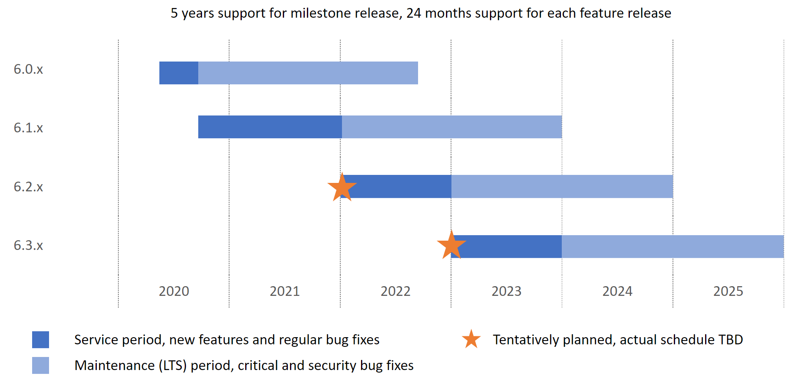

# Product Support Policy

This document applies for Eclipse ThreadX components including ThreadX, NetX Duo, FileX, GUIX, USBX and LevelX.

## Version definitions

Eclipse ThreadX releases generally follow the guidelines defined by [Semantic Versioning](https://semver.org/). Given an Eclipse ThreadX version number **X.Y.Z** (e.g. 6.1.9):

* **X** increases for a **milestone release**. Currently Eclipse ThreadX components stay at version **6**.
* **Y** increases for a **feature release** when there is a major feature added (e.g. v6.**1**.0 introduced Eclipse ThreadX IoT Middleware).
* **Z** increases for a every three month **regular updates** or **patch** for critical bug fixes.

## Roadmap

Last updated: **2021/11**

## Support policy

Eclipse ThreadX provides 60 months support for each milestone release (e.g. v6.x.x) and 24 months for each feature release (e.g. v6.1.x). The **Maintenance** or so called **LTS (Long-term-support)** period starts right after a new feature release is published. Eclipse ThreadX version 6.0.0 and all future releases will follow this support policy.

The entire life cycle of a certain feature release (e.g. v6.1.x) can be broken down into **Service** and **Maintenance** periods:

| **Period** | **Duration** | **Definition** |
| --- | --- | --- |
| Service | Subject to the actual development plan | New features and regular bug fixes |
| Maintenance (LTS) | 24 months after next feature release published | Critical and security bug fixes |

### Example

* Eclipse ThreadX v6.1.0 was released in 2020/10, it will be actively in development with bug fixes for the regular update version (e.g. v6.1.11 released in 2022/04). 
* Users are always welcomed to update to the latest version during the Service period.
* When Eclipse ThreadX v6.2.0 is released. The latest v6.1.x will get into the Maintenance (LTS) period. We will keep backporting important bug fixes from v6.2.x to it. Until 24 months later, which v6.1.x will come to End Of Life.

The actual duration of each feature release may varies depending on the actual development plan. Please view the [Roadmap](#roadmap) section above for the recent feature release versions.

### Other notes

* Users are recommended starting a new project using release in Service period.
* Users are encouraged to upgrade all projects to a newer Eclipse ThreadX release before the support period finishes.
* For particular cases users cannot upgrade the projects, security / critical bug fixes can be applied to it with communication with Eclipse Foundation.
* Pre-release version (public preview, pre-release and etc.,) or feature marked as "Preview" are not covered by any support period.
* For prior releases to v6. The support is covered by ExpressLogic support contract.