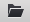
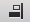
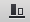
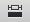
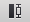
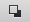
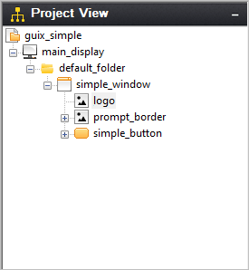
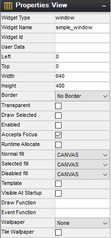

# Chapter 3: Description of GUIX Studio

This chapter contains a description of the GUIX Studio system analysis tool. A description of the overall functionality of the GUI is found in this chapter. 

## GUIX Studio Views

There are five principal areas of the GUIX Studio UI, namely the ***Toolbar***, ***Project View***, ***Properties View***, ***Target View***, and ***Resource View***. ***Figure 2*** shows the basic GUIX Studio UI. Each of the views is further discussed in the following sub-sections.

**Figure 2**

### Title

- GUIX Studio 18: The ***Title*** displays the GUIX Studio version as well as the currently open project, as shown at the top of ***Figure 2*** previously.

### Toolbar

The ***Toolbar*** shows the buttons available to the GUIX Studio developer, as shown in ***Figure 3***.

**Figure 3**

The toolbar buttons are defined as follows:

 Creates a new GUIX Studio project

 Opens an existing GUIX Studio project

 Saves the project

 Cut widget selected, including children

 Copy selected widget, including children

 Paste widget and children

 Left-align selected widgets

 Right-align selected widgets

 Top-align selected widgets

 Bottom-align selected widgets

 Equally space selected widgets vertically

 Equally space selected widgets horizontally

 Make selected widgets equal width

 Make selected widgets equal height

 Move selected widgets to front

 Move selected widgets to back

 Size selected widget to content Zoom out target screen

 Zoom out target screen

 Zoom in target screen

 Record Macro

 Playback Macro

 Run Application

 About GUIX Studio

### Project View

The ***Project View*** shows the hierarchical list GUIX objects that comprise the embedded UI. New GUIX objects can be added by clicking on the parent object and then selecting an object from the ***Insert*** menu (or by right-clicking on the object and selecting from the right-click menu). ***Figure 4*** below shows the GUIX Studio ***Project View***.

**Figure 4**

### Properties View

The ***Properties View*** shows detailed property information of the currently selected GUIX object, which can be selected via the ***Project View*** or by clicking directly on the object in the ***Target View***. ***Figure 5*** below shows the GUIX Studio ***Properties View***.

**Figure 5**

### Target View

The ***Target View*** is the WYSIWYG screen design and layout area. This view is meant to represent the physical display or displays available on your target hardware. Objects can be selected, moved, resized, etc. via simple mouse operations. In addition, alignment and Z-order button operations are available on selected objects in the Target View. Selecting an object in the ***Target View*** will also result in the properties for that object to be displayed in the ***Properties View***. ***Figure 6*** below shows the GUIX Studio ***Target View***.

**Figure 6**

### Resource View

The ***Resource View*** is used to manage the resources (colors, fonts, pixelmaps, and strings) available to applications screens defined for each display. You can click on the resource view group headers to expand each group and examine the group contents. ***Figure 7*** below shows the GUIX Studio ***Resource View***.

**Figure 7**

The title of the resource groups indicates current theme name. If multi themes available, you are able to switch between themes by clicking on the up and down arrow.

Each resource group in the view above can be expanded or collapsed by clicking on the group header. A more detailed description of each resource groups follows in the next chapter.

## The GUIX Studio Project

A GUIX Studio project maintains information about your UI screen design and UI resources. The project data is saved to an XML format file with the extension ".***gxp***". Since the project file is an XML schema file, it can be versioned controlled and shared similar to any other source file.

When you first start using GUIX Studio, you will need to either open one of the example projects provided with the distribution or create a new project. All of your work is saved to the project data file.

GUIX Studio also produces ANSI C source files. These source files contain either your application resources or data structures describing your designed screens. GUIX Studio also writes to these generated source files API functions that know to utilize the generated data structures to dynamically create your application screens. Your application software will simply invoke the provided API functions to create the screens you have designed within GUIX Studio.

As you progress in designing your user interface, you will periodically want to use GUIX Studio to generate the GUIX compatible output files that will allow you to build and run the interface you have designed. You can compile and run the generated source files for either your target hardware or on your Windows desktop that simulates ThreadX and GUIX.

## GUIX Studio Project Organization

It is helpful to have some knowledge of the basic organization of a GUIX Studio project to understand how to use GUIX Studio effectively and to understand the information presented in the Project View of the GUIX Studio IDE. The Project View is a summary visual representation of all of the information contained in your project.

Before describing the project, it is necessary to define few terms. First, we use the term **Display** to mean a physical display device. This is most often an LCD display device but it could be using other technology. The next term is **Screen**, which mean a top-level GUIX object, usually a GUIX Window, and all of its associated child elements. A Screen is a software construct that can be defined and modified at runtime. Finally, a **Theme** is a collection of resources. A theme includes a table of color definitions, font definitions, and pixelmap definitions that are designed to work well together and present your end user with a consistent look and feel.

The project first includes a set of global information such as the project name, number of displays supported, the resolution and color format of each display, the number of languages supported, the name of each supported language. The project name is the first node displayed in the Project View.

The project next organizes all of the information required for up to 4 physical displays and the screens and resources available to each display. The display names are the next level nodes in the Project View tree.

A unique feature of the GUIX Studio application is built-in support for multiple physical displays, each with its own x,y resolution, color format, screens, and resources. While the vast majority of GUIX applications utilize only one physical display, this capability is important for those making a product that must support multiple simultaneous physical displays.

Beneath each display definition are the top-level windows or screens defined for that display. The screen definitions can be nested to any level depending on the number and nesting of child widgets on each screen.

This screen and child widget organization is displayed in a graphical manner in the Project View.

Also associated with each display are the Themes supported by the display and the resource content composing each Theme. If your project includes multiple displays, you will notice that the Resource View changes its content when you select one display and then another. This is because the resource content is linked to each display. Not only the color format may be different, but the pixelmaps, colors, and fonts you choose to use may vary from one physical display to another.

The final component maintained by the project is the string table data associated with each display. Since displays can be of very different x,y resolutions, the string data is maintained independently for each display defined in the project.
