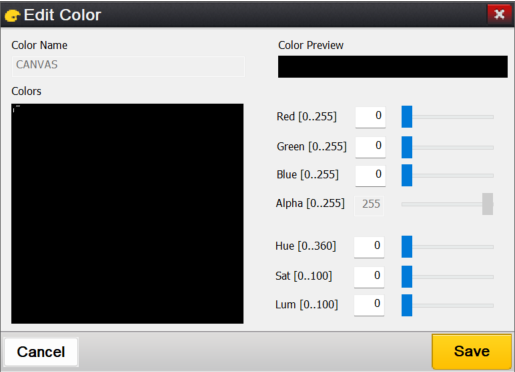
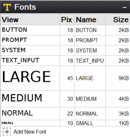
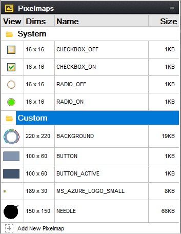
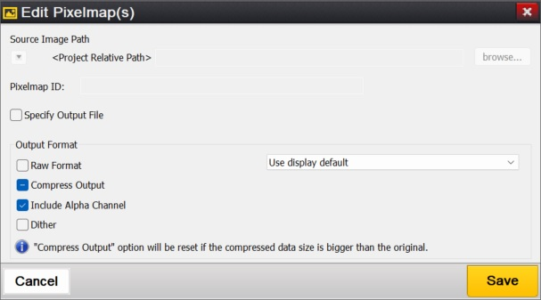

# Chapter 4: GUIX Studio Resources

GUIX Studio provides management of all UI resources the application will use for colors, fonts, pixel-maps, and strings. The sections that follow describe how to add, modify, and delete resources within your UI screen design. 

All resource management is done within the ***Resource View*** of the GUIX Studio UI, as shown below in ***Figure 8***.

**Figure 8**

## Color Resources

The ***Colors*** section of the ***Resource View*** allows you to manage your color resources. You can expand this view by clicking on the **+** field in the view header, resulting in the view shown below in ***Figure 9***:

**Figure 9**

Color resources consist of one or more colors, each with a unique logical name. For example, in **Figure 9** the logical name **CANVAS,** which is the system color ID for the screen background fill color, is associated with the physical color black. This color resource is used whenever the application specifies **GX_COLOR_ID_CANVAS** as the color in the object properties.

The color "swatch" indicating the color RGB value is shown on the left, followed by the color ID name. You can change the RGB value associated with any ID name at any time. You cannot change the pre-defined system color ID names because these are used internally by the GUIX library. You can however change any of the color values. Changing a system color value is a **global change**. This means that any widget that does not have a specific color assignment will take on the new system color value.

You can change both the color name and color value for custom colors that you have added to the Theme.

To modify a color resource, double-click (or right-click and menu select) on the color resource. This action brings up the color-definition dialog. From this dialog, the color resource can be modified to match the application's UI needs. ***Figure 10*** shows the modification dialog when **CANVAS** is double-clicked. The appearance of this dialog will change based on the color-format settings of the target display.

**Figure 10**

The appearance of the Edit Color dialog will change depending on the color depth and color format configuration of the current display.

To add a new color resource, from the ***Colors*** section of the ***Resource View*** select the following button:

Use the resulting color dialog to add a new color resource, as shown below in ***Figure 11**:*

**Figure 11**

After completing these steps, selecting **Save** a new color resource with the name **NEW_COLOR** with the physical color green will be available for the application to use.

**Special considerations when changing display color format settings:**

When you create a new project, you are automatically prompted to configure the project's displays and the color format of each display. Most often you will make these selections one time and you would not need to modify those configuration settings.

You may determine that it is necessary to change your display color format settings at a later time. In that case, GUIX Studio will make a best fit conversion of your current system and user color RGB values from the old color format to the new color format. This conversion follows a few logical rules.

For user-defined colors, GUIX Studio always attempts to convert the previous color to the closest matching color in the new color format. If you are converting from a high color depth such as 16 bpp 5:6:5 color format to a gray scale or monochrome color format, this change may result in undesired color conversions. When making a large change in the display color depth settings, some manual updates to the new user-defined color table may be required.

For the pre-defined system colors, GUIX Studio internally defines three unique default color tables. One default color table is used for all color depths greater than 4-bpp gray scale, a second default color table is used for gray scale color formats (1 bpp < display_color_format <= 4bpp) and finally a third default system color table is used for monochrome color format.

When you switch the display color format using Project Configuration dialog, the following rules are applied:

1) If the old and new display color formats use different default system color tables as defined above, the system colors are each reset to the pre-defined default colors. In other words, if you switch from color to gray scale, or from gray scale to monochrome color depth, your system colors will be reset to the internally defined default values for the new color depth. While this may cause the loss of some customized color information, this solution gives you a reasonable starting point when you make a dramatic change to your display color format settings.

2) If the old and new color formats use the same default color table, meaning you are making a less dramatic color format change, GUIX Studio will test each system color to determine if you have modified the system color RGB value from its default value. If the system color RGB value has been modified, GUIX Studio will do a best-match conversion from the old color format to the new color format. If the system color has not been modified, it will be reset to the default color for the new color format.

**Special considerations for palette mode operation:**

When a project is configured for 256 color palette mode color format, the user can configure how the palette to be installed and used is defined. You can access and edit the palette definition by the using the Configure|Themes dialog, and if your project is set for 8 bpp you should see the "Edit Palette" button. Click this button to bring up the Edit Palette dialog:

GUIX Studio divides the palette into two sections: The "user defined" section and the "auto-generated" section. GUIX Studio runs a sophisticated optimal palette generation algorithm to create the best palette for displaying the images that are included in each theme. You can carve out any number of palette entries you need to define by typing a number into the "Predefined Palette Entries" field, and enter any RGB value you like for any of these slots. The remaining slots will be allocated to Studio to create an optimal color palette for displaying your images.

When running in this mode, if you want to edit a color defined in the resource view, the color editor will allow you to select only from the predefined palette entries that you have defined. This is because the remaining palette entries are auto-generated by GUIX Studio and will change as the images added to your project are modified.

If you require the display of anti-aliased fonts when running in 8bpp palette mode, you must define an array of palette entries that create a gradient for each foreground/background color use to display your anti-aliased text. You can use either 8 palette entries for the gradient for each color combination, or 16 palette entries for a smoother gradient. This number of palette entries used is determined by the "Number of Palette Mode Anti-Aliased Text Colors" checkbox on the Project Configuration dialog. You can use a gradient with only eight entries to minimize the palette entries used for each color combination, or use 16 entry gradients to provide the smoothest anti-aliased text appearance.

To simplify defining a color gradient for displaying anti-aliased text, or to generate a color gradient for your own usage, the Edit Palette dialog provides a Generate Gradient button. To use this feature, you should first assign the r:g:b values of the starting and ending gradient colors.

For example, if you wanted to display anti-aliased red text on a medium gray background using eight palette entries starting at index 50, you would assign the r:g:b value of 255:0:0 to palette index 50, and the r:g:b value 128:128:128 to palette index 57. Enter these palette index values into the start-index and end-index fields on this dialog, and click the Generate Gradient button. The palette entries 51 through 56 will be initialized to define a smooth gradient transition between your bounding colors.

## Font Resources

In order to manage font resources the ***Fonts*** section of the ***Resource View*** must first be expanded by clicking on the **+** field, resulting in the dialog shown below in ***Figure 12***:

**Figure 12**

Font resources consist of one or more fonts, each with a unique logical name. For example, in **Figure 12** the logical name **SYSTEM** is associated with a specific font. This font resource is used whenever the application specifies **SYSTEM** as the font in the object properties. The font group shows you a WYSIWYG preview of the font glyphs on the left, the font height in pixels, the Font ID name and the font size (in kb).

In the view above, the first four fonts are the pre-defined default fonts that are required by the GUIX library. You can change the font data associated with these fonts, however you cannot change these font ID names.

The last font shown above, named "Italic", is a custom font that has been added to the project by the user.

To modify a font resource, double-click (or right-click and menu select) on the font resource. From this dialog the font resource can be modified to match the application's UI needs. ***Figure 13*** shows the modification dialog when **SYSTEM** is double-clicked.

**Figure 13**

To add a new font resource, from the ***Fonts*** section of the ***Resource View*** select the following button:

This will invoke the `Font Edit` dialog to add a new font resource, as shown below in ***Figure 14***:

**Figure 14**

New GUIX fonts are created by GUIX Studio rendering a chosen TrueType font at a particular size. Therefore the dialog above first requires a TrueType font path. You can use the browse button to browse to a directory containing font files on your development system. Several TrueType fonts are also included in the GUIX/fonts sub-folder wherever you have installed GUIX Studio.

If possible the location of the TrueType font file is stored internally using a project-relative path. For this reason it is important to keep all of your font files in a common location and use a common directory tree structure for your projects and font files in order to enable you to move GUIX Studio projects from one development station to another.

The Font Name field allows you to specify the font resource ID name. This is the resource ID that will be used in the code generated by GUIX Studio and also used by your application when referencing the font. This name must follow C variable naming syntax requirements.

Once you have chosen a TrueType font file to use as input, enter a font logical name.

The `Specify Output File` checkbox allows you to specify a unique output file for each font. If this checkbox is not selected, the font data is written to the default resource file for this display. If the checkbox is selected, you can type a specific filename into which the data for this font will be written. The purpose for this option is to allow you to divide your font data, which can be very large C arrays, into multiple output files. Certain compilers struggle to handle C files that are hundreds of thousands of source lines. The `Standalone Binary` allows you to store font data in a binary file. Later, you can load this binary file into RAM and utilize the GUIX API **gx_binres_font_load** to load the font resource from the RAM buffer. This capability is especially helpful when you need to place specific font resources in external memory and load them dynamically during runtime.

The checkbox `Generate Kerning Info `instructs GUIX Studio to include kerning information within the generated font, which is used to adjust the relative positions of successive glyphs in a string. If you want to apply kerning with your strings, you will need to use a font that contains kerning information and turn on this checkbox. You will also need to define the GUIX library build option "GX_FONT_KERNING_SUPPORT" to support rendering text with kerning information.

The checkbox `Include character set defined by String Table` instructs GUIX Studio to include those glyphs referenced by your static string table within the generated font. You can include additional glyphs by selecting and editing the character ranges listed below, but this option can be selected to quickly generate the minimum character set needed to display the strings defined within your string table. Of course, if your string table uses glyphs which are not present in your TrueType source font, those characters will not be available in your GUIX font, and will not be displayed on your target system.

To generate a more complete font, or a font that includes characters that may not be used within your statically defined string table, you can also select character ranges from the list below. Note that you can select any number of character ranges, and you can edit the actual starting and ending character code to be included within each selected range.

The pre-defined character ranges and page names are only suggestions allowing you to easily select the character set needed for the active languages in use today. The listed language names do not have any effect on the generated GUIX font, and you are free to type in any Hex character range you like for any enabled or selected character range.

For example, if you would like to generate a font which contains only the numeric characters, you might select the "Ascii" code page, but enter the starting value 0030 and the ending value 0039 to generate a font containing only the numeric characters. Note that the character range values encoded in Hexadecimal, which is the normal notation for Unicode character tables.

By default, GUIX Studio and the GUIX library support character codes 0x0000 through 0xffff, which encompasses all active languages, mathematical forms, and other symbols in use today. If you require the use of character codes above the value 0xffff, including certain Private Use Areas, you will need to turn on the checkbox "Support Extended Character Range". When this checkbox is selected, GUIX Studio allows the user to specify character ranges from 0x0000 through 0x10ffff, which includes the Unicode Private Use character ranges. If you require this extended character range, you will also need to define the GUIX library build option "GX_EXTENDED_UNICODE_SUPPORT" so that the GUIX library will internally support 32-bit character codes, rather than the default configuration which supports 16 bit character codes.

If you select both the "Include character set defined by String Table" checkbox and one or more of the character ranges in the list below, GUIX Studio will combine these selections into the superset of both the ranges selected and those characters used within your string table. Of course the selected TrueType source font must also contain the needed characters in order for GUIX Studio to produce meaningful glyphs for each requested character value.

Once the character range is determined, specify the font height in pixels and the font format. Both anti-aliased and binary fonts are supported. Binary fonts require less static data storage area, however anti-aliased fonts produce the best appearance on targets running at 4-bpp grayscale or higher color depths.

**Note:** *The "font height" refers to the font's EM Square. In traditional metal type, the EM Square was equal to the line height of the metal body from which each letter rises, and each metal body was of the same size. In metal type, the physical size of a letter could not normally exceed the EM Square. In digital type, the EM is a grid of arbitrary resolution that is used as the design space of a digital font. For these digital fonts it's common that some glyph features, such as accents and descents, may extend beyond the limits of the EM square. The end result is that the widget height needed to fully display a particular font will often need to be slightly larger then the requested font pixel height.*

Once all of the font configuration fields are completed, click on the OK button to create a new font resource. GUIX Studio will generate a GUIX compatible font with the chosen properties, add that font to the project resources, and make the font available for the application to use.

## Pixel-map Resources

In order to manage pixel-map resources the ***Pixel-maps*** section of the ***Resource View*** must first be expanded by clicking on the **+** field, resulting in the dialog shown below in ***Figure 15***:

When the `Pixelmap` group is expanded, you should see a preview similar to this:

**Figure 15**

Pixel-map resources consist of one or more pixel-maps, each with a preview of the pixel-map image on the left, the pixel-map dimensions in pixels, a unique logical name and the pixel-map storage size in the output resource file (in kb).

The first group of pixel-maps comprises the pre-defined system pixel-maps required by GUIX widgets such as radio buttons and checkboxes. You can change the pixel-map data associated with the system pixel-maps, however you cannot change these pixel-map ID names. Also shown above are several custom pixel-maps with names like "BACKGROUND" and "BUTTON_ACTIVE". These are examples of pixel-maps a user has added to the project that might be used to render a GX_PIXELMAP_BUTTON widget.

Since many projects contain a large number of pixel-maps, the pixel-map view allows you to define any number of pixel-map folders to organize your pixel-map images. 

Adding a new pixel-map folder is done by right-clicking on `Pixelmaps` section header of the ***Resource View*** selecting "Add Folder".

To modify a pixel-map resource, double-click (or right-click and menu select) on the pixel-map resource. From this dialog the pixel-map resource can be modified to match the application's UI needs. ***Figure 16*** shows the modification dialog when **RADIO_ON** is double-clicked.

**Figure 16**

The `Edit Pixelmap` dialog allows you to define a new pixel-map or modify the content of an existing pixel-map. Behind the scenes, GUIX Studio reads the input image and converts the image to the `GUIX GX_PIXELMAP` format that can be used by the GUIX library. GUIX Studio also converts the color space of the incoming image to the color space of the display on which this pixel-map will be used.

The first field of this dialog is the path to the source image. GUIX Studio supports the input of PNG (.png) or JPEG (.jpg) format image files. You can use the "browse" button to find the desired input file on your local file system.

If possible the location of the input image file is stored internally using a project-relative path. For this reason it is important to keep all of your image files in a common location and use a common directory tree structure for your projects and image files in order to enable you to move GUIX Studio projects from one development station to another and not lose track of input image data.

The `Pixelmap ID` fields allow you to specify the logical name of the pixel-map resource. This name typed here must be unique and must follow C variable naming syntax rules.

The `Specify Output File` checkbox allows you to specify a unique output file for each pixel-map. If this checkbox is not selected, the pixel-map data is written to the default resource file for this display. If the checkbox is selected, you can type a specific filename into which the data for this pixel-map will be written. The purpose for this option is to allow you to divide your pixel-map data, which can be very large C arrays, into multiple output files. Certain compilers struggle to handle C files that are hundreds of thousands of source lines. The `Standalone Binary` allows you to store pixelmap data in a binary file. Later, you can load this binary file into RAM and utilize the GUIX API **gx_binres_pixelmap_load** to load the pixelmap resource from the RAM buffer. This capability is especially helpful when you need to place specific font resources in external memory and load them dynamically during runtime.

The `Compress Output` checkbox allows you to specify if the pixel-map output is uses a proprietary GUIX compression algorithm. Compressed output files are generally smaller, but they also require processor time to render on the target. Most often you will choose compression for your large pixel-maps, and use non-compressed format for your smaller pixel-maps.

The `Include Alpha Channel` checkbox determines how GUIX Studio utilizes alpha channel information sometimes present in .png format input files. If this checkbox is checked and the display is running at 16-bpp color depth or higher, GUIX Studio will preserve the full incoming alpha data in the output file. If this checkbox is not checked, GUIX will produce a slightly smaller output file. This output file may include transparency, but it will not include full alpha-blending information.

The `Dither` checkbox instructs GUIX Studio to apply an advanced dithering algorithm when converting the input image for use with a lower color depth display. Dithering is usually enabled, but can cause larger output files if compression is used because there will be fewer repeating pixels.

Once all options are set as desired, click the OK button to produce a new pixel-map resource. GUIX Studio will read the input image file, decompress it, perform color space conversion and dithering, optionally re-compress the data, and save the data in GUIX compatible `GX_PIXELMAP` format. The new pixel-map is added to the project resources and made available for the application to use.

To add a new pixel-map resource, from within the `Pixelmaps` section of the ***Resource View*** select the following button:

**Batch Pixelmap Edit**

To modify the properties of a bunch of pixelmaps, right click on pixelmap group or folder, and select **Edit Pixelmap(s)** menu to invoke **Edit Pixelmap(s)** dialog.

Checkbox status description:

This status means all pixelmaps have the property checked, you can uncheck the button to change the property for all the pixelmaps.

This status means all pixelmaps have the property unchecked, you can check the button to change the property for all the pixelmaps.

This status means pixelmaps have a different status for the property, you can check or uncheck the button to change the property for all the pixelmaps, otherwise, the property remains unchanged.

## String Resources

When the Strings group is expanded you should see a preview of the project string table, as shown below:

**Figure 17**

String resources consist of one or more strings, each with a unique logical name. For example, in **Figure 17** the logical name "PATIENT_LIST" is associated with the string "Patient List" shown on its right. This string resource is used whenever the application specifies PATIENT_LIST as the string in the object properties.

Always remember that your ID names for all resource types must be C syntax compatible variable names. These names will be used extensively when your project resource files and specifications files are produced by Studio.

To modify a string resource, double-click (or right-click and menu select) on the string resource to invoke the ***String Table Editor*** dialog. From the ***String Table Editor*** dialog the string resource can be modified to match the application's UI needs. ***Figure 18*** shows the modification dialog when **STRING_13** is double-clicked.

In this case, the string ID name is shown on the left, which the string content for the first or reference language is shown on the right. Of course the exact string content is very specific to your application, however the layout of the String group preview is consistent.

GUIX Studio supports static text and multi-lingual application by defining and maintaining a String Table. The String Table defines one string ID for each record, and one string constant for each record for each supported language.

The languages to be supported by your application are defined by using the Language Configuration Dialog, show here:

**Figure 18**

The Language Configuration Dialog is invoked by using the Configure | Languages command on the application menu. This dialog allows you to define the number of languages to be supported by your application and the name or language ID to be associated with each language. The languages supported can be modified after your project has been created, however if a language is removed you should be aware that the string data associated with that language is also removed and cannot be retrieved.

The checkbox "**Statically Defined**" indicates the selected language will be statically defined in source code format in the generated resource file. If no languages are statically defined, the language table pointer will be set to NULL in the generated display table and a language must be loaded and installed by the application using the binary resource loader APIs provided by the GUIX library.

The checkbox "**Support Bidi Text**" instructs GUIX Studio to enable bidirectional text rendering support. You should turn on this checkbox if the strings you will be entering for this language require bi-directional text rendering.

The checkbox "**Generate Bidi Text in Display Order**" instructs GUIX Studio to generate bidirectional text to the output file in its display order. If this option is selected, no runtime processing is required within the GUIX library to properly render bidirectional text. When this option is selected, bidirectional text rendering should NOT be enabled within the GUIX library. This configuration yields the best runtime performance, but does not support rendering of dynamically defined bidirectional text strings.

The first language or "Index 1" language is referred to as your "reference language". This is the language that GUIX Studio will use when you are defining and editing your UI design. All other languages in your string table are referred to as Translation Languages. GUIX Studio supports exporting and importing the string table data in industry standard XLIFF or CSV format data files, convenient for exchanging string information with translators who might assist the application developer with adding translations for the languages to be supported other than the reference language. When you export the GUIX string table to an XLIFF or CSV file, the reference language along with one translation language are included in the XLIFF or CSV string data exchange file. Similarly, when you import an XLIFF or CSV file, the imported data is used to populate one translation language in your GUIX String table.

**Figure 19**

The String Table Editor dialog first displays a list of string IDs on the left, followed by the reference language string data. If more than one language is defined, a third column shows any one of the supported translation languages. You can open and close the third column by clicking on the small arrow at the top-right of the reference language column.

When the translation language column is visible, you can cycle through the translation languages contained in the project by clicking on the small arrows at the top-right of the translation language column of the string list.

You can edit a string record by clicking on the record in the table to select it. When a record is selected, the record String ID and string content are shown in the fields below the table view. You can type new values into these fields to modify the string ID and string content.

The box in the right side of the table view shows previews of widgets that reference the selected string. This is useful to tell if an edited string will exceed a specific widget area.

The fields to the right of the string content include:

- "Number of references": This field indicates how often a particular string ID is used within the GUIX Studio project. If the reference count is 0, this string may be obsolete and may optionally be removed by the user.
- String Width (pixels) indicates the display width of the string using the indicated font.
- The "Notes" field is an optional comment field that allows you to add information about the purpose or use of each string. These notes are included in any exported XLIFF string data files to aid translators in making accurate and meaningful string translations.

Anytime you have the ***String Table Editor*** dialog open you can add additional strings to your project by clicking on the Add String button at the top of the dialog. Obsolete or unused strings can be removed from the project by first selecting the string, then clicking on the Delete String button at the top of the dialog.

In addition to manually adding new strings to your project using the String Table Editor dialog, you can also add new strings indirectly by simply typing string content in the "Text" field of the Properties View of any widget that supports text. In other words, when you are adding new widgets in the target view or typing text information in the properties view, these actions are automatically creating new entries in the project string table.

## Adding Language Translations

The GUIX Studio string table editor supports a language definition workflow that allows the developer to create an application using his primary language, then export the string data to a standard schema XML or CSV file to be sent to a language translation expert. The translation file is then returned to the developer, who can import the language translations back into his Studio project, thereby adding support for a new language to his application.

This facility is invoked by using the Export (to write the string data to a file) and Import (to read the translated strings) buttons at the top of the String Table Editor. The Export button is used to create an XLIFF schema XML or CSV file which contains your reference language strings. This file can be utilized by a translator using tools and editors that support the standard XLIFF or CSV file format.

When a translation expert returns the XLIFF file to you with the new string translations, you can use the Import button to read the data from this XLIFF or CSV file. If the XLIFF or CSV file contains a new language, the new language is added to your project. If the XLIFF file contains new string data for an existing language, this new data is imported into your project. The reference language strings are not modified by the Import operation.

When you click the Export button, the XLIFF/CSV Export Control dialog, show below, is displayed:

**Figure 20**

The Source Language and Target Language fields specify which string table columns will be written to the XLIFF or CSV file as the reference language and the translation language. The Source language is the reference strings, and the Target Language is the language for which your translator will provide translated string data.

The XLIFF version field specifies one of two main XLIFF file format versions, either version 1.2 or version 2.0 (and later). These XLIFF file format standards are incompatible, and you need to know which version your tools utilize before using the XLIFF Export/Import commands. More information about the XLIFF schema and XLIFF standards can be found here:

- version 1.2: [https://docs.oasis-open.org/xliff/xliff-core/xliff-core.html](https://docs.oasis-open.org/xliff/xliff-core/xliff-core.html)
- version 2.0: [https://docs.oasis-open.org/xliff/xliff-core/v2.0/os/xliff-core-v2.0os.pdf](https://docs.oasis-open.org/xliff/xliff-core/v2.0/os/xliff-core-v2.0-os.pdf)

The output filename and output path fields allow you to specify the filename and location to which the output file will be written. The filename is entirely up to the user, however we suggest that you use names that indicate the source and target languages contained within the exported file.
