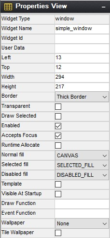

# Chapter 5: GUIX Studio Screen Designer

Designing application screens is the primary purpose of GUIX Studio. Screen design is accomplished through all the various views described previously in Chapter 3. However, the main element of screen design in GUIX Studio is the ***Target View***, which is where all the screen elements are shown visually and in exactly the same manner they will appear on the embedded target display. These screen elements can be selected, moved, resized, etc. via simple mouse and button operations. In addition, alignment and Z-order button operations are available on selected object(s). The following sub-sections describe various features of GUIX Studio screen design. 

## Creating/Configuring Projects

Creating projects in GUIX Studio is straightforward – select the ***New Project*** button or the menu selection ***Project, New Project***. Next, GUIX Studio presents the ***Configure Project*** dialog. From this dialog, basic display settings, as well as path information for where to locate code generated by GUIX Studio is specified.

When a new project is created, the configure project dialog is presented. This is where the developer specifies the number of hardware displays available on the target and the properties each display. Properties include the display's logical name, x/y resolution, color depth and format, and other display properties. GUIX Studio supports multiple displays in the same project. If additional displays are required, the ***Number of Displays*** field should be changed to match the number of displays on the embedded device. The maximum number of displays in a project is 4. ***Figure 21*** shows the Configure Project dialog.

Modifying the project and/or display settings is accomplished by either the menu option ***Configure, Project/Display*** or by selecting the project or display, right-clicking, and selecting ***Configure, Project/Display***. In either case, the ***Configure Project*** dialog is presented to facilitate changes to the project settings and/or display(s).

**Figure 21**

The Directories group is where you can specify the default output directories for the C source and header files produced by Studio. These directories are normally saved relative the project location to make it easy to move projects from one computer to another or from one filesystem to another.

The Additional Headers field is where you can specify custom header files. If more than one header file is needed, use semicolons to delimit the list.

When you invoke the Studio "Generate Application" or "Generate Resources" commands, these are the default directories into which those source files will be written. Of course, you can override these directory locations at any time by entering new locations in the Output Directory dialog.

## Selecting Widgets

Selecting widgets is done by either clicking on the widget in the ***Project View*** widget tree or by clicking on the widget visible in the ***Target View*** area. When a single widget is selected, its properties are displayed in the ***Property View*** area. ***Figure 22*** shows the widget "***button***" selected.

**Figure 22**

## Using Properties

As mentioned previously, the properties for a selected widget are presented in the ***Properties View***. All widgets have a common set of properties as well as some properties that are specific to the particular widget type. For example, a button widget has a ***Pushed*** property while a window widget does not. The following are the common set of widget properties:

| Property         | Meaning                                                                               |
| ---------------- | ------------------------------------------------------------------------------------- |
| Widget Type    | Type of widget, for reference                                                                               |
| Widget Name      | Name of widget, passed to the widget create function and used for variable naming in the generated source files.               |
| Widget ID        | ID of widget. This ID value is used to generate signals from child widgets to their parent screens.                            |
| Left             | Left-most coordinate of widget                                                                                                 |
| Top              | Top-most coordinate of widget                                                                                                  |
| Width            | Width of widget in pixels                                                                                                      |
| Height           | Height of widget in pixels                                                                                                     |
| Border           | Type of widget border                                                                                                          |
| Transparent      | Should be checked if the widget is partially transparent                                                                       |
| Draw Selected    | Should be checked if the widget should initially draw itself in the selected state.                                            |
| Enable           | Should be checked if the widget can be selected or clicked by the end user.                                                    |
| Accepts Focus    | Should be checked if the widget accepts focus.                                                                                 |
| Runtime Allocate | Should be checked if the widget control block should be allocated dynamically.                                                 |
| Normal Fill      | Normal fill color resource id                                                                                                  |
| Selected Fill    | Selected fill color resource id                                                                                                |
| Draw Function    | User-defined custom drawing function Name. If this field is blank, the standard drawing function for that widget type is used. |
| Event Function   | User-defined custom event handling function name. If blank, the standard event handling for this widget type is used.          |

***Figure 23*** shows the properties of a simple window widget.

**Figure 23**

Many widget types have additional properties specific to each widget type.

For example, in Figure 23 above, the Window widget type supports a Wallpaper pixelmap Id, and a style setting indicating if the wallpaper should be centered or tiled.

Text widgets support a string ID field, along with text alignment styles and a font specification. The additional widget properties are normally intuitive once you have read the description of each widget type and the available styles and Create function parameters for that widget type.

## Manipulating Widgets

To manipulate a widget, is first must be selected. This is done by either clicking directly on the widget in the ***Target View*** or by selecting it in the ***Project View*** widget tree. Once selected, the widget will have a dashed outline. In this state, it may be moved by clicking on the widget and dragging it to the desired location on its parent. If the widget is a top-level widget, dragging the widget is effectively setting the widget's initial position on the target display. Of course, it is always possible to move or resize any widget at any time using the GUIX API.

To resize the widget's height, position the mouse on the top edge of the widget and wait for the mouse pointer to change to an up-down arrow. At this point, the widget height may be changed by moving the mouse while the right mouse button is depressed. The width of the mouse may be resized in a similar fashion by positioning the mouse pointer on the left edge of the widget. ***Figure 24*** shows the "***button***" widget resized and moved to the left/top area of the parent window.

**Figure 24**

## Manipulating Multiple Widgets

Selecting multiple widgets is accomplished by clicking on multiple widgets in the target view while holding the ***Ctrl*** key down. Doing this will show each of the widgets selected with a dashed-outline around it. Note that when selecting multiple widgets each widget in the selection group must a child of the same parent.

Once multiple widgets are selected, they may be simultaneously moved by clicking inside one on the selected widgets and moving the mouse with the right mouse button pushed down. In addition, the alignment buttons on the ***Tool Bar*** may be used to align the group of selected widgets. ***Figure 25*** shows both the "***button***" and "***new button***" widgets selected and ***Figure 26*** shows the result of the ***Align-Left*** button selection while these widgets are selected.

**Figure 25**

**Figure 26**

## Cut/Copy/Paste Operations

A selected widget in the ***Target View*** may be cut, copied, and pasted in standard fashion. Widgets and screens can be copied within one project, or copied from one project and pasted into another.The ***Tool Bar*** has buttons for cut, copy, and paste. There are also the same options in the Edit menu option. Note that when pasting a widget, the parent widget should be selected before pasting the new widget. ***Figure 27*** shows the result of selecting the "***button***" widget, copying it, and pasting the copy in the same window.

**Figure 27**

Copy/Paste within one project is generally straightforward because the resources that might be required by the copied widget(s) are always present when you are working within one project. However, if you copy a widget from project A and paste that widget into project B, some problems with resource dependencies can arise.

When you copy widget(s) within Studio, the Studio application makes a list of the resources required by the copied widgets, and generates a portable resource dependency table in the form of XML which is copied to the windows clipboard, along with the actual copied widget information. When you paste the widget(s) into a different project, Studio first examines the resource dependency list and adds the needed resources to the open project if they do not already exist. Studio identifies matching resources by the resource ID names, and for string resources Studio also compares the string content. If matching resources are found, Studio updates the resource IDs of the pasted widgets to properly use the resources in the new project. If the resources are not found, they are added.

When Studio adds a resource to your project as part of a widget paste operation, Studio is really adding a link to the resource in the case of font and pixelmap resources. This link is generated from the source project, and you will receive warning messages if those resources cannot be found relative to the project location of the project into which you are pasting. The resource links will be added to the project regardless, but you may need to manually copy fonts and image files into the proper locations under your new project tree to eliminate resource loading errors. Studio does not copy .ttf, .png, or .jpg files from one location to another.

The easy way to avoid any problems in this regard is to keep a consistent directory structure between projects that you want to share. If you want to move things from Project A to Project B easily, then keep the graphics images and fonts used by both projects in a consistent sub-directory of each project folder.

## Changing Z-Order

Widgets can easily be moved in front of or behind other widgets. This is accomplished by selecting the widget and selecting either the ***Move to Front*** or ***Move to Back*** buttons on the ***Tool Bar***. ***Figure 28*** shows the moving the second button to the back.

**Figure 28**

## Assigning Colors, Fonts, and Pixelmaps

In addition to selecting colors, fonts, and pixelmaps in the Properties View for a selected widget, a shorthand drag-and-drop method of assigning resources to widgets is also supported. To use this feature, simply left click on a resource such as a color of font in the resource view, and drag the resource over the desired widget in the target view. Drop the resource by releasing the left mouse button over the widget.

Color resources are always assigned to the widget normal background color when using the drag and drop method. Other colors such as selected color or selected text color must be assigned using the Properties View.

Similarly, pixelmap resources are assigned to the "normal" or "fill" pixelmap field of a widget that supports pixelmap display. To assign other fields to a widget that supports multiple pixelmaps, you must use the Properties View.

## Using templates

Any screen or collection of child widgets that you design in Studio can be used as a template for new screens and new child controls. You can base a template on a Window type widget, which is the normal use case, or any other widget types. Using a template is similar to copying and pasting a widget, except anything derived from a template is automatically modified when the template upon which it is based is modified. You are not allowed to modify the template widget properties when working with a derived screen or inherited instance of the template. However, when you modify the template properties in any way, all instances that reference that template are automatically updated, since they are derived from that template.

Another advantage of using templates for repeated items is that the Studio generated specifications file will usually be smaller in size than if you recreated the repeating items each time they are used.

To designate that a screen or collection of child widgets is to be used as a template, you turn on the "Template" checkbox in the widget properties view. Once you turn on the "Template" checkbox, the template widget will appear in the ***Insert|Template*** pull down menu(s).

As an example of using a template, you might define a window that is used as a button bar. This window may itself contain have several child buttons, and this button bar is used frequently on various screens. You can define a small standalone window within your Studio project that holds the required child buttons, and give this window the name "button_bar". Then select this window and turn on the "Template" property. Next select a screen on which you wish to add this button bar. Use the Insert|Template|button_bar menu command to insert an instance of the button_bar window on your screen. Note that you can reposition the button bar, but you are not allowed to change most properties. However you can use the button_bar widget (and any children) just like any other pre-defined GUIX widget types. To modify the button_bar, you must select the button_bar template to make your changes.

Another example of a typical template usage is an application that includes many similar screens. For example the application might have 10 different screens that all share a common title bar, fill color, size, etc. In this case, you could define a template screen that includes your title bar child widgets and configures the screen size, fill color, and other properties. Once this template screen is defined, you can then derive your 10 different screens from this template. When you use the Insert|Template|\<base_screen> menu command, your screen will start out with all the child widgets and settings of your template screen. Note that each screen you derive from the template screen is not a copy of the template, but is truly a derived instance of the template screen. You can then customize each derived screen to hold whatever additional content is required.

Note that in addition to saving size the generated specifications file, using templates can make it easier to manage changes to your application appearance. In the above example, suppose you are required to change the background color of your 10 similar screens. Rather than being required to select each screen and change the fill color settings, you only have to select the base template and change its fill color, and this change will immediately be reflected in all derived screens.

A further comment regarding templates: you must insure that the event processing flow is maintained, meaning that if you provide an event handler for both a base screen (for handling the common widget events) and for a derived screen, the derived screen event handler should call the base_screen event handler in the default case. This will allow the base screen event handler to process events generated by widgets common to all screens derived from this template base.

## Record and Playback Macro

Macro record and playback functions help you record and playback
keystrokes and mouse events.

Recording to a macro file is accomplished by selecting the ***Record Macro*** toolbar button or the menu selecting ***Edit, Record Macro***. GUIX Studio will presents the ***Record Macro*** dialog which allows you to specify the pathname for your macro file. After making this selection, click the ***Record*** button to start recording. After you have finished recording, again select the ***Record Macro*** toolbar button or use the pull-down menu selecting ***Edit, End Macro*** to end macro recording.

Playback of a macro file is accomplished by selecting the ***Playback Macro*** toolbar button using the main pull-down menu to select the ***Edit, Playback Macro*** command. GUIX Studio presents the ***Playback Macro*** dialog, which allows you to specify the previously recorded macro file to be run.

When recording macros that choose input or output files, such as adding a font or image, it is important to use the keyboard to type the file name, rather than using the mouse to select from the file browser. Since the macro recorder records mouse and keyboard events, and since your file browser may change over time, it is more reliable to type the filename than to select the file graphically.

## Zooming Target View

Zoom In function help you to get a close-up view of the target screen.

You are able to choose the percentage zoom setting that you want in ***Configure|Target View|Zoom*** menu option. The ***Tool Bar*** also has buttons for zoom in/out.

## Grid/Snap Settings

The ***Grid and Snap Settings*** dialog contains some settings and options for grid and snap. ***Figure 29*** shows the ***Grid and Snap Setting*** dialog when menu ***Configure|Target View|Grid/Snap*** is selected.

**Figure 29**

Turn on ***Show Grid*** option will display grid on target screen, you can specify grid increment (in pixels) in ***Grid Spacing*** field and minimum snap distance in ***Snap Spacing*** field. The ***Snap to Grid*** and ***Snap to Widget*** options help you to get the proper position for a widget. Turning on these options activate snaps.

When ***Snap to Grid*** option is enabled:

- If you drag an object with the mouse in target view, the object center would snap to grid position.
- If you drag the edge of an object to resize, the edge that you are dragging would snap to grid position.
- If you select an object and use up/left/down/right keys, selected widget would move by snap distance.

When ***Snap to Widget*** option is enabled:

- The selected widget would snap to the suggested aligned position when it is moving near a position that would align with another widget.
- ALT key could be used to disable "Snap to Widget" feature temporarily.
