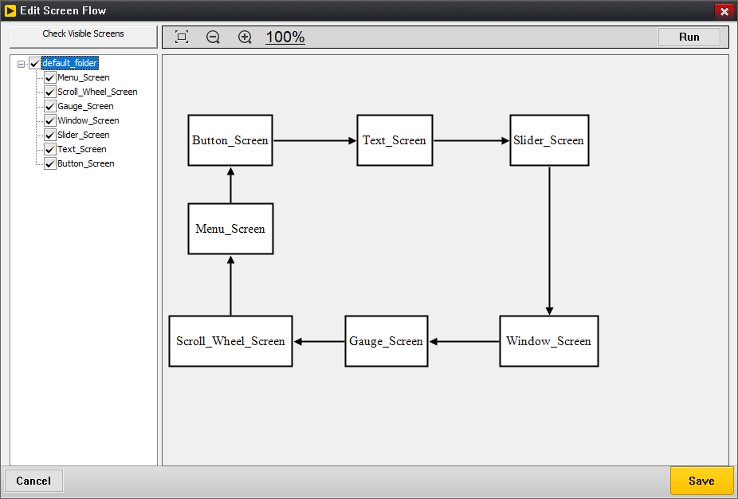
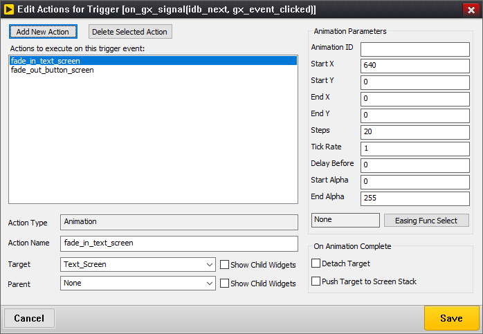

# Chapter 7: Defining Screen Flow

GUIX Studio supports automatic generation and execution of screen transition logic. The user defines the screen transition logic by creating and editing a graphical screen flow diagram. When a screen flow diagram is added to the project, it enables two important features: 1) The application can be executed from within the Studio environment and 2) Studio automatically generates event handlers and screen transition logic to implement the designated screen flow within the generated specifications.c file, removing this burden from the application program. 

Running the application on your desktop from within the Studio environment is a handy feature which saves time in that you are not required to go through a compile/link cycle to execute your application. There are of course limitations to what can be done without compiling the application. Custom drawing functions, custom event handlers, and complex event handling are not available when running the application from within the GUIX Studio environment. Still, this capability allows you to auto-generate screen transition logic, and program animations to be executed to transition from one screen to another. These effects and animations can be observed directly from within the GUIX Studio environment.

Note that when you define screen flow, triggers, and actions which we will describe in the following paragraphs, you are not only enabling the execution of your UI from within the Studio environment, but you are also enabling GUIX Studio to generate logic within your specifications file that will handle events and take actions based on those events, such as transitioning from one screen to another.

## Configuring Screen Flow

Before an application can be executed from within the Studio environment a few things must be defined. First, the top level screen or screens that should be displayed at program startup must be indicated by selecting the "Visible at Startup" property in the Studio properties view. This flag indicates that this screen should initially be displayed when the program starts. More than one screen can have this designation if desired.

After defining the screen(s) which are visible at startup, the user can define how the UI application will flow from screen to screen. GUIX Studio provides a graphical screen flow diagram to define screen transition logic. Simply select the menu selection ***Configure, Screen Flow*** to bring up screen flow edit dialog, see the screen shot in ***Figure 30***.

**Figure 30**

Each top-level screen defined in the project will be shown as a box showing the screen name. This box is a placeholder representing each top-level screen defined in the project. These boxes can be moved and resized as desired. When a transition from one top-level screen to another has been defined, a connection line with an arrow head between two screens will be shown to indicate transitions from one screen to another.

The tree view in left-side of the screen-flow diagram shows each top-level screen and you are able to select which top-level screens should be drawn in the screen-flow diagram.

The screen-flow diagram is scrollable. You are able to drag any screen block down and right outside the visible area to enlarge the scrollable window. Once your scrollable window is enlarged, you are able to zoom out to make it fit the visible area by scrolling the mouse wheel down. If the scrollable window is zoomed out, you are able to make it big enough to hold all of blocks by scrolling the mouse wheel up.

To define transitions for a screen, right click on the placeholder for that screen to bring up a Edit Trigger List dialog, see ***Figure 31***.

**Figure 31**

The trigger edit dialog list the events that the user has defined that will trigger a screen transition, which is why we call these events triggers. Triggers are normally signals generated by one or more child widgets of the selected screen.

To define a new trigger, select the ***Add New Trigger*** button in the Edit Trigger List  dialog to bring up Add Trigger dialog shown in ***Figure 32***.

**Figure 32**

You are able to define the event type that will trigger a new set of actions, and define the actions that will be executed when that trigger event is received.

Once you define the event type that you want to use to trigger a new animation screen transition, save this new trigger and it will be displayed in the Edit Trigger List dialog.

You can modify this event (without modifying the related actions to be taken) by selecting the event in the Edit Trigger List dialog and selecting the ***Edit Trigger Event*** button.

Likewise, you can remove any trigger event from the list by selecting the event and clicking on the ***Delete Selected Trigger*** button.

To specify the animation or screen transition that should occur based on a particular trigger event, select that trigger event and click the ***Edit Action(s)*** button. Note that you can fire off more than one action based on each defined trigger.

The **Edit Action(s)** button brings up the Edit Actions for Trigger dialog, shown in Figure 33: 

**Figure 33**

This dialog allows you to define any number of actions to implement based on this trigger event. You can give each action a meaningful name to help you associate each action definition with a visual animation or transition. In the example above, we defined two actions named "fade_in_text_screen" and "fade_out_button_screen".

The define a new action to implement, click the Add New Action button, which brings up the Select Action dialog, Figure 34:

**Figure 34**

Available action types include:

- **Animation**: Start an animation with specified information.
- **Attach**: Attach the target screen to the parent screen, if the parent screen is not specified, the target screen will be attached to the root window.
- **Detach**: Detach the target screen from its parent.
- **Hide**: Hide the target screen.
- **Screen Stack Pop**: Pop a screen from the internal screen stack.
- **Screen Stack Push**: Push a screen pointer to the internal screen stack.
- **Screen Stack Reset**: Remove all screen pointers from the internal screen stack.
- **Show**: Show the target screen.
- **Toggle**: Attach the target screen to the current screen's parent, and detach the current screen from its parent.
- **Window Execute**: Modally executes the target screen.
- **Window Execute Stop**: Exit modally execution of the current screen.

Once you have defined an action to take based on the selected trigger event, that action will be displayed in the Edit Actions for Trigger dialog. You can select this action to modify the parameters of that action as shown in Figure 35.

**Figure 35**

If the action type is an animation, a set of animation parameters are displayed on the right to allow you to define a slide and/or fade type animation to be executed. When an animation action is completed, you can also determine if the animation should be automatically detached from it's parent and/or pushed to the internal screen stack, which is often useful when defining multi-layer menu systems.

For slide and fade animations, you can also define the Easing Function to use by Selecting the Easing Func Select button. Easing functions are various curves designed to more closely mimic real life movement events. Selecting this button brings up the **Select Easing Function** dialog, Figure 36:

**Figure 36**

If you are defining multiple actions to associate with one trigger event, it can be useful to assign each action a meaningful name. Action names must follow C syntax naming rules, as these names will be used within the generated specifications file to define event and action tables.

When you define trigger events and actions within GUIX Studio, automated event handlers are generated within your project specifications file to handle these events and execute the specified actions. This means that you do NOT need to handle these events in your application code, although the trigger events are still passed to any custom event handlers you have defined. In other words the Studio generated event handlers augment, rather than replace, your own custom event handlers.

## Running the Application

Once startup screens and a screen flow diagram have been created, you can run your application within Studio by selecting the "Run Application"

button on the toolbar, selecting Edit | Run Application from the project menu, or by selecting the Run button at the bottom of the Edit Screen Flow dialog.

When you run the application, you will see the screen(s) you have designated as "Visible At Startup" display within a new window. The child widgets on these screen are fully operational. You can click on buttons, operate sliders and scroll wheels, etc.. If you have defined custom drawing functions or customer event handling for any of these widgets, you will of course NOT see this when running the application in this mode. But if you have defined a screen flow diagram with trigger events and actions, those triggers will be operational and your screens will transition as you have defined, including any animations that you may have defined.
