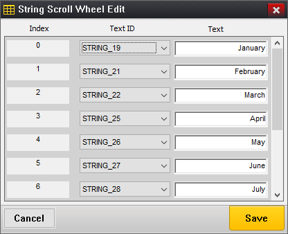
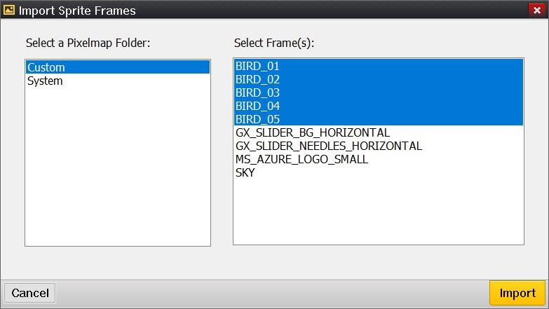

# Chapter 8: Notes on Editing Specific Widget Types

GUIX Studio allows the user to easily create and modify GUIX widgets that will compose the application UI screens. Most of these editing methods are intuitive and obvious. For example, to resize a widget you can select the widget with the mouse and drag the widget borders. You can also directly type into the left/top/width/height property fields of the selected widget.

Certain widget types require a more advanced editing process, because these widgets are themselves a bit more sophisticated in their feature support.

This chapter provides notes on the more advanced editing features for these more complex widget types. These notes will expand as the features of GUIX Studio advance along with the widget types provided within the GUIX library.

## Rich Text View

This widget is used to display rich text that supports inline text formatting codes. These formatting codes include bold, italic, and several others. To begin, right-click on the selected parent from the *Project View* or *Target View* and select menu **Insert/Text/Rich Text View** to insert a rich text view widget.

In addition to the standard set of properties supported by all widget types, the Rich Text View widget type supports additional properties.

### Additional Properties

| Property | Meaning |
|----------|---------|
| Text Align | Default text alignment |
| Normal Font| Default text font |
| Bold Font  | Text font for text tagged as bold |
| Italic Font| Text font for text tagged as italic|
| Bold Italic Font| Text font for text tagged as bold and italic |
| Private Text Copy | Should be checked if the widget is to keep its own private copy of any text assigned |
| Whitespace | Width of margin between the widget and the displayed text, in pixels. |
| Line Space | Space between two lines of the text, in pixels. |
|||

### The Rich Text formatting codes

The following format codes are supported for text formatting.

|Tag|Meaning|
|---|---|
|\<b>\</b> | Render text font with user specified bold font ID|
|\<i>\</i> | Render text font with user specified italic font ID|
|\<u>\</u> | Render underlined text|
|\<f GX_FONT_ID>\</f> | Render text using the specified font ID. |
|\<c GX_COLOR_ID>\</c> | Render text using the specified color ID|
|\<hc GX_COLOR_ID>\</hc> | Render text using the specified background color ID|
|\<align left/right/center>\</align> | Assign text alignment|
|||

There are two ways to edit the rich text string from within GUIX Studio:

- Use the Edit Rich Text dialog, which is the recommended and simplest editing method.
- Use the String Table Editor dialog, which allows you to manually insert the formatting tags shown in the preceding table.

After selecting a Rich Text View widget in the *Target View*, select the **Edit Rich Text** button in the *Properties View* to invoke the  rich text edit dialog, shown in Figure 8.1.

**Figure 8.1**

The left pane is the rich text edit field. You can use the toolbar icons to help insert tags you require. Select any block of text in the edit field, and then select the toolbar buttons to apply the required styles and colors to the selected text block. The Edit Rich Text dialog is an easy way to insert the formatting codes into the test string. You can also insert these tags manually or even generate them at runtime if needed.

The Right pane is the widget preview to show how the text is rendered in the target view. The background color of the widget preview is fixed, which may not match the widget's assigned background color in the target view.

Resource ID names are used in rich text to reference specific font or color resources. If the resource name of a font or color is changed after it has been referenced by the rich text string, GUIX Studio will automatically update the rich text string to reflect the resource name changes. On the other hand if you delete a font or color resource that is referenced by a rich text widget, you must edit the affected rich text manually to remove or change the resource ID names that have been deleted.

When you select the Save button in this dialog, the rich text string you have defined is added to the project string table.

## String Scroll Wheel

A string scroll wheel widget supports the display of an array of strings. These strings may be dynamically assigned, or, in the case that the application supports multiple languages, the assigned strings can be pulled from the active string table.

The string scroll wheel widget supports an array of strings. The String Scroll Wheel Edit dialog, shown in Figure 8.2, is provided to allow the user to assign this array of strings.

**Figure 8.2**

To invoke this dialog, select a string scroll wheel widget within the *Target View* or the *Project View*. Once this widget type is selected, the *Properties View* will include an **Edit Strings** button. Select this button to invoke the String Scroll Wheel Edit dialog.

To assign a string for each text index, you can either select a string ID from the drop-down list, or you can type a new string value in the Text field on the right. When you are done with your changes, any new or modified strings are saved to the active string table.

## Sprite

A sprite widget is used to display a sequence of images to provide an animation effect. A sprite widget requires a frame list, which is an array of image IDs and unique parameters applied to each image in the frame. To build this frame list for the sprite widget the Edit Sprite Frames dialog, shown in figure 8.3, is provided:

**Figure 8.3**

To invoke this dialog, select a sprite widget within the *Target View* or the *Project View*. Once this widget type is selected, the *Properties View* will include an **Edit Framelist** button. Select this button to invoke the Edit Sprite Frames dialog.

The *Total number of Sprite Frames* field is an input field allowing you to enter the integer total number of frames to be displayed by the sprite widget. Images can be reused within the frame list, meaning not every image must be unique.

The *Import Frames* button allows you to import a bunch of frames from pixelmap folders. Figure 8.4 shows the **Import Sprite Frames** dialog. You can select a folder from left, and then choose pixelmaps you'd like to import in the right.

**Figure 8.4**

The *Sprite Frame ID* field is a frame index selection value that ranges from 1 to Total number of Frames. Increment and Decrement this value to move from one sprite frame to the next.

The  *Apply to All Frames* option applies frame property changes to all the sprite frames.

Each sprite frame has several parameters. The first is the Background Operation. This field mimics the capabilities of the popular GIF animation format. The choices here include:

- No Operation, which means the current frame image is drawn over the previous frame image.
- Restore First Pixel-map, which means the index 1 pixel-map is drawn before the current pixel-map and
- Solid Color Fill, which means the sprite background is filled with the sprite background color before the current frame is drawn.

The *Pixel-map ID* field allows you to select any pixel-map previously added to the project resources. The same pixel-map ID can be used for multiple frames. For example your sprite animation might utilize movement of the image (using the x and y offset fields) instead of or in addition to using different sprite images.

The *Alpha value* field is applied to the entire pixel-map drawing. This field only has an effect when running at 8 bpp color depth and higher. Alpha value 0 is fully transparent, and alpha value 255 is opaque.

You can specify an offset within the sprite frame at which the current pixel-map will be drawn using the Frame x-offset and Frame y-offset fields. In other words, each image drawn does not have to be the full size of the sprite widget.

The Delay period specifies the time to delay before moving to the next sprite frame. This value is in ticks, which for the default GUIX/ThreadX timer configuration each tick represents 50 ms.

When you save your changes in the Edit Sprite Frames dialog, GUIX Studio is able to generate the complete frame list array as part of the output specifications file generation.

### Assign a sprite widget with GIF resource
You can add a GIF resource to **Pixelmap** resource group and assign the GIF resource to the sprite widget directly. After GIF resource is set, a frame list will be automatically generated, you can further edit each frame of the frame list through the sprite edit dialog:

**Figure 8.5**