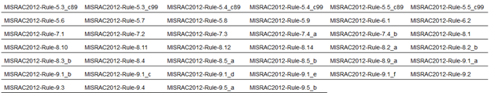
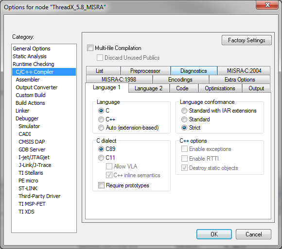

# Appendix E - ThreadX SMP MISRA C compliance

## MISRA C Overview

MISRA C is a set of programming guidelines for critical systems using
the C programming language. The original MISRA C guidelines were
primarily targeted toward automotive applications, however, MISRA C is
now widely recognized as being applicable to any safety critical
application. MISRA-C:2004 consists of 142 rules (122 are "required"
while 20 are "advisory"). MISRA C:2012 consists of 143 rules of varying
importance and 16 directives. ThreadX is compliant with all "required"
and "mandatory" rules of MISRA-C:2004 and MISRA C:2012. ThreadX is also
compliant with all but two "advisory" rules.

ThreadX SMP has nearly the same compliance, however, there are a two
"required" rule exceptions specific to ThreadX SMP implementation. These
are of low priority and are necessary for the reuse of the standard
ThreadX code base.

### Enabling ThreadX SMP MISRA Compliance

Full MISRA compliance is achieved by building the ThreadX SMP library
with **_TX_MISRA_ENABLE_** defined.

It is important to note that **_TX_MISRA_ENABLE_** must be defined on
the command line or within project settings of the IDE, i.e., it isn't
sufficient for this to be defined in **_tx_port.h_** or **_tx_user.h_**.
All other defines can be added to the header files. It's also important
that **_TX_INLINE_INITIALIZATION_** must not be defined. By default,
this is defined in most distribution's **_tx_port.h_** file.

> **Note:** Some versions of ThreadX SMP might require changes to project and/or **_tx_port.h_**. Please see the end of this document for additional information.

### MISRA High-Level Compliance

There are several areas in MISRA C:2012 that are not easily determined
by static analysis tools such as IAR's C-STAT. These areas are addressed
in this section, as follows:

|Directive|ThreadX SMP Compliance Support|
|---------|------------------------------|
|Dir 1.1|IEC 61508 certification indicates this directive is met.|
|Dir 3.1|IEC 61508 certification indicates this directive is met.|
|Dir 4.1|IEC 61508 certification indicates this directive is met.|
|Dir 4.2|There are eight assembly language files – each effectively a function in size – comprising a typical ThreadX SMP port. The assembly files are:  **_txinitialize_low_level.s_** **_txthread_context_save.s_** **_txthread_context_restore.s_** **_txthread_interrupt_control.s_** **_txthread_schedule.s_** **_txthread_smp_core_get.s_** **_txthread_smp_core_preempt.s_** **_txthread_smp_current_state_get.s_** **_txthread_smp_current_thread_get.s_** **_txthread_smp_initialize_wait.s_** **_txthread_smp_low_level_initialize.s_** **_txthread_smp_protect.s_** **_txthread_smp_time_get.s_** **_txthread_smp_unprotect.s_** **_txthread_stack_build.s_** **_txthread_system_return.s_** **_txtimer_interrupt.s_**  When **_TX_MISRA_ENABLE_** is used to build the ThreadX SMP library, another assembly file **_tx_misra.s_** is present that encapsulates all pointer arithmetic/manipulation.|

### ThreadX SMP MISRA Exceptions

ThreadX SMP conforms with almost all "required" and "mandatory"
MISRA-C:2004 and MISRA C:2012 rules/directives. The only exceptions to
this are several "advisory" and "lower priority" required
rules/directives, as follows:

**MISRA Exception(s):**

MISRA-C:2004 5.6 (advisory)  
MISRA C:2012 Dir 4.5 (advisory)

**_"No identifier in one name space should have the same spelling as an identifier in another name space, with the exception of structure member and union member names."_**

There are handful of structure member names associated with the notify callbacks that are the same in their first 31 characters. In addition, there are macro parameters that are problematic with regard to this directive.

MISRA C:2012 Dir 5.1 (Required)

**_"External identifiers shall be distinct. This is a link analysis check."_**

Several global variables are the same in their first 31 characters.

MISRA-C:2004 16.7 (advisory)

**_"A pointer parameter in a function prototype should be declared as pointer to const if the pointer is not used to modify the addressed object."_**

ThreadX SMP has an established API from before this MISRA rule so changing this in the ThreadX SMP API is not practical. In addition, some services in ThreadX SMP are conditionally enabled or disabled and therefore some cases supplied pointers to the API are not used to modify the addressed object.

MISRA-C:2004 19.7 (advisory)  
MISRA C:2012 4.9 (advisory)

**_"A function should be used in preference to a function-like macro."_**

ThreadX SMP uses function-like macros to make the ThreadX SMP code base
more portable across the many different processors that are supported by
ThreadX SMP.

MISRA C:2012 Dir-4.6_b (advisory)

**_"typedefs that indicate size and signedness should be used in place of the basic numerical types."_**

ThreadX SMP uses basic typedefs without sign or size information, such as UINT and ULONG.

MISRA C:2012 Dir-4.8 (advisory)

**_"If a pointer to a structure or union is never dereference within a translation unit, then the implementation of the object should be hidden."_**

ThreadX SMP objects have a structure name and a typedef name. Since the structure name is not used directly by the ThreadX SMP code, this advisory directive is not met.

MISRA C:2012 2.3 (advisory)

**_"A project should not contain unused type declarations."_**

ThreadX SMP defines a few typedefs that are not used in the standard ThreadX SMP configuration, but are used in some configurations and in the middleware supported by ThreadX SMP.

MISRA C:2012 2.4 (advisory)

"**_A project should not contain unused tag declarations_**."

ThreadX SMP uses some structures only once while defining a typedef.

MISRA C:2012 2.5 (advisory)

**_"A project should not contain unused macro declarations."_**

ThreadX SMP defines a few typedefs that are not used in the standard ThreadX SMP configuration, but are used in some configurations and in the middleware supported by ThreadX SMP.

MISRA C:2012 2.7 (advisory)

**_"There should be no unused parameters in functions."_**

By default, ThreadX SMP conforms to this advisory rule. However, when ThreadX is built with **_TX_DISABLE_NOTIFY_CALLBACKS_**, Four functions in the ThreadX SMP library are flagged as not meeting this advisory rule, as follows:

**_tx_event_flags_set_notify.c  
tx_queue_send_notify.c  
tx_semaphore_put_notify.c  
tx_thread_entry_exit_notify.c_**

In addition, when **_TX_TIMER_PROCESS_IN_ISR_** is defined, the file **_tx_timer_thread_entry.c_** is flagged as not meeting this advisory rule.

MISRA C:2012 3.1 (required)

**_"The character sequences /\* and // shall not be used within a comment."_**

"//" is used in the copyright as part of the URL. 

MISRA C:2012 8.7 (advisory)

**_"Functions and objects should not be defined with external linkage if they are referenced in only one translation unit."_**

Internal functions and variables in ThreadX SMP are not always referenced from more than one external translation unit.

MISRA C:2012 8.9_b (advisory)

**_"An object should be defined at block scope if its identifier only appears in a single function."_**

Some global data elements of ThreadX SMP are only referenced in one function, necessitating an exception to this rule.

MISRA C:2012 8.13 (advisory)

**_"A pointer should point to a const-qualified type whenever
possible."_**

The ThreadX SMP API has input parameters that are not modified but the
pointer does not have the const qualifier.

MISRA C:2012 17.8 (advisory)

**_"A function parameter should not be modified."_**

In several files the input parameter to a ThreadX SMP API is used as a
local variable within the API itself. There are no side effects since
in C the parameters are passed as value.

MISRA-C:2004 20.1 (required, low priority)  
MISRA C:2012 21.1

"**Reserved identifiers, macros and functions in the standard library,
shall not be defined, redefined or undefined**"

ThreadX SMP utilizes much of the field proven ThreadX single core
source code. However, to enable the reuse, macros are used to replace
data structures specific to each core with function calls or an array
indexed by core, like the following:

Technically, this isn't replacing a reserved identifier, but the
MISRA-C:2004 specification indicates that anything with an underscore
cannot be redefined.

MISRA C:2012 5.2 (required, low priority)

"**Identifiers declared in the same scope and name space shall be
distinct**"

This is the same situation as the previous issue, the macro
re-definition of **_"\_tx_thread_system_state_**" matches the default
definition of the actual data structure, which is expected since
ThreadX SMP needs to override the standard, single core data structure
usage.

MISRA C:2012 18.1 (required)

"**_A pointer resulting from arithmetic on a pointer operand shall
address an element of the same array as that pointer operand_**."

C-STAT generates six messages when building the Thread SMP library,
however, these are all false positives, i.e., this version of C-STAT
is erroneously reporting this error.

### MISRA C Verification Tools

ThreadX SMP MISRA compliance is verified using the IAR EWARM 8.11.1
C-STAT 1.4.4 MISRA-C:2004 and MISRA C:2012. The following figures show
the MISRA C rules checked by C-STAT (and should also serve as a
compliance matrix):

**Figure 1: MISRA-C:2004/MISRA C:2012 Compliance Matrix**

### Building ThreadX SMP Without TX_MISRA_ENABLE

Building ThreadX SMP without **_TX_MISRA_ENABLE_** has significant
run-time performance advantages and is the default (and recommended)
configuration for ThreadX SMP. When building in this manner, there are
several mandatory MISRA C rules that are not met, including the
following:

- **MISRA-C:2004** - 8.5a, 10.1a, 11.3, 12.13, 13.2d, 14.7, 17.4a
- **MISRA C:2012** - 10.3, 11.4, 13.3, 14.4d, 15.5, 17.7

### Additional Project and/or tx_port.h Requirements

Some versions of ThreadX SMP may need additional configuration to
achieve full MISRA compliance. In addition to building ThreadX SMP with
**_TX_MISRA_ENABLE_**, the ThreadX project should have the C dialect C89
specified and strict language conformance selected, as follows:

Next, if the version of ThreadX does not have a pre-built
**_tx_misra.s_** assembly file, the **_tx_misra.c_** file should be
compiled to assembly and the assembly file should be included in the
project.

Finally, **_tx_port.h_** should have the following changes for full
MISRA compliance:

1. The following defines should be present in **_tx_port.h_** or in the project settings:

   \#define TX_BLOCK_POOL_ENABLE_PERFORMANCE_INFO  
   \#define TX_BYTE_POOL_ENABLE_PERFORMANCE_INFO  
   \#define TX_EVENT_FLAGS_ENABLE_PERFORMANCE_INFO  
   \#define TX_MUTEX_ENABLE_PERFORMANCE_INFO  
   \#define TX_QUEUE_ENABLE_PERFORMANCE_INFO  
   \#define TX_SEMAPHORE_ENABLE_PERFORMANCE_INFO  
   \#define TX_THREAD_ENABLE_PERFORMANCE_INFO  
   \#define TX_TIMER_ENABLE_PERFORMANCE_INFO

2. The TX_DISABLE_NOTIFY_CALLBACKS should NOT be defined in **_tx_port.h_** or in the project settings.

3. TX_DISABLE_INLINE should be defined to disable the in-line helper functions in ThreadX SMP.

4. The trace timer source should be redefined as follows:

   \#ifndef TX_MISRA_ENABLE  
   \#ifndef TX_TRACE_TIME_SOURCE  
   \#define TX_TRACE_TIME_SOURCE /\* ORIGINAL SOURCE \*/  
   \#endif  
   \#else  
   ULONG \_tx_misra_time_stamp_get(VOID);  
   \#define TX_TRACE_TIME_SOURCE \_tx_misra_time_stamp_get()  
   \#endif

5. Change the in-line initialization option to (this also disables in-line assembly macros):

   \#ifdef TX_MISRA_ENABLE  
   \#define TX_DISABLE_INLINE  
   \#else  
   \#define TX_INLINE_INITIALIZATION  
   \#endif

6. Ensure that the disable stack checking option is disabled:
   \#ifndef TX_MISRA_ENABLE  
   \#ifdef TX_ENABLE_STACK_CHECKING  
   \#undef TX_DISABLE_STACK_FILLING  
   \#endif  
   \#endif
