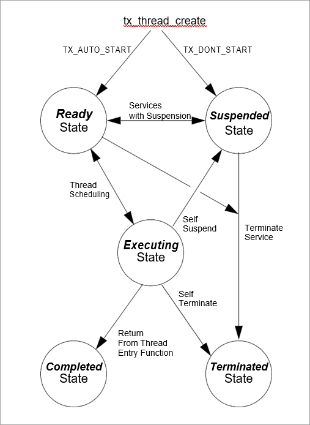

# Chapter 3 - Functional Components of ThreadX

This chapter contains a description of the high-performance ThreadX kernel from a functional perspective. Each functional component is presented in an easy-to-understand manner.

## Execution Overview

There are four types of program execution within a ThreadX application: Initialization, Thread Execution, Interrupt Service Routines (ISRs), and Application Timers.

Figure 2 shows each different type of program execution. More detailed information about each of these types is found in subsequent sections of this chapter.

### Initialization

As the name implies, this is the first type of program execution in a ThreadX application. Initialization includes all program execution between processor reset and the entry point of the *thread scheduling loop.*

### Thread Execution

After initialization is complete, ThreadX enters its thread scheduling loop. The scheduling loop looks for an application thread ready for execution. When a ready thread is found, ThreadX transfers control to it. After the thread is finished (or another higher-priority thread becomes ready), execution transfers back to the thread scheduling loop to find the next highest priority ready thread.

This process of continually executing and scheduling threads is the most common type of program execution in ThreadX applications.

### Interrupt Service Routines (ISR)

Interrupts are the cornerstone of real-time systems. Without interrupts it would be extremely difficult to respond to changes in the external world in a timely manner. On detection of an interrupt, the processor saves key information about the current program execution (usually on the stack), then transfers control to a predefined program area. This predefined program area is commonly called an Interrupt Service Routine. In most cases, interrupts occur during thread execution (or in the thread scheduling loop). However, interrupts may also occur inside of an executing ISR or an Application Timer.


**FIGURE 2. Types of Program Execution**

### Application Timers

Application Timers are similar to ISRs, except the hardware implementation (usually a single periodic hardware interrupt is used) is hidden from the application. Such timers are used by
applications to perform time-outs, periodics, and/or watchdog services. Just like ISRs, Application Timers most often interrupt thread execution. Unlike ISRs, however, Application Timers cannot interrupt each other.

## Memory Usage

ThreadX resides along with the application program. As a result, the static memory (or fixed memory) usage of ThreadX is determined by the development tools; e.g., the
compiler, linker, and locator. Dynamic memory (or run-time memory) usage is under direct control of the application.

### Static Memory Usage

Most of the development tools divide the application program image into five basic areas: *instruction*, *constant*, *initialized data*, *uninitialized data*, and *system
stack*. Figure 3 shows an example of these memory areas.

It is important to understand that this is only an example. The actual static memory layout is specific to the processor, development tools, and the underlying hardware.

The instruction area contains all of the program's processor instructions. This area is typically the largest and is often located in ROM.

The constant area contains various compiled constants, including strings defined or referenced within the program. In addition, this area contains the "initial copy" of the initialized data area. During the *Memory Usage* compiler's initialization process, this portion of the constant area is used to set up the initialized data area in RAM. The constant area usually follows the instruction area and is often located in ROM.

The initialized data and uninitialized data areas contain all of the global and static variables. These areas are always located in RAM.

The system stack is generally set up immediately following the initialized and uninitialized data areas.

The system stack is used by the compiler during initialization, then by ThreadX during initialization and, subsequently, in ISR processing.


**FIGURE 3. Memory Area Example**

### Dynamic Memory Usage

As mentioned before, dynamic memory usage is under direct control of the application. Control blocks and memory areas associated with stacks, queues, and memory pools can be placed anywhere in the target's memory space. This is an important feature because it facilitates easy utilization of different types of physical memory.

For example, suppose a target hardware environment has both fast memory and slow memory. If the application needs extra performance for a high-priority thread, its control block
(TX_THREAD) and stack can be placed in the fast memory area, which may greatly enhance its performance.

## Initialization

Understanding the initialization process is important. The initial hardware environment is set up here. In addition, this is where the application is given its initial personality.

> **Note:** *ThreadX attempts to utilize (whenever possible) the complete development tool's initialization process. This makes it easier to upgrade to new versions of the development tools in the future.*

### System Reset Vector

All microprocessors have reset logic. When a reset occurs (either hardware or software), the address of the application's entry point is retrieved from a specific memory location. After the entry point is retrieved, the processor transfers control to that location. The application entry point is quite often written in the native assembly language and is usually supplied by the development tools (at least in template form). In some cases, a special version of the entry program is supplied with ThreadX.

### Development Tool Initialization

After the low-level initialization is complete, control transfers to the development tool's high-level initialization. This is usually the place where initialized global and static C variables are set up. Remember their initial values are retrieved from the constant area. Exact initialization processing is development tool specific.

### main Function

When the development tool initialization is complete, control transfers to the user-supplied *main* function. At this point, the application controls what happens next. For most applications, the main function simply calls *tx_kernel_enter*, which is the entry into ThreadX. However, applications can perform preliminary processing (usually for hardware initialization) prior to entering ThreadX.

> **Important:** *The call to tx_kernel_enter does not return, so do not place any processing after it.*

### tx_kernel_enter

The entry function coordinates initialization of various internal ThreadX data structures and then calls the application's definition function ***tx_application_define***.

When ***tx_application_define*** returns, control is transferred to the thread scheduling loop. This marks the end of initialization.

### Application Definition Function

The ***tx_application_define*** function defines all of the initial application threads, queues, semaphores, mutexes, event flags, memory pools, and timers. It is also possible to create and delete system resources from threads during the normal operation of the application. However, all initial application resources are defined here.

The ***tx_application_define*** function has a single input parameter and it is certainly worth mentioning. The *first-available* RAM address is the sole input parameter to this function. It is typically used as a starting point for initial run-time memory allocations of thread stacks, queues, and memory pools.

> **Note:** *After initialization is complete, only an executing thread can create and delete system resources— including other threads. Therefore, at least one thread must be created during initialization.*

### Interrupts

Interrupts are left disabled during the entire initialization process. If the application somehow enables interrupts, unpredictable behavior may occur. Figure 4 shows the entire
initialization process, from system reset through application-specific initialization.

## Thread Execution

Scheduling and executing application threads is the most important activity of ThreadX. A thread is typically defined as a semi-independent program segment with a dedicated purpose. The
combined processing of all threads makes an application.

Threads are created dynamically by calling ***tx_thread_create*** during initialization or during thread execution. Threads are created in either a *ready* or *suspended* state.


**FIGURE 4. Initialization Process**

### Thread Execution States

Understanding the different processing states of threads is a key ingredient to understanding the entire multithreaded environment. In ThreadX there are five distinct thread states:
*ready*, *suspended*, *executing*, *terminated*, and *completed*. Figure 5 shows the thread state transition diagram for ThreadX.



**FIGURE 5. Thread State Transition**

A thread is in a *ready* state when it is ready for execution. A ready thread is not executed until it is the highest priority thread in ready state. When this happens, ThreadX executes the thread, which then changes its state to *executing*.

If a higher-priority thread becomes ready, the executing thread reverts back to a *ready* state. The newly ready high-priority thread is then executed, which changes its logical state to *executing*. This transition between *ready* and *executing* states occurs every time thread preemption occurs.

At any given moment, only one thread is in an *executing* state. This is because a thread in the *executing* state has control of the underlying processor.

Threads in a *suspended* state are not eligible for execution. Reasons for being in a *suspended* state include suspension for time, queue messages, semaphores, mutexes, event flags, memory, and basic thread suspension. After the cause for suspension is removed, the thread is placed back in a *ready* state.

A thread in a *completed* state is a thread that has completed its processing and returned from its entry function. The entry function is specified during thread creation. A thread in a *completed* state cannot execute again.

A thread is in a *terminated* state because another thread or the thread itself called the *tx_thread_terminate* service. A thread in a *terminated* state cannot execute again.

> **Important:** *If re-starting a completed or terminated thread is desired, the application must first delete the thread. It can then be re-created and re-started.*

### Thread Entry/Exit Notification

Some applications may find it advantageous to be notified when a specific thread is entered for the first time, when it completes, or is terminated. ThreadX provides this ability through the ***tx_thread_entry_exit_notify*** service. This service registers an application notification function for a specific thread, which is called by ThreadX whenever the thread starts running, completes, or is terminated. After being invoked, the application notification function can perform the application-specific processing. This typically involves informing another application thread of the event via a ThreadX synchronization primitive.

### Thread Priorities

As mentioned before, a thread is a semi-independent program segment with a dedicated purpose. However, all threads are not created equal! The dedicated purpose of some threads is much more important than others. This heterogeneous type of thread importance is a hallmark of embedded realtime applications.

ThreadX determines a thread's importance when the thread is created by assigning a numerical value representing its *priority*. The maximum number of ThreadX priorities is configurable from 32 through 1024 in increments of 32. The actual maximum number of priorities is determined by the **TX_MAX_PRIORITIES** constant during compilation of the ThreadX library. Having a larger number of priorities does not significantly increase processing overhead. However, for each group of 32 priority levels an additional 128 bytes of RAM is required to manage them. For example, 32 priority levels require 128 bytes of RAM, 64 priority levels require 256 bytes of RAM, and 96 priority levels requires 384 bytes of RAM.

By default, ThreadX has 32 priority levels, ranging from priority 0 through priority 31. Numerically smaller values imply higher priority. Hence, priority 0 represents the highest priority, while priority (**TX_MAX_PRIORITIES**-1) represents the lowest priority.

Multiple threads can have the same priority relying on cooperative scheduling or time-slicing. In addition, thread priorities can be changed during run-time.

### Thread Scheduling

ThreadX schedules threads based on their priority. The ready thread with the highest priority is executed first. If multiple threads of the same priority are ready, they are executed in a *first-in-first-out* (FIFO) manner.

### Round-robin Scheduling

ThreadX supports *round-robin* scheduling of multiple threads having the same priority. This is accomplished through cooperative calls to ***tx_thread_relinquish***. This service gives all other ready threads of the same priority a chance to execute before the ***tx_thread_relinquish*** caller executes again.

### Time-Slicing

*Time-slicing* is another form of round-robin scheduling. A time-slice specifies the maximum number of timer ticks (timer interrupts) that a thread can execute without giving up the
processor. In ThreadX, time-slicing is available on a per-thread basis. The thread's time-slice is assigned during creation and can be modified during run-time. When a time-slice expires, all other ready threads of the same priority level are given a chance to execute before the time-sliced thread executes again.

A fresh thread time-slice is given to a thread after it suspends, relinquishes, makes a ThreadX service call that causes preemption, or is itself time-sliced.

When a time-sliced thread is preempted, it will resume before other ready threads of equal priority for the remainder of its time-slice.

> **Note:** *Using time-slicing results in a slight amount of system overhead. Because time-slicing is only useful in cases in which multiple threads share the same priority, threads having a unique priority should not be assigned a time-slice.*

### Preemption

Preemption is the process of temporarily interrupting an executing thread in favor of a higher-priority thread. This process is invisible to the executing thread. When the higher-priority thread is finished, control is transferred back to the exact place where the preemption took place. This is a very important feature in real-time systems because it facilitates fast response to important application events. Although a very important feature, preemption can also be a source of a variety of problems, including starvation, excessive overhead, and priority inversion.

### Preemption Threshold

To ease some of the inherent problems of preemption, ThreadX provides a unique and advanced feature called *preemption-threshold*.

A preemption-threshold allows a thread to specify a priority *ceiling* for disabling preemption. Threads that have higher priorities than the ceiling are still allowed to preempt, while those less than the ceiling are not allowed to preempt.

For example, suppose a thread of priority 20 only interacts with a group of threads that have priorities between 15 and 20. During its critical sections, the thread of priority 20 can set its preemption-threshold to 15, thereby preventing preemption from all of the threads that it interacts with. This still permits really important threads (priorities between 0 and 14) to preempt this thread during its critical section processing, which results in much more responsive processing.

Of course, it is still possible for a thread to disable all preemption by setting its preemption-threshold to 0. In addition, preemption-threshold can be changed during run-time.

> **Note:** *Using preemption-threshold disables time-slicing for the specified thread.*

### Priority Inheritance

ThreadX also supports optional priority inheritance within its mutex services described later in this chapter. Priority inheritance allows a lower priority thread to temporarily assume the priority of a high priority thread that is waiting for a mutex owned by the lower priority thread. This capability helps the application to avoid nondeterministic priority inversion by eliminating preemption of intermediate thread priorities. Of course, *preemption-threshold* may be used to achieve a similar result.

### Thread Creation

Application threads are created during initialization or during the execution of other application threads. There is no limit on the number of threads that can be created by an application.

### Thread Control Block TX_THREAD

The characteristics of each thread are contained in its control block. This structure is defined in the ***tx_api.h*** file.

A thread's control block can be located anywhere in memory, but it is most common to make the control block a global structure by defining it outside the scope of any function.

Locating the control block in other areas requires a bit more care, just like all dynamically-allocated memory. If a control block is allocated within a C function, the memory associated with it is part of the calling thread's stack. In general, avoid using local storage for control blocks because after the function returns, all of its local variable stack space is released—regardless of whether another thread is using it for a control block.

In most cases, the application is oblivious to the contents of the thread's control block. However, there are some situations, especially during debug, in which looking at certain members is useful. The following are some of the more useful control block members.

**tx_thread_run_count** contains a counter of the number of many times the thread has been scheduled. An increasing counter indicates the thread is being scheduled and executed.

**tx_thread_state** contains the state of the associated thread. The following lists the possible thread states.

|  Thread state   | Value |
| --------------- | ------ |
| TX_READY       | (0x00) |
| TX_COMPLETED   | (0x01) |
| TX_TERMINATED  | (0x02) |
| TX_SUSPENDED   | (0x03) |
| TX_SLEEP       | (0x04) |
| TX_QUEUE_SUSP | (0x05) |
| TX_SEMAPHORE_SUSP | (0x06) |
| TX_EVENT_FLAG   | (0x07) |
| TX_BLOCK_MEMORY | (0x08) |
| TX_BYTE_MEMORY  | (0x09) |
| TX_MUTEX_SUSP   | (0x0D) |

> **Note:** *Of course there are many other interesting fields in the thread control block, including the stack pointer, time-slice value, priorities, etc. Users are welcome to review control block members, but modifications are strictly prohibited!*

> **Important:** *There is no equate for the "executing" state mentioned earlier in this section. It is not necessary because there is only one executing thread at a given time. The state of an executing thread is also* **TX_READY**.

### Currently Executing Thread

As mentioned before, there is only one thread executing at any given time. There are several ways to identify the executing thread, depending on which thread is making the request.
A program segment can get the control block address of the executing thread by calling ***tx_thread_identify***. This is useful in shared portions of application code that are executed from multiple threads.

In debug sessions, users can examine the internal ThreadX pointer ***_tx_thread_current_ptr***. It contains the control block address of the currently executing thread. If this pointer is NULL, no application thread is executing; i.e., ThreadX is waiting in its scheduling loop for a thread to become ready.

### Thread Stack Area

Each thread must have its own stack for saving the context of its last execution and compiler use. Most C compilers use the stack for making function calls and for temporarily allocating local variables. Figure 6 shows a typical thread's stack.

Where a thread stack is located in memory is up to the application. The stack area is specified during thread creation and can be located anywhere in the target's address space. This is an important feature because it allows applications to improve performance of important threads by placing their stack in high-speed RAM.

**Stack Memory Area** (example)


**FIGURE 6. Typical Thread Stack**

How big a stack should be is one of the most frequently asked questions about threads. A thread's stack area must be large enough to accommodate worst-case function call nesting, local variable allocation, and saving its last execution context.

The minimum stack size, **TX_MINIMUM_STACK**, is defined by ThreadX. A stack of this size supports saving a thread's context and minimum amount of function calls and local variable allocation.

For most threads, however, the minimum stack size is too small, and the user must ascertain the worst-case size requirement by examining function-call nesting and local variable allocation. Of course, it is always better to start with a larger stack area.

After the application is debugged, it is possible to tune the thread stack sizes if memory is scarce. A favorite trick is to preset all stack areas with an easily identifiable data pattern like (0xEFEF) prior to creating the threads. After the application has been thoroughly put through its paces, the stack areas can be examined to see how much stack was actually used by finding the area of the stack where the data pattern is still intact. Figure 7 shows a stack preset to 0xEFEF after thorough thread execution.

**Stack Memory Area** (another example)


**FIGURE 7. Stack Preset to 0xEFEF**

> **Important:** *By default, ThreadX initializes every byte of each thread stack with a value of 0xEF.*

### Memory Pitfalls

The stack requirements for threads can be large. Therefore, it is important to design the application to have a reasonable number of threads. Furthermore, some care must be taken to avoid excessive stack usage within threads. Recursive algorithms and large local data structures should be avoided.

In most cases, an overflowed stack causes thread execution to corrupt memory adjacent (usually before) its stack area. The results are unpredictable, but most often result in an unnatural change in the program counter. This is often called "jumping into the weeds." Of course, the only way to prevent this is to ensure all thread stacks are large enough.

### Optional Run-time Stack Checking

ThreadX provides the ability to check each thread's stack for corruption during run-time. By default, ThreadX fills every byte of thread stacks with a 0xEF data pattern during creation. If the application builds the ThreadX library with **TX_ENABLE_STACK_CHECKING** defined, ThreadX will examine each thread's stack for corruption as it is suspended or resumed. If stack corruption is detected, ThreadX will call the application's stack error handling routine as specified by the call to ***tx_thread_stack_error_notify***. Otherwise, if no stack error handler was specified, ThreadX will call the internal ***_tx_thread_stack_error_handler*** routine.

### Reentrancy

One of the real beauties of multithreading is that the same C function can be called from multiple threads. This provides great power and also helps reduce code space. However, it does require that C functions called from multiple threads are *reentrant*.

Basically, a reentrant function stores the caller's return address on the current stack and does not rely on global or static C variables that it previously set up. Most compilers place the return address on the stack. Hence, application developers must only worry about the use of *globals* and *statics*.

An example of a non-reentrant function is the string token function ***strtok*** found in the standard C library. This function "remembers" the previous string pointer on subsequent calls. It does this with a static string pointer. If this function is called from multiple threads, it would most likely return an invalid pointer.

### Thread Priority Pitfalls

Selecting thread priorities is one of the most important aspects of multithreading. It is sometimes very tempting to assign priorities based on a perceived notion of thread importance rather than determining what is exactly required during run-time. Misuse of thread priorities can starve other threads, create priority inversion, reduce processing bandwidth, and make the application's run-time behavior difficult to understand.

As mentioned before, ThreadX provides a priority-based, preemptive scheduling algorithm. Lower priority threads do not execute until there are no higher priority threads ready for execution. If a higher priority thread is always ready, the lower priority threads never execute. This condition is called *thread starvation*.

Most thread starvation problems are detected early in debug and can be solved by ensuring that higher priority threads don't execute continuously. Alternatively, logic can be added to the application that gradually raises the priority of starved threads until they get a chance to execute.

Another pitfall associated with thread priorities is *priority inversion*. Priority inversion takes place when a higher priority thread is suspended because a lower priority thread has a needed resource. Of course, in some instances it is necessary for two threads of different priority to share a common resource. If these threads are the only ones active, the priority inversion time is bounded by the time the lower priority thread holds the resource. This condition is both deterministic and quite normal. However, if threads of
intermediate priority become active during this priority inversion condition, the priority inversion time is no longer deterministic and could cause an application failure.

There are principally three distinct methods of preventing nondeterministic priority inversion in ThreadX. First, the application priority selections and run-time behavior can be designed in a manner that prevents the priority inversion problem. Second, lower priority threads can utilize *preemption threshold* to block preemption from intermediate threads
while they share resources with higher priority threads. Finally, threads using ThreadX mutex objects to protect system resources may utilize the optional mutex *priority inheritance* to eliminate nondeterministic priority inversion.

### Priority Overhead

One of the most overlooked ways to reduce overhead in multithreading is to reduce the number of context switches. As previously mentioned, a context switch occurs when execution of a higher priority thread is favored over that of the executing thread. It is worthwhile to mention that higher priority threads can become ready as a result of both external events (like
interrupts) and from service calls made by the executing thread.

To illustrate the effects thread priorities have on context switch overhead, assume a three thread environment with threads named *thread_1*, *thread_2*, and *thread_3*. Assume further that all of the threads are in a state of suspension waiting for a message. When thread_1 receives a message, it immediately forwards it to thread_2. Thread_2 then forwards the message to thread_3. Thread_3 just discards the message. After each thread processes its message, it goes back and waits for another message.

The processing required to execute these three threads varies greatly depending on their priorities. If all of the threads have the same priority, a single context switch occurs before the execution of each thread. The context switch occurs when each thread suspends on an empty message queue.

However, if thread_2 is higher priority than thread_1 and thread_3 is higher priority than thread_2, the number of context switches doubles. This is because another context switch occurs inside of the *tx_queue_send* service when it detects that a higher priority thread is now ready.

The ThreadX preemption-threshold mechanism can avoid these extra context switches and still allow the previously mentioned priority selections. This is an important feature because it allows several thread priorities during scheduling, while at the same time eliminating some of the unwanted context switching between them during thread execution.

### Run-time Thread Performance Information

ThreadX provides optional run-time thread performance information. If the ThreadX library and application is built with **TX_THREAD_ENABLE_PERFORMANCE_INFO** defined, ThreadX accumulates the following information.

Total number for the overall system:

  - thread resumptions

  - thread suspensions

  - service call preemptions

  - interrupt preemptions

  - priority inversions

  - time-slices

  - relinquishes

  - thread timeouts

  - suspension aborts

  - idle system returns

  - non-idle system returns

Total number for each thread:

  - resumptions

  - suspensions

  - service call preemptions

  - interrupt preemptions

  - priority inversions

  - time-slices

  - thread relinquishes

  - thread timeouts

  - suspension aborts

This information is available at run-time through the services ***tx_thread_performance_info_get*** and ***tx_thread_performance_system_info_get***. Thread performance information is useful in determining if the application is behaving properly. It is also useful in optimizing the application. For example, a relatively high number of service call preemptions might
suggest the thread's priority and/or preemption-threshold is too low. Furthermore, a relatively low number of idle system returns might suggest that lower priority threads are not suspending enough.

### Debugging Pitfalls

Debugging multithreaded applications is a little more difficult because the same program code can be executed from multiple threads. In such cases, a break-point alone may not be enough. The debugger must also view the current thread pointer **_tx_thread_current_ptr** using a conditional breakpoint to see if the calling thread is the one to debug.

Much of this is being handled in multithreading support packages offered through various development tool vendors. Because of its simple design, integrating ThreadX with different development tools is relatively easy.

Stack size is always an important debug topic in multithreading. Whenever unexplained behavior is observed, it is usually a good first guess to increase stack sizes for all threads—especially the stack size of the last thread to execute!

> **Tip:** *It is also a good idea to build the ThreadX library with **TX_ENABLE_STACK_CHECKING** defined. This will help isolate stack corruption problems as early in the processing as possible.*

## Message Queues

Message queues are the primary means of inter-thread communication in ThreadX. One or more messages can reside in a message queue. A message queue that holds a single message is commonly called a *mailbox*.

Messages are copied to a queue by ***tx_queue_send*** and are copied from a queue by ***tx_queue_receive***. The only exception to this is when a thread is suspended while waiting for a message on an empty queue. In this case, the next message sent to the queue is placed directly into the thread's destination area.

Each message queue is a public resource. ThreadX places no constraints on how message queues are used.

### Creating Message Queues

Message queues are created either during initialization or during run-time by application threads. There is no limit on the number of message queues in an application.

### Message Size

Each message queue supports a number of fixed-sized messages. The available message sizes are 1 through 16 32-bit words inclusive. The message size is specified when the queue is created. Application messages greater than 16 words must be passed by pointer. This is accomplished by creating a queue with a message size of 1 word (enough to hold a pointer) and then sending and receiving message pointers instead of the entire message.

### Message Queue Capacity

The number of messages a queue can hold is a function of its message size and the size of the memory area supplied during creation. The total message capacity of the queue is calculated by dividing the number of bytes in each message into the total number of bytes in the supplied memory area.

For example, if a message queue that supports a message size of 1 32-bit word (4 bytes) is created with a 100-byte memory area, its capacity is 25 messages.

### Queue Memory Area

As mentioned previously, the memory area for buffering messages is specified during queue creation. Like other memory areas in ThreadX, it can be located anywhere in the target's address space.

This is an important feature because it gives the application considerable flexibility. For example, an application might locate the memory area of an important queue in high-speed RAM to improve performance.

### Thread Suspension

Application threads can suspend while attempting to send or receive a message from a queue. Typically, thread suspension involves waiting for a message from an empty queue. However, it is also possible for a thread to suspend trying to send a message to a full queue.

After the condition for suspension is resolved, the service requested is completed and the waiting thread is resumed. If multiple threads are suspended on the same queue, they are resumed in the order they were suspended (FIFO).

However, priority resumption is also possible if the application calls ***tx_queue_prioritize*** prior to the queue service that lifts thread suspension. The queue prioritize service places the highest priority thread at the front of the suspension list, while leaving all other suspended threads in the same FIFO order.

Time-outs are also available for all queue suspensions. Basically, a time-out specifies the maximum number of timer ticks the thread will stay suspended. If a time-out occurs, the thread is resumed and the service returns with the appropriate error code.

### Queue Send Notification

Some applications may find it advantageous to be notified whenever a message is placed on a queue. ThreadX provides this ability through the ***tx_queue_send_notify*** service. This service registers the supplied application notification function with the specified queue. ThreadX will subsequently invoke this application notification function whenever a message is sent to the queue. The exact processing within the application notification function is determined by the application; however, it typically consists of resuming the appropriate thread for processing the new message.

### Queue Event chaining

The notification capabilities in ThreadX can be used to chain various synchronization events together. This is typically useful when a single thread must process multiple synchronization events.

For example, suppose a single thread is responsible for processing messages from five different queues and must also suspend when no messages are available. This is easily accomplished by registering an application notification function for each queue and introducing an additional counting semaphore. Specifically, the application notification function performs a *tx_semaphore_put* whenever it is called (the semaphore count represents the total number of messages in all five queues). The processing thread suspends on this semaphore via the
*tx_semaphore_get* service. When the semaphore is available (in this case, when a message is available!), the processing thread is resumed. It then interrogates each queue for a message, processes the found message, and performs another ***tx_semaphore_get*** to wait for the next message. Accomplishing this without event-chaining is quite difficult and likely would require more threads and/or additional application code.

In general, *event-chaining* results in fewer threads, less overhead, and smaller RAM requirements. It also provides a highly flexible mechanism to handle synchronization requirements of more complex systems.

### Run-time Queue Performance Information
ThreadX provides optional run-time queue performance information. If the ThreadX library and application is built with
***TX_QUEUE_ENABLE_PERFORMANCE_INFO*** defined, ThreadX accumulates the following information.

Total number for the overall system:

  - messages sent

  - messages received

  - queue empty suspensions

  - queue full suspensions

  - queue full error returns (suspension not specified)

  - queue timeouts

Total number for each queue:

  - messages sent

  - messages received

  - queue empty suspensions

  - queue full suspensions

  - queue full error returns (suspension not specified)

  - queue timeouts

This information is available at run-time through the services ***tx_queue_performance_info_get*** and ***tx_queue_performance_system_info_get***. Queue performance
information is useful in determining if the application is behaving properly. It is also useful in optimizing the application. For example, a relatively high number of "queue full suspensions" suggests an increase in the queue size might be beneficial.

### Queue Control Block TX_QUEUE

The characteristics of each message queue are found in its control block. It contains interesting information such as the number of messages in the queue. This structure is defined in the ***tx_api.h*** file.

Message queue control blocks can also be located anywhere in memory, but it is most common to make the control block a global structure by defining it outside the scope of any function.

### Message Destination Pitfall

As mentioned previously, messages are copied between the queue area and application data areas. It is important to ensure the destination for a received message is large enough to hold the entire message. If not, the memory following the message destination will likely be corrupted.

> **Note:** *This is especially lethal when a too-small message destination is on the stack—nothing like corrupting the return address of a function!*

## Counting Semaphores

ThreadX provides 32-bit counting semaphores that range in value between 0 and 4,294,967,295. There are two operations for counting semaphores: *tx_semaphore_get* and *tx_semaphore_put*. The get operation decreases the semaphore by one. If the semaphore is 0, the get operation is not successful. The inverse of the get operation is the put operation.
It increases the semaphore by one.

Each counting semaphore is a public resource. ThreadX places no constraints on how counting semaphores are used.

Counting semaphores are typically used for *mutual exclusion*. However, counting semaphores can also be used as a method for event notification.

### Mutual Exclusion

 Mutual exclusion pertains to controlling the access of threads to certain application areas (also called *critical sections* or *application resources*). When used for mutual exclusion, the "current count" of a semaphore represents the total number of threads that are allowed access. In most cases, counting semaphores used for mutual exclusion will have an initial value of 1, meaning that only one thread can access the associated resource at a time. Counting semaphores that only have values of 0 or 1 are commonly called *binary semaphores*.

> **Important:** *If a binary semaphore is being used, the user must prevent the same thread from performing a get operation on a semaphore it already owns. A second get would be unsuccessful and could cause indefinite suspension of the calling thread and permanent unavailability of the resource.*

### Event Notification

It is also possible to use counting semaphores as event notification, in a producer-consumer fashion. The consumer attempts to get the counting semaphore while the producer increases
the semaphore whenever something is available. Such semaphores usually have an initial value of 0 and will not increase until the producer has something ready for the consumer. Semaphores used for event notification may also benefit from use of the ***tx_semaphore_ceiling_put*** service call. This service ensures that the semaphore count never exceeds the value supplied in the call.

### Creating Counting Semaphores

Counting semaphores are created either during initialization or during run-time by application threads. The initial count of the semaphore is specified during creation. There is no limit on the number of counting semaphores in an application.

### Thread Suspension

Application threads can suspend while attempting to perform a get operation on a semaphore with a current count of 0.

After a put operation is performed, the suspended thread's get operation is performed and the thread is resumed. If multiple threads are suspended on the same counting semaphore, they are resumed in the same order they were suspended (FIFO).

However, priority resumption is also possible if the application calls ***tx_semaphore_prioritize*** prior to the semaphore put call that lifts thread suspension. The semaphore prioritize service places the highest priority thread at the front of the suspension list, while leaving all other suspended threads in the same FIFO order.

### Semaphore Put Notification

Some applications may find it advantageous to be notified whenever a semaphore is put. ThreadX provides this ability through the ***tx_semaphore_put_notify*** service. This service registers the supplied application notification function with the specified semaphore. ThreadX will subsequently invoke this application notification function whenever the semaphore is put. The exact processing within the application notification function is determined by the application; however, it typically consists of resuming the appropriate thread for processing the new semaphore put event.

### Semaphore Event chaining

The notification capabilities in ThreadX can be used to chain various synchronization events together. This is typically useful when a single thread must process multiple synchronization events.

For example, instead of having separate threads suspend for a queue message, event flags, and a semaphore, the application can register a notification routine for each object. When invoked, the application notification routine can then resume a single thread, which can interrogate each object to find and process the new event.

In general, *event-chaining* results in fewer threads, less overhead, and smaller RAM requirements. It also provides a highly flexible mechanism to handle synchronization requirements of more complex systems.

### Run-time Semaphore Performance Information

ThreadX provides optional run-time semaphore performance information. If the ThreadX library and application is built with **TX_SEMAPHORE_ENABLE_PERFORMANCE_INFO** defined, ThreadX accumulates the following information.

Total number for the overall system:

  - semaphore puts

  - semaphore gets

  - semaphore get suspensions

  - semaphore get timeouts

Total number for each semaphore:

  - semaphore puts

  - semaphore gets

  - semaphore get suspensions

  - semaphore get timeouts

This information is available at run-time through the services ***tx_semaphore_performance_info_get*** and ***tx_semaphore_performance_system_info_get***. Semaphore performance
information is useful in determining if the application is behaving properly. It is also useful in optimizing the application. For example, a relatively high number of "semaphore get timeouts" might suggest that other threads are holding resources too long.

### Semaphore Control Block TX_SEMAPHORE

The characteristics of each counting semaphore are found in its control block. It contains information such as the current semaphore count. This structure is defined in the ***tx_api.h*** file.

Semaphore control blocks can be located anywhere in memory, but it is most common to make the control block a global structure by defining it outside the scope of any function.

### Deadly Embrace

One of the most interesting and dangerous pitfalls associated with semaphores used for mutual exclusion is the *deadly embrace*. A deadly embrace, or *deadlock*, is a condition in which two or more threads are suspended indefinitely while attempting to get semaphores already owned by each other.

This condition is best illustrated by a two thread, two semaphore example. Suppose the first thread owns the first semaphore and the second thread owns the second semaphore. If the first thread attempts to get the second semaphore and at the same time the second thread attempts to get the first semaphore, both threads enter a deadlock condition. In addition, if these threads stay suspended forever, their associated resources are locked-out forever as well. Figure 8 illustrates this example.

**Deadly Embrace** (example)


**FIGURE 8. Example of Suspended Threads**

For real-time systems, deadly embraces can be prevented by placing certain restrictions on how threads obtain semaphores. Threads can only have one semaphore at a time. Alternatively, threads can own multiple semaphores if they gather them in the same order. In the previous example, if the first and second thread obtain the first and second semaphore in order, the deadly embrace is prevented.

> **Tip:** *It is also possible to use the suspension time-out associated with the get operation to recover from a deadly embrace.*

### Priority Inversion

Another pitfall associated with mutual exclusion semaphores is priority inversion. This topic is discussed more fully in "[Thread Priority Pitfalls](#thread-priority-pitfalls)".

The basic problem results from a situation in which a lower-priority thread has a semaphore that a higher priority thread needs. This in itself is normal. However, threads with priorities in between them may cause the priority inversion to last a nondeterministic amount of time. This can be handled through careful selection of thread priorities, using preemption-threshold, and temporarily raising the priority of the thread that owns the resource to that of the high priority thread.

## Mutexes

In addition to semaphores, ThreadX also provides a mutex object. A mutex is basically a binary semaphore, which means that only one thread can own a mutex at a time. In addition, the same thread may perform a successful mutex get operation on an owned mutex multiple times, 4,294,967,295 to be exact. There are two operations on the mutex object: ***tx_mutex_get*** and ***tx_mutex_put***. The get operation obtains a mutex not owned by another thread, while the put operation releases a previously obtained mutex. For a thread to release a mutex, the number of put operations must equal the number of prior get operations.

Each mutex is a public resource. ThreadX places no constraints on how mutexes are used.

ThreadX mutexes are used solely for *mutual exclusion*. Unlike counting semaphores, mutexes have no use as a method for event notification.

### Mutex Mutual Exclusion

Similar to the discussion in the counting semaphore section, mutual exclusion pertains to controlling the access of threads to certain application areas (also called *critical sections* or *application resources*). When available, a ThreadX mutex will have an ownership count of 0. After the mutex is obtained by a thread, the ownership count is incremented once for every successful get operation performed on the mutex and decremented for every successful put operation.

### Creating Mutexes

ThreadX mutexes are created either during initialization or during run-time by application threads. The initial condition of a mutex is always "available." A mutex may also be created with *priority inheritance* selected.

### Thread Suspension

Application threads can suspend while attempting to perform a get operation on a mutex already owned by another thread.

After the same number of put operations are performed by the owning thread, the suspended thread's get operation is performed, giving it ownership of the mutex, and the thread is resumed. If multiple threads are suspended on the same mutex, they are resumed in the same order they were suspended (FIFO).

However, priority resumption is done automatically if the mutex priority inheritance was selected during creation. Priority resumption is also possible if the application calls ***tx_mutex_prioritize*** prior to the mutex put call that lifts thread suspension. The mutex prioritize service places the highest priority thread at the front of the suspension list, while leaving all other suspended threads in the same FIFO order.

### Run-time Mutex Performance Information

ThreadX provides optional run-time mutex performance information. If the ThreadX library and application is built with **TX_MUTEX_ENABLE_PERFORMANCE_INFO** defined, ThreadX accumulates the following information.

Total number for the overall system:

- mutex puts

- mutex gets

- mutex get suspensions

- mutex get timeouts

- mutex priority inversions

- mutex priority inheritances

Total number for each mutex:

  - mutex puts

  - mutex gets

  - mutex get suspensions

  - mutex get timeouts

  - mutex priority inversions

  - mutex priority inheritances

This information is available at run-time through the services ***tx_mutex_performance_info_get*** and ***tx_mutex_performance_system_info_get***. Mutex performance information is useful in determining if the application is behaving properly. It is also useful in optimizing the application. For example, a relatively high number of "mutex get timeouts" might
suggest that other threads are holding resources too long.

### Mutex Control Block TX_MUTEX

The characteristics of each mutex are found in its control block. It contains information such as the current mutex ownership count along with the pointer of the thread that owns the mutex. This structure is defined in the ***tx_api.h*** file. Mutex control blocks can be located anywhere in memory, but it is most common to make the control block a global structure by defining it outside the scope of any function.

### Deadly Embrace

One of the most interesting and dangerous pitfalls associated with mutex ownership is the *deadly embrace*. A deadly embrace, or *deadlock*, is a condition where two or more threads are suspended indefinitely while attempting to get a mutex already owned by the other threads. The discussion of *deadly embrace* and its remedies are completely valid for the mutex object as well.

### Priority Inversion

As mentioned previously, a major pitfall associated with mutual exclusion is priority inversion. This topic is discussed more fully in "[Thread Priority Pitfalls](#thread-priority-pitfalls)".

The basic problem results from a situation in which a lower priority thread has a semaphore that a higher priority thread needs. This in itself is normal. However, threads with priorities in between them may cause the priority inversion to last a nondeterministic amount of time. Unlike semaphores discussed previously, the ThreadX mutex object has optional *priority inheritance*. The basic idea behind priority inheritance is that a lower priority thread has its priority raised temporarily to the priority of a high priority thread that wants the same mutex owned by the lower priority thread. When the lower priority thread releases the mutex, its original priority is then restored and the higher priority thread is given ownership of the mutex. This feature eliminates nondeterministic priority inversion by bounding the amount of inversion to the time the lower priority thread holds the mutex. Of course, the techniques discussed earlier in this chapter to handle nondeterministic priority inversion are also valid with mutexes
as well.

## Event Flags

Event flags provide a powerful tool for thread synchronization. Each event flag is represented by a single bit. Event flags are arranged in groups of 32. Threads can operate on all 32 event flags in a group at the same time. Events are set by ***tx_event_flags_set*** and are retrieved by ***tx_event_flags_get***.

Setting event flags is done with a logical AND/OR operation between the current event flags and the new event flags. The type of logical operation (either an AND or OR) is specified in the ***tx_event_flags_set*** call.

There are similar logical options for retrieval of event flags. A get request can specify that all specified event flags are required (a logical AND).

Alternatively, a get request can specify that any of the specified event flags will satisfy the request (a logical OR). The type of logical operation associated with event flags retrieval is specified in the ***tx_event_flags_get*** call.

> **Important:** *Event flags that satisfy a get request are consumed, i.e., set to zero, if* **TX_OR_CLEAR** *or* **TX_AND_CLEAR** *are specified by the request.*

Each event flags group is a public resource. ThreadX places no constraints on how event flags groups are used.

### Creating Event Flags Groups

Event flags groups are created either during initialization or during run-time by application threads. At the time of their creation, all event flags in the group are set to zero. There is no limit on the number of event flags groups in an application.

### Thread Suspension

Application threads can suspend while attempting to get any logical combination of event flags from a group. After an event flag is set, the get requests of all suspended threads are reviewed. All the threads that now have the required event flags are resumed.

> **Note:** *All suspended threads on an event flag group are reviewed when its event flags are set. This, of course, introduces additional overhead. Therefore, it is good practice to limit the number of threads using the same event flag group to a reasonable number.*

### Event Flags Set Notification

Some applications may find it advantageous to be notified whenever an event flag is set. ThreadX provides this ability through the ***tx_event_flags_set_notify*** service. This service registers the supplied application notification function with the specified event flags group. ThreadX will subsequently invoke this application notification function whenever an event flag in the group is set. The exact processing within the application notification function is determined by the application, but it typically consists of resuming the appropriate thread for processing the new event flag.

### Event Flags Event chaining

The notification capabilities in ThreadX can be used to "chain" various synchronization events together. This is typically useful when a single thread must process multiple synchronization events.

For example, instead of having separate threads suspend for a queue message, event flags, and a semaphore, the application can register a notification routine for each object. When invoked, the application notification routine can then resume a single thread, which can interrogate each object to find and process the new event.

In general, *event-chaining* results in fewer threads, less overhead, and smaller RAM requirements. It also provides a highly flexible mechanism to handle synchronization requirements of more complex systems.

### Run-time Event Flags Performance Information

ThreadX provides optional run-time event flags performance information. If the ThreadX library and application is built with **TX_EVENT_FLAGS_ENABLE_PERFORMANCE_INFO** defined, ThreadX accumulates the following information.

Total number for the overall system:

  - event flags sets

  - event flags gets

  - event flags get suspensions

  - event flags get timeouts

Total number for each event flags group:

  - event flags sets

  - event flags gets

  - event flags get suspensions

  - event flags get timeouts

This information is available at run-time through the services ***tx_event_flags_performance_info_get*** and ***tx_event_flags_performance_system_info_get***. The performance information of event flags is useful in determining if the application is behaving properly. It is also useful in optimizing the application. For example, a relatively high number of timeouts on the ***tx_event_flags_get*** service might suggest that the event flags suspension timeout is too short.

### Event Flags Group Control Block TX_EVENT_FLAGS_GROUP

The characteristics of each event flags group are found in its control block. It contains information such as the current event flags settings and the number of threads suspended for events. This structure is defined in the ***tx_api.h*** file.

Event group control blocks can be located anywhere in memory, but it is most common to make the control block a global structure by defining it outside the scope of any function.

## Memory Block Pools

Allocating memory in a fast and deterministic manner is always a challenge in real-time applications. With this in mind, ThreadX provides the ability to create and manage multiple pools of fixed-size memory blocks.

Because memory block pools consist of fixed-size blocks, there are never any fragmentation problems. Of course, fragmentation causes behavior that is inherently nondeterministic. In addition, the time required to allocate and free a fixed-size memory block is comparable to that of simple linked-list manipulation. Furthermore, memory block allocation and de-allocation is done at the head of the available list. This provides the fastest possible linked list processing and might help keep the actual memory block in cache.

Lack of flexibility is the main drawback of fixed-size memory pools. The block size of a pool must be large enough to handle the worst case memory requirements of its users. Of course, memory may be wasted if many different size memory requests are made to the same pool. A possible solution is to make several different memory block pools that contain different sized memory blocks.

Each memory block pool is a public resource. ThreadX places no constraints on how pools are used.

### Creating Memory Block Pools

Memory block pools are created either during initialization or during run-time by application threads. There is no limit on the number of memory block pools in an application.

### Memory Block Size

As mentioned earlier, memory block pools contain a number of fixed-size blocks. The block size, in bytes, is specified during creation of the pool.

> **Note:** *ThreadX adds a small amount of overhead—the size of a C pointer—to each memory block in the pool. In addition, ThreadX might have to pad the block size to keep the beginning of each memory block on proper alignment.*

### Pool Capacity

The number of memory blocks in a pool is a function of
the block size and the total number of bytes in the memory area supplied
during creation. The capacity of a pool is calculated by dividing the
block size
(including padding and the
pointer overhead bytes) into the total number of bytes in the supplied
memory area.

### Pool's Memory Area

As mentioned before, the memory area for the block pool is specified during creation. Like other memory areas in ThreadX, it can be located anywhere in the target's address space.

This is an important feature because of the considerable flexibility it provides. For example, suppose that a communication product has a highspeed memory area for I/O. This memory area is easily managed by making it into a ThreadX memory block pool.

### Thread Suspension

Application threads can suspend while waiting for a memory block from an empty pool. When a block is returned to the pool, the suspended thread is given this block and the thread is resumed.

If multiple threads are suspended on the same memory block pool, they are resumed in the order they were suspended (FIFO).

However, priority resumption is also possible if the application calls ***tx_block_pool_prioritize*** prior to the block release call that lifts thread suspension. The block pool prioritize service places the highest priority thread at the front of the suspension list, while leaving all other suspended threads in the same FIFO order.

### Run-time Block Pool Performance Information

ThreadX provides optional run-time block pool performance information. If the ThreadX library and application is built with **TX_BLOCK_POOL_ENABLE_PERFORMANCE_INFO** defined, ThreadX accumulates the following information.

Total number for the overall system:

  - blocks allocated

  - blocks released

  - allocation suspensions

  - allocation timeouts

Total number for each block pool:

  - blocks allocated

  - blocks released

  - allocation suspensions

  - allocation timeouts

This information is available at run-time through the services ***tx_block_pool_performance_info_get*** and ***tx_block_pool_performance_system_info_get***. Block pool performance information is useful in determining if the application is behaving properly. It is also useful in optimizing the application. For example, a relatively high number of "allocation suspensions" might suggest that the block pool is too small.

### Memory Block Pool Control Block TX_BLOCK_POOL

The characteristics of each memory block pool are found in its control block. It contains information such as the number of memory blocks available and the memory pool block size. This structure is defined in the ***tx_api.h*** file.

Pool control blocks can also be located anywhere in memory, but it is most common to make the control block a global structure by defining it outside the scope of any function.

### Overwriting Memory Blocks

It is important to ensure that the user of an allocated memory block does not write outside its boundaries. If this happens, corruption occurs in an adjacent (usually subsequent) memory area. The results are unpredictable and often fatal to the application.

## Memory Byte Pools

ThreadX memory byte pools are similar to a standard C heap. Unlike the standard C heap, it is possible to have multiple memory byte pools. In addition, threads can suspend on a pool until the requested memory is available.

Allocations from memory byte
pools are similar to traditional ***malloc*** calls, which include the amount of memory desired (in bytes). Memory is allocated from the pool in a *first-fit* manner; i.e., the first free memory block that satisfies the request is used. Excess memory from this block is converted into a new block and placed back in the free memory list. This process is called *fragmentation*.

Adjacent free memory blocks are *merged* together during a subsequent
allocation search for a large enough free memory block. This process
is called *defragmentation*.

Each memory byte pool is a public resource. ThreadX places no
constraints on how pools are used, except that memory byte services
cannot be called from ISRs.

### Creating Memory Byte Pools

Memory byte pools are created either during
initialization or during run-time by application threads. There
is no limit on the number of memory byte pools in an application.

### Pool Capacity

The number of allocatable bytes in a memory byte pool is slightly less than what was specified during creation. This is because management of the free memory area introduces some overhead. Each free memory block in the pool requires the equivalent of two C pointers of overhead. In addition, the pool is created with two blocks, a large free block and a small permanently allocated block at the end of the memory area. This allocated block is used to improve performance of the allocation algorithm. It eliminates the need to continuously check for the end of the pool area during merging.

During run-time, the amount of overhead in the pool typically increases. Allocations of an odd number of bytes are padded to ensure proper alignment of the next memory block. In addition, overhead increases as the pool becomes more fragmented.

### Pool's Memory Area

The memory area for a memory byte pool is specified during creation. Like other memory areas in ThreadX, it can be located anywhere in the target's address space. This is an important feature because of the considerable flexibility it provides. For example, if the target hardware has a high-speed memory area and a low-speed memory area, the user can manage memory allocation for both areas by creating a pool in each of them.

### Thread Suspension

Application threads can suspend while waiting for memory bytes from a pool. When sufficient contiguous memory becomes available, the suspended threads are given their requested memory and the threads are resumed.

If multiple threads are suspended on the same memory byte pool, they are given memory (resumed) in the order they were suspended (FIFO).

However, priority resumption is also possible if the application calls ***tx_byte_pool_prioritize*** prior to the byte release call that lifts thread suspension. The byte pool prioritize service places the highest priority thread at the front of the suspension list, while leaving all other suspended threads in the same FIFO order.

### Run-time Byte Pool Performance Information

ThreadX provides optional run-time byte pool performance information. If the ThreadX library and application is built with ***TX_BYTE_POOL_ENABLE_PERFORMANCE_INFO***
defined, ThreadX accumulates the following information.

Total number for the overall system:

  - allocations

  - releases

  - fragments searched

  - fragments merged

  - fragments created

  - allocation suspensions

  - allocation timeouts

Total number for each byte pool:

  - allocations

  - releases

  - fragments searched

  - fragments merged

  - fragments created

  - allocation suspensions

  - allocation timeouts

This information is available at run-time through the services ***tx_byte_pool_performance_info_get*** and ***tx_byte_pool_performance_system_info_get***. Byte pool performance information is useful in determining if the application is behaving properly. It is also useful in optimizing the application. For example, a relatively high number of "allocation suspensions" might suggest that the byte pool is too small.

### Memory Byte Pool Control Block TX_BYTE_POOL

The characteristics of each memory byte pool are found in its control block. It contains useful information such as the number of available bytes in the pool. This structure is defined in the ***tx_api.h*** file.

Pool control blocks can also be located anywhere in memory, but it is most common to make the control block a global structure by defining it outside the scope of any function.

### Nondeterministic Behavior

Although memory byte pools provide the most flexible memory allocation, they also suffer from somewhat nondeterministic behavior. For example, a memory byte pool may have 2,000 bytes of memory available but may not be able to satisfy an allocation request of 1,000 bytes. This is because there are no guarantees on how many of the free bytes are contiguous. Even if a 1,000 byte free block exists, there are no guarantees on how long it might take to find the block. It is completely possible that the entire memory pool would need to be searched to find the 1,000 byte block.

> **Tip:** *As a result of the nondeterministic behavior of memory byte pools, it is generally good practice to avoid using memory byte services in areas where deterministic, real-time behavior is required. Many applications pre-allocate their required memory during initialization or run-time configuration.*

### Overwriting Memory Blocks

It is important to ensure that the user of allocated memory does not write outside its boundaries. If this happens, corruption occurs in an adjacent (usually subsequent) memory area. The results are unpredictable and often catastrophic for program execution.

## Application Timers

Fast response to asynchronous external events is the most important function of real-time, embedded applications. However, many of these applications must also perform certain activities at predetermined intervals of time.

ThreadX application timers provide applications with the ability to execute application C functions at specific intervals of time. It is also possible for an application timer to expire only once. This type of timer is called a *one-shot timer*, while repeating interval timers are called *periodic timers*.

Each application timer is a public resource. ThreadX places no constraints on how application timers are used.

### Timer Intervals

In ThreadX time intervals are measured by periodic timer interrupts. Each timer interrupt is called a timer *tick*. The actual time between timer ticks is specified by the application, but 10ms is the norm for most implementations. The periodic timer setup is typically found in the ***tx_initialize_low_level*** assembly file.

It is worth mentioning that the underlying hardware must have the ability to generate periodic interrupts for application timers to function. In some cases, the processor has a built-in periodic interrupt capability. If the processor doesn't have this ability, the user's board must have a peripheral device that can generate periodic interrupts.

> **Important:** *ThreadX can still function even without a periodic interrupt source. However, all timer-related processing is then disabled. This includes timeslicing, suspension time-outs, and timer services.*

### Timer Accuracy

Timer expirations are specified in terms of ticks. The specified expiration value is decreased by one on each timer tick. Because an application timer could be enabled just prior to a timer interrupt (or timer tick), the actual expiration time could be up to one tick early.

If the timer tick rate is 10ms, application timers may expire up to 10ms early. This is more significant for 10ms timers than 1 second timers. Of course, increasing the timer interrupt frequency decreases this margin of error.

### Timer Execution

Application timers execute in the order they become active. For example, if three timers are created with the same expiration value and activated, their corresponding expiration functions are guaranteed to execute in the order they were activated.

### Creating Application Timers

Application timers are created either during initialization or during run-time by application threads. There is no limit on the number of application timers in an application.

### Run-time Application Timer Performance Information

ThreadX provides optional run-time application timer performance information. If the ThreadX library and application are built with **TX_TIMER_ENABLE_PERFORMANCE_INFO** defined, ThreadX accumulates the following information.

Total number for the overall system:

- activations

- deactivations

- reactivations (periodic timers)

- expirations

- expiration adjustments

Total number for each application timer:

- activations

- deactivations

- reactivations (periodic timers)

- expirations

- expiration adjustments

This information is available at run-time through the services ***tx_timer_performance_info_get*** and ***tx_timer_performance_system_info_get***. Application Timer performance information is useful in determining if the application is behaving properly. It is also useful in optimizing the application.

### Application Timer Control Block TX_TIMER

The characteristics of each application timer are found in its control block. It contains useful information such as the 32-bit expiration identification value. This structure is defined in the ***tx_api.h*** file.

Application timer control blocks can be located anywhere in memory, but it is most common to make the control block a global structure by defining it outside the scope of any function.

### Excessive Timers

By default, application timers execute from within a hidden system thread that runs at priority zero, which is typically higher than any application thread. Because of this, processing inside application timers should be kept to a minimum.

It is also important to avoid, whenever possible, timers that expire every timer tick. Such a situation might induce excessive overhead in the application.

> **Important:** *As mentioned previously, application timers are executed from a hidden system thread. It is, therefore, important not to select suspension on any ThreadX service calls made from within the application timer's expiration function.*

## Relative Time

In addition to the application timers mentioned previously, ThreadX provides a single continuously incrementing 32-bit tick counter. The tick counter or *time* is increased by one on each timer interrupt.

The application can read or set this 32-bit counter through calls to ***tx_time_get*** and ***tx_time_set***, respectively. The use of this tick counter is determined completely by the application. It is not used internally by ThreadX.

## Interrupts

Fast response to asynchronous events is the principal function of real-time, embedded applications. The application knows such an event is present through hardware interrupts.

An interrupt is an asynchronous change in processor execution. Typically, when an interrupt occurs, the *Interrupts* processor saves a small portion of the current execution on the stack and transfers control to the appropriate interrupt vector. The interrupt vector is basically just the address of the routine responsible for handling the specific type interrupt. The exact interrupt handling procedure is processor specific.

### Interrupt Control

The ***tx_interrupt_control*** service allows applications to enable and disable interrupts. The previous interrupt enable/disable posture is returned by this service. It is important to mention that interrupt control only affects the currently executing program segment. For example, if a thread disables interrupts, they only remain disabled during execution of that thread.

> **Note:** *A Non-Maskable Interrupt (NMI) is an interrupt that cannot be disabled by the hardware. Such an interrupt may be used by ThreadX applications. However, the application's NMI handling routine is not allowed to use ThreadX context management or any API services.*

### ThreadX Managed Interrupts

ThreadX provides applications with complete interrupt management. This management includes saving and restoring the context of the interrupted execution. In addition, ThreadX allows certain services to be called from within Interrupt Service Routines (ISRs). The following is a list of ThreadX services allowed from application ISRs.

```c
tx_block_allocate
tx_block_pool_info_get tx_block_pool_prioritize
tx_block_pool_performance_info_get
tx_block_pool_performance_system_info_get tx_block_release
tx_byte_pool_info_get tx_byte_pool_performance_info_get
tx_byte_pool_performance_system_info_get
tx_byte_pool_prioritize tx_event_flags_info_get
tx_event_flags_get tx_event_flags_set
tx_event_flags_performance_info_get
tx_event_flags_performance_system_info_get
tx_event_flags_set_notify tx_interrupt_control
tx_mutex_performance_info_get
tx_mutex_performance_system_info_get tx_queue_front_send
tx_queue_info_get tx_queue_performance_info_get
tx_queue_performance_system_info_get tx_queue_prioritize
tx_queue_receive tx_queue_send tx_semaphore_get
tx_queue_send_notify tx_semaphore_ceiling_put
tx_semaphore_info_get tx_semaphore_performance_info_get
tx_semaphore_performance_system_info_get
tx_semaphore_prioritize tx_semaphore_put tx_thread_identify
tx_semaphore_put_notify tx_thread_entry_exit_notify
tx_thread_info_get tx_thread_resume
tx_thread_performance_info_get
tx_thread_performance_system_info_get
tx_thread_stack_error_notify tx_thread_wait_abort tx_time_get
tx_time_set tx_timer_activate tx_timer_change
tx_timer_deactivate tx_timer_info_get
tx_timer_performance_info_get
tx_timer_performance_system_info_get
```

> **Important:** *Suspension is not allowed from ISRs. Therefore, the **wait_option** parameter for all ThreadX service calls made from an ISR must be set to **TX_NO_WAIT**.*

### ISR Template

To manage application interrupts, several ThreadX utilities must be called in the beginning and end of application ISRs. The exact format for interrupt handling varies between ports.

The following small code segment is typical of most ThreadX managed ISRs. In most cases, this processing is in assembly language.

```c
_application_ISR_vector_entry:

; Save context and prepare for

; ThreadX use by calling the ISR

; entry function.

CALL _tx_thread_context_save

; The ISR can now call ThreadX

; services and its own C functions

; When the ISR is finished, context

; is restored (or thread preemption)

; by calling the context restore ; function. Control does not return!

JUMP _tx_thread_context_restore
```

### High-frequency Interrupts

Some interrupts occur at such a high frequency that saving and restoring full context upon each interrupt would consume excessive processing bandwidth. In such cases, it is common for the application to have a small assembly language ISR that does a limited amount of processing for a majority of these high-frequency interrupts.

After a certain point in time, the small ISR may need to interact with ThreadX. This is accomplished by calling the entry and exit functions described in the above template.

### Interrupt Latency

ThreadX locks out interrupts over brief periods of time. The maximum amount of time interrupts are disabled is on the order of the time required to save or restore a thread's context.
