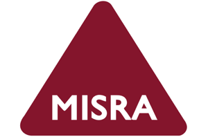

# Overview of ThreadX

ThreadX is Eclipse Foundation's advanced industrial grade Real-Time Operating System (RTOS). It is designed specifically for deeply embedded, real-time, and IoT applications. ThreadX provides advanced scheduling, communication, synchronization, timer, memory management, and interrupt management facilities. In addition, ThreadX has many advanced features, including its picokernel architecture, preemption-threshold scheduling, event-chaining, execution profiling, performance metrics, and system event tracing. Combined with its superior ease-of-use, ThreadX is the ideal choice for the most demanding of embedded applications. ThreadX has billions of deployments across a wide variety of products, including consumer devices, medical electronics, and industrial control equipment.

## ThreadX footprint

ThreadX has a remarkably small 2-KB instruction area and 1 KB of RAM minimal footprint. This small size is largely due to its non-layered picokernel architecture and automatic scaling. Automatic scaling means that only the services (and supporting infrastructure) used by the application are included in the final image at link time.

Here are some typical ThreadX size characteristics.

|ThreadX Service  |Typical Size in Bytes  |
|---------|---------|
|Core Services (Require) |2,000  |
|Queue Services  |900  |
|Event Flag Services  |900  |
|Semaphore Services  |450  |
|Mutex Services  |1,200  |
|Block Memory Services  |550  |
|Byte Memory Services  |900  |

## ThreadX execution speed

ThreadX achieves a sub-microsecond context switch on most popular processors and is faster overall than other commercial RTOSs. In addition to being fast, ThreadX is also highly deterministic. It achieves the same fast performance whether there are 200 threads ready, or just one.

Here are some typical performance characteristics of ThreadX:

* Fast boot: ThreadX boots in fewer than 120 cycles.
* Optional removal of basic error checking: Basic ThreadX error checking can be skipped at compile time. This can be useful when the application code is verified and no longer requires error checking on each parameter. Skipping error checking can be done on a compilation unit, rather than system-wide.
* Picokernel design: Services are not layered on each other, eliminating unnecessary function call overhead.
* Optimized interrupt processing: Only scratch registers are saved/restored upon ISR entry/exit, unless preemption is necessary.
* Optimized API processing:

    |ThreadX Service  |Service Time in Microseconds*  |
    |---------|---------|
    |Thread Suspend  |0.6  |
    |Thread Resume  |0.6  |
    |Queue Send  |0.3  |
    |Queue Receive  |0.3  |
    |Get Semaphore  |0.2  |
    |Put Semaphore  |0.2  |
    |Context Switch  |0.4  |
    |Interrupt Response  |0.0 – 0.6  |

    **Performance figures based on typical processor running at 200 MHz*.

## Advanced technology

ThreadX is notable for its preemption-threshold scheduling. This feature is unique to ThreadX and has been the subject of extensive academic research. You can learn more from the paper [Scheduling Fixed-Priority Tasks with Preemption Threshold](https://ieeexplore.ieee.org/document/811269), by Yun Wang (Concordia University) and Manas Saksena (University of Pittsburgh).

Key capabilities of ThreadX:

* Complete and Comprehensive Multitasking Facilities
  * Threads, application timers, message queues, counting semaphores, mutexes, event flags, block, and byte memory pools
* Priority-Based Preemptive Scheduling
* Priority Flexibility – Up to 1024 Priority Levels
* Cooperative Scheduling
* Preemption-Threshold – Unique to ThreadX, helps reduce context switches and help guarantee schedulability (per academic research)
* Memory Protection via ThreadX MODULES
* Fully Deterministic
* Event Trace – Capture last *n* system/application events
* Event Chaining – Register an application-specific "notify" callback function for each ThreadX communication or synchronization object
* ThreadX MODULES with Optional Memory Protection
* Run-Time Performance Metrics
  * Number of thread resumptions
  * Number of thread suspensions
  * Number of solicited thread pre-emptions
  * Number of asynchronous thread interrupt pre-emptions
  * Number of thread priority inversions
  * Number of thread relinquishes
* Execution Profile Kit (EPK)
* Separate Interrupt Stack
* Run-Time Stack Analysis
* Optimized Timer Interrupt Processing

## Multicore support (AMP & SMP)

Standard ThreadX is often used in an Asymmetric Multiprocessing (AMP) fashion, where a separate copy of ThreadX and the application (or Linux) executes on each core and communicate with each other via shared memory or an inter-processor communication mechanism such as OpenAMP (ThreadX supports OpenAMP).

In environments where loading processors is highly dynamic, ThreadX Symmetric Multiprocessing (SMP) is available for the following processor families:

* ARM Cortex-Ax
* ARM Cortex-Rx
* ARM Cortex-A5x 64-bit
* Synopsys ARC HS

ThreadX SMP performs dynamic load balancing across *n* processors. It allows all ThreadX resources (queues, semaphores, event flags, memory pools, etc.) to be accessed by any thread on any core. ThreadX SMP enables the complete ThreadX API on all cores and introduces the following new APIs applicable to SMP operation:

* `UINT tx_thread_smp_core_exclude(TX_THREAD *thread_ptr, ULONG exclusion_map);`
* `UINT tx_thread_smp_core_exclude_get(TX_THREAD *thread_ptr, ULONG *exclusion_map_ptr);`
* `UINT tx_thread_smp_core_get(void);`
* `UINT tx_timer_smp_core_exclude(TX_TIMER *timer_ptr, ULONG exclusion_map);`
* `UINT tx_timer_smp_core_exclude_get(TX_TIMER *timer_ptr, ULONG *exclusion_map_ptr);`

## Memory protection via ThreadX Modules

An add-on product called ThreadX Modules enables one or more application threads to be bundled into a "Module" that can be dynamically loaded and run (or executed in place) on the target.

Modules enable field upgrade, bug fixing, and program partitioning to allow large applications to occupy only the memory needed by active threads.

Modules also have a separate address space from ThreadX itself. This enables ThreadX to place memory protection (via MPU or MMU) around the Module such that accidental access outside the module will not be able to corrupt any other software component.

## MISRA compliant

ThreadX and ThreadX SMP source code is MISRA-C: 2004 and MISRA C:2012 compliant. MISRA C is a set of programming guidelines for critical systems using the C programming language. The original MISRA C guidelines were primarily targeted toward automotive applications; however, MISRA C is now widely recognized as being applicable to any safety-critical application. ThreadX is compliant with all required and mandatory rules of MISRA-C: 2004 and MISRA C:2012.

## Supports most popular tools

ThreadX supports most popular embedded development tools, including IAR's Embedded Workbench, which also has the most comprehensive ThreadX kernel awareness available. Other tool integration includes GNU (GCC), ARM DS-5/uVision®, Green Hills MULTI®, Wind River Workbench, Imagination Codescape, Renesas e2studio, Metaware SeeCode, NXP CodeWarrior, Lauterbach TRACE32®, TI Code-Composer Studio, CrossCore, and all analog devices.

## Adaptation layer for ThreadX

You can ease application migration issues to Eclipse ThreadX by using ThreadX [adaption layers](https://github.com/eclipse-threadx/threadx/tree/master/utility/rtos_compatibility_layers) for various legacy RTOS APIs (FreeRTOS, POSIX, OSEK, etc.)

