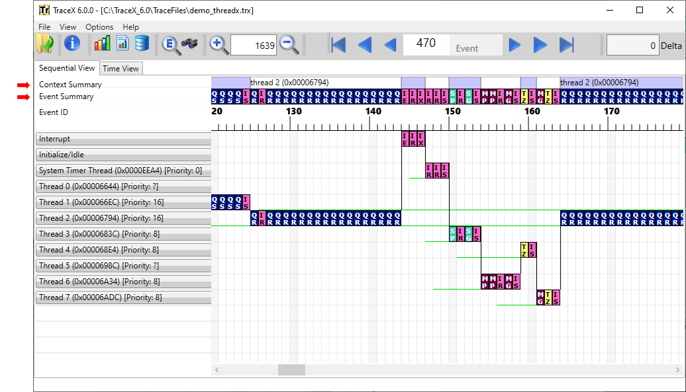
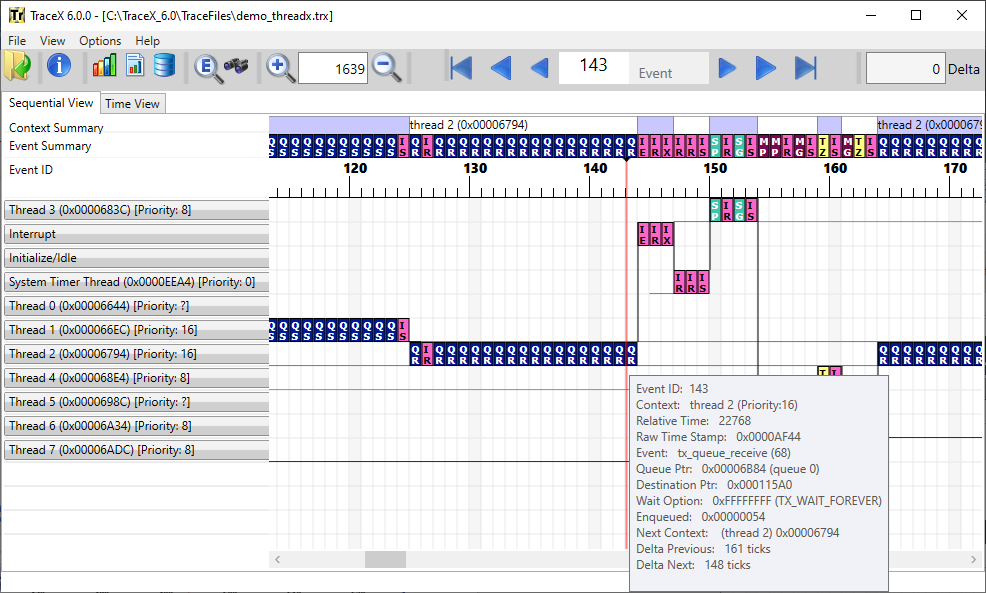
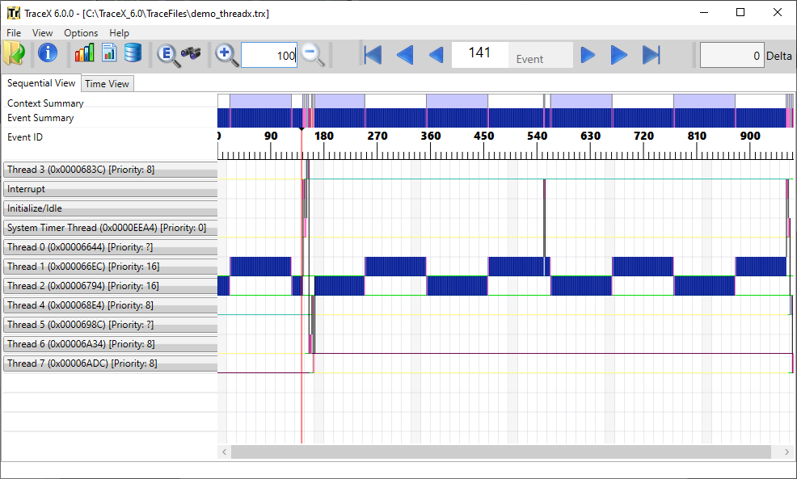

# Overview of TraceX

TraceX is Eclipse Foundation's host-based analysis tool that provides developers with a graphical view of real-time system events and enables them to visualize and better understand the behavior of their real-time systems. With TraceX, developers can see clearly the occurrence of system events like interrupts and context switches that occur out of view of standard debugging tools. The ability to identify and study these events, and to pinpoint the timing of their occurrence in the context of the overall system's operation enables developers to resolve programming problems by finding unexpected behavior and letting them investigate specific areas further Trace information is stored in a buffer on the target system, with the buffer location and size determined by the application at run-time. TraceX can process any buffer constructed in the proper manner, not only from ThreadX, but from any application or RTOS. The trace information may be uploaded to the host for analysis at any time – either post mortem or upon a breakpoint. ThreadX implements a circular buffer, which enables the most recent "N" events to be available for inspection in the event of system malfunction or other significant event.

**TraceX Single-Core Display**

## Key capabilities

### TraceX built-in system analysis

TraceX is provides built-in system analysis reports that are available via a single button click from the TraceX toolbar. These buttons and reports include:

 Generate Execution Profile report

 Generate Performance Statistics report

 Generate Thread Stack Usage report

### Trace data collected By ThreadX

TraceX is designed to work with ThreadX, which constructs a database of system and application "events" on the target system during run-time. These events include:

* thread context switches
* preemptions
* suspensions
* terminations
* system interrupts
* application-specific events
* all ThreadX API calls
* all NetX Duo API calls
* all FileX API calls
* all USBX API calls
* application-defined icons and information

Events are logged under program control, with time-stamping and active thread identification so they can be displayed later in the proper time sequence, and associated with the appropriate thread. Event logging may be stopped and restarted by the application program dynamically, for example, when an area of interest is encountered. This avoids cluttering the database and using up target memory when the system is performing correctly.

### TraceX is like a software logic analyzer

Once the event log has been uploaded from target memory to the host, TraceX displays the events graphically on a horizontal axis representing time, with the various application threads and system routines to which the events are related listed along the vertical axis. TraceX creates a "software logic analyzer" on the host, making system events plainly visible. Events are represented by color coded icons, located at the point of occurrence along the horizontal timeline, to the right of the relevant thread or system routine. When an event icon is selected, the corresponding information for that event is displayed, as well as the information for the two previous and two subsequent events. This provides quick, single-click access to the most immediate information about the event and its immediately surrounding events. TraceX provides a "Summary" display that shows all system events on a single horizontal line to simplify analysis of systems with many threads.

### Sequential view mode

The sequential view mode is selected by clicking the "Sequential View" tab.
This is the default mode. In this mode, events are shown immediately following each other–regardless of the elapsed time between them. Note also the ruler above the display area. It shows the relative event number from the beginning of the trace. This mode is the default mode and is especially useful in getting a good overview of what is going on in the system.

**Sequential view mode**

### Time view mode

In this mode, events are shown in a time relative manner–with a solid green bar being used to show execution between events. This mode is especially useful to see where the bulk of processing is taking place in the system, which can help developers tune their system for greater performance and/or responsiveness.

Note also the ruler above the event display. This ruler shows relative ticks from the beginning of the trace, as derived from the time stamp instrumented in the event trace logging inside of ThreadX. If the time-stamps are too close (low frequency timer), the events will run together. Conversely, if the time-stamps are too far apart (high frequency timer), then the events will be too far apart. Choosing the right frequency time stamp is an important consideration in making the time relative view meaningful.

### System summary line

TraceX also provides a single summary line that includes all events on the same line. The summary line contains a summary of the context as well as the corresponding event summary underneath. This makes it easy to see an overview of a complex system. The summary bar is especially beneficial in systems that have a great number of threads. Without such a summary line, the user would have to follow complex system interactions using the vertical scroll bar to follow the context of execution.

TraceX lists the system contexts on the left-hand side of the display.
Events that occur in a particular context are displayed on the horizontal line to the right of that context. In this way, the user can easily ascertain which context the event occurred as well as follow that context line to see all the events that occurred in a particular context.

**System Summary Line**

The first two context entries are always the "Interrupt" and "Initialize/Idle" contexts. The "Interrupt" context represents all system events made from Interrupt Service Routines (ISRs). The "Initialize/Idle" context represents two contexts in ThreadX. Events that occur during tx_application_define, are "Initialize" events and are displayed on the "Initialize/Idle" context. If the system is idle and thus no events are occurring, the green bar representing "Running" in the time view is drawn on the "Initialize/Idle" context.

## Methods of navigation

TraceX enables the developer to specify how the "Next" and "Previous" navigation buttons operate.

If "Event" is selected, navigation is done on the next/previous event. If "Context" is selected, navigation is done on the next/previous event on the same context. If "Object" is selected, navigation is done on the next/previous event of the current object, e.g., events associated with a specific queue. If "Switches" is selected, navigation is done on the next/previous context switch. If "Same ID" is selected, navigation is done on the next/previous event for the same event ID.

### Event information display

TraceX provides detailed information on some 300 events. 
These include six internal ThreadX events, two ISR events (enter and exit), 14 internal FileX events, 42 internal NetX Duo events, and one user-defined event. The remaining events correspond directly to ThreadX, FileX, and NetX Duo API services.
Regardless of whether sequential or time display mode is selected, a mouse-over on any event in the display area results in detailed event information displayed near the event. The mouse-over of event 494 in the demonstration demo_threadx.trx trace file is shown here:

**Mouse-Over Displays More Info**

Each event displayed contains standard information about Context and both the Relative Time and Time Stamp. The Context field shows what context the event took place in. There are exactly four contexts: thread, idle, ISR, and initialization. When an event takes place in a thread context, the thread name and its priority at that time is gathered and displayed as shown above. The Relative Time shows the relative number of timer ticks from the beginning of the trace. The Raw Time Stamp displays the raw time source of the event. Finally, all event-specific information is displayed.

### Zooming in and out

By default, TraceX displays the events in an easy-to-view size, with a 1:1 pixel:tick mapping. The user may zoom in or zoom out as desired. Zooming out to 100% is useful to see the entire trace in the current display view, while zooming in is useful in conditions where the events overlap due to the resolution of the time stamp source.

**Zoom Out to 100% View or Zoom In for Details**

When zoomed out at 100% – showing the entire trace within the current display page – it is easy to see all the context execution captured in the trace as well as the general events occurring within those contexts. Notice that "thread 1" and "thread 2" execute most often. The blue coloring for their events also suggests that these threads are making queue service calls (queue events are blue in color).

Restoring to a full icon view is equally easy; Either the zoom-in button may be selected repeatedly or some factor of 100 may be entered.

### Delta ticks between events

Determining the number of ticks between various events in TraceX is easy–simply click on the starting event and drag the mouse to the ending event.
The delta number of ticks between the events will show up in the upper right-hand corner of the display.

**Delta Ticks**

The delta ticks show that 5032 ticks have elapsed between event 494 and event 496. This could also be calculated manually by looking at the relative time stamps in each event and subtracting, but using the GUI is easy and instantaneous.

### Priority inversions

TraceX automatically displays priority inversions detected in the trace file. Priority inversions are defined as conditions where a higher-priority thread is blocked trying to obtain a mutex that is currently owned by a lower-priority thread. This condition is termed "deterministic," since the system was setup to operate in this manner. In order to inform the user, TraceX shows "deterministic" priority inversion ranges as a light salmon color.

TraceX also displays "un-deterministic" priority inversions. These priority inversions differ from the "deterministic" priority inversions in that another thread of a different priority level has executed in the middle of what was a "deterministic" priority inversion, thereby making the time within the priority inversion somewhat "un-deterministic." This condition is often unknown to the user and can be very serious. In order to alert the user of this condition, TraceX shows "un-deterministic" priority inversions as a brighter salmon color.

**Deterministic and Non-Deterministic Priority Inversion**

### Execution profile

TraceX provides a built-in execution profile report for all execution contexts within in the currently loaded trace file.

### Performance statistics

TraceX provides a built-in performance statistics report for the currently loaded trace file.

### Thread stack usage

TraceX provides a built-in stack usage report for all threads executing within in the currently loaded trace file.

TraceX presents the FileX performance statistics of the currently loaded trace file. This information is displayed for the entire system–on all opened media objects.

### NetX Duo statistics

TraceX also presents the NetX Duo performance statistics of the currently loaded trace file. This information is displayed for the entire system.

### Raw trace dump

TraceX can build a raw trace file in text format and launch notepad to display it.

Please note that all timing and size figures listed are estimates and may be different on your development platform
