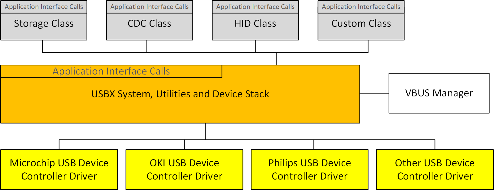

# Chapter 3 - Functional Components of USBX Device Stack

This chapter contains a description of the high performance USBX embedded USB device stack from a functional perspective.

## Execution Overview

USBX for the device is composed of several components.
- [Initialization](#initialization)
- [Application interface calls](#application_interface_calls)
- [USB Device Classes](#usb_device_classes)
- [USB Device Stack](#usb_device_stack)
- [USB Device controller](#usb_device_controller)
- [VBUS manager](#vbus_manager)

The following diagram illustrates the USBX Device stack.



## initialization

In order to activate USBX, the function ***ux_system_initialize*** must be called. This function initializes the memory resources of USBX.

In order to activate USBX device facilities, the function ***ux_device_stack_initialize*** must be called. This function will in turn initialize all the resources used by the USBX device stack such as ThreadX threads, mutexes, and semaphores.

It is up to the application initialization to activate the USB device controller and one or more USB classes. Contrary to the USB host side, the device side can have only one USB controller driver running at any time. When the classes have been registered to the stack and the device controller(s) initialization function has been called, the bus is active and the stack will reply to bus reset and host enumeration commands.

## application_interface_calls

There are two levels of APIs in USBX.

- USB Device Stack APIs
- USB Device Class APIs

Normally, a USBX application should not have to call any of the USB device stack APIs. Most applications will only access the USB Class APIs.

## usb_device_classes

The Class APIs are very specific to each USB class. Most of the common APIs for USB classes provided services such as opening/closing a device and reading from or writing to a device.

### Storage Class

The storage class is in charge of answering storage class specific control requests and handling storage class protocol commands. Refer to USB Device Storage Class in Chapter 5 for more information.

### CDC Class

The CDC class is in charge of answering CDC class specific control requests and offering ways to communicate with host through data pipes. Following functionalities are supported now:
* CDC-ACM: communicate with host as a serial device
* CDC-ECM: communicate with host as an ethernet device
Refer to USB Device CDC-ACM Class and USB Device CDC-ECM Class in Chapter 5 for more information.

### HID Class

The HID class is in charge of answering the HID class specific control requests and offering ways to communicate host with HID class specific reports. Refer to USB Device HID Class in Chapter 5 for more information.

### Custom Class

For advanced developers, it's possible to create more customized class, to answering customized control requests and handling customized protocol on data pipes. Note such class may also require specific customization on host side, too.

## usb_device_stack
The device stack APIs are responsible for the registration of USBX device components such as classes and the device framework.

### Device Framework

The USB device side is responsible for the definition of the device framework. The device framework is divided into three categories, as described in the following sections.

#### Definition of the Components of the Device Framework

The definition of each component of the device framework is related to the nature of the device and the resources utilized by the device. Following are the main categories.

- Device Descriptor
- Configuration Descriptor
- Interface Descriptor
- Endpoint Descriptor

USBX supports device component definition for both high and full speed (low speed being treated the same way as full speed). This allows the device to operate differently when connected to a high speed or full speed host. The typical differences are the size of each endpoint and the power consumed by the device.

The definition of the device component takes the form of a byte string that follows the USB specification. The definition is contiguous and the order in which the framework is represented in memory will be the same as the one returned to the host during enumeration.

Following is an example of a device framework for a high speed USB Flash Disk.

```c
#define DEVICE_FRAMEWORK_LENGTH_HIGH_SPEED 60
UCHAR device_framework_high_speed[] = {
    /* Device descriptor */
    0x12, 0x01, 0x00, 0x02, 0x00, 0x00, 0x00, 0x40, 0x0a, 0x07, 0x25, 0x40, 0x01, 0x00, 0x01, 0x02, 0x03, 0x01,

    /* Device qualifier descriptor */
    0x0a, 0x06, 0x00, 0x02, 0x00, 0x00, 0x00, 0x40, 0x01, 0x00,

    /* Configuration descriptor */
    0x09, 0x02, 0x20, 0x00, 0x01, 0x01, 0x00, 0xc0, 0x32,

    /* Interface descriptor */
    0x09, 0x04, 0x00, 0x00, 0x02, 0x08, 0x06, 0x50, 0x00,

    /* Endpoint descriptor (Bulk Out) */
    0x07, 0x05, 0x01, 0x02, 0x00, 0x02, 0x00,

    /* Endpoint descriptor (Bulk In) */
    0x07, 0x05, 0x82, 0x02, 0x00, 0x02, 0x00
};
```

#### Definition of the Strings of the Device Framework

Strings are optional in a device. Their purpose is to let the USB host know about the manufacturer of the device, the product name, and the revision number through Unicode strings.

The main strings are indexes embedded in the device descriptors. Additional strings indexes can be embedded into individual interfaces.

Assuming the device framework above has three string indexes embedded into the device descriptor, the string framework definition could look like this example code.

```c
/* String Device Framework:
    Byte 0 and 1: Word containing the language ID: 0x0904 for US
    Byte 2 : Byte containing the index of the descriptor
    Byte 3 : Byte containing the length of the descriptor string
*/

#define STRING_FRAMEWORK_LENGTH 38
UCHAR string_framework[] = {
    /* Manufacturer string descriptor: Index 1 */
    0x09, 0x04, 0x01, 0x0c,
    0x45, 0x78, 0x70, 0x72, 0x65, 0x73, 0x20, 0x4c,
    0x6f, 0x67, 0x69, 0x63,

    /* Product string descriptor: Index 2 */
    0x09, 0x04, 0x02, 0x0c,
    0x4D, 0x4C, 0x36, 0x39, 0x36, 0x35, 0x30, 0x30,
    0x20, 0x53, 0x44, 0x4B,

    /* Serial Number string descriptor: Index 3 */
    0x09, 0x04, 0x03, 0x04,
    0x30, 0x30, 0x30, 0x31
};
```

If different strings have to be used for each speed, different indexes must be used as the indexes are speed agnostic.

The encoding of the string is UNICODE-based. For more information on the UNICODE encoding standard refer to the following publication:

*The Unicode Standard, Worldwide Character Encoding, Version 1., Volumes 1 and 2, The Unicode Consortium, Addison-Wesley Publishing Company, Reading MA.*

#### Definition of the Languages Supported by the Device for each String

USBX has the ability to support multiple languages although English is the default. The definition of each language for the string descriptors is in the form of an array of languages definition defined as follows.

```c
#define LANGUAGE_ID_FRAMEWORK_LENGTH 2
UCHAR language_id_framework[] = {
    /* English. */
    0x09, 0x04
};
```

To support additional languages, simply add the language code double-byte definition after the default English code. The language code has been defined by Eclipse Foundation in the document.

*Developing International Software for Windows 95 and Windows NT, Nadine Kano, Eclipse Foundation Press, Redmond WA*

## usb_device_controller

The device controller driver (DCD) interoperates USB Device Stack operations to hardware actions. Normally, a USBX application should not have to call device controller APIs, except initialization function. When the device controller initialization function is called, the bus is active and the stack will reply to bus reset and host enumeration commands through device controller driver.

Here are some possible hardware which USB Device Stack can operate on:
* STMicroelectronics chip with USB device controller
* Microchip chip with USB device controller
* NXP chip with USB device controller
* Reneses chip with USB device controller
* Other chip with USB device controller, etc.

## vbus_manager

In most USB device designs, VBUS is not part of the USB Device core but rather connected to an external GPIO, which monitors the line signal.

As a result, VBUS has to be managed separately from the device controller driver.

It is up to the application to provide the device controller with the address of the VBUS IO. VBUS must be initialized prior to the device controller initialization.

Depending on the platform specification for monitoring VBUS, it is possible to let the controller driver handle VBUS signals after the VBUS IO is initialized or if this is not possible, the application has to provide the code for handling VBUS.

If the application wishes to handle VBUS by itself, its only requirement is to call the function ***ux_device_stack_disconnect*** when it detects that a device has been extracted. It is not necessary to inform the controller when a device is inserted because the controller will wake up when the BUS RESET assert/deassert signal is detected.
