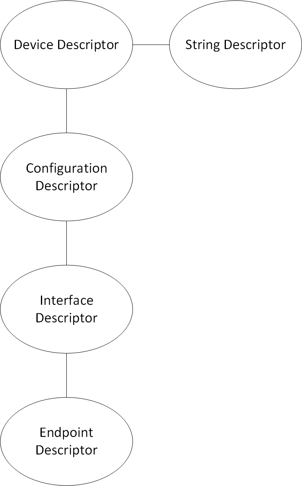
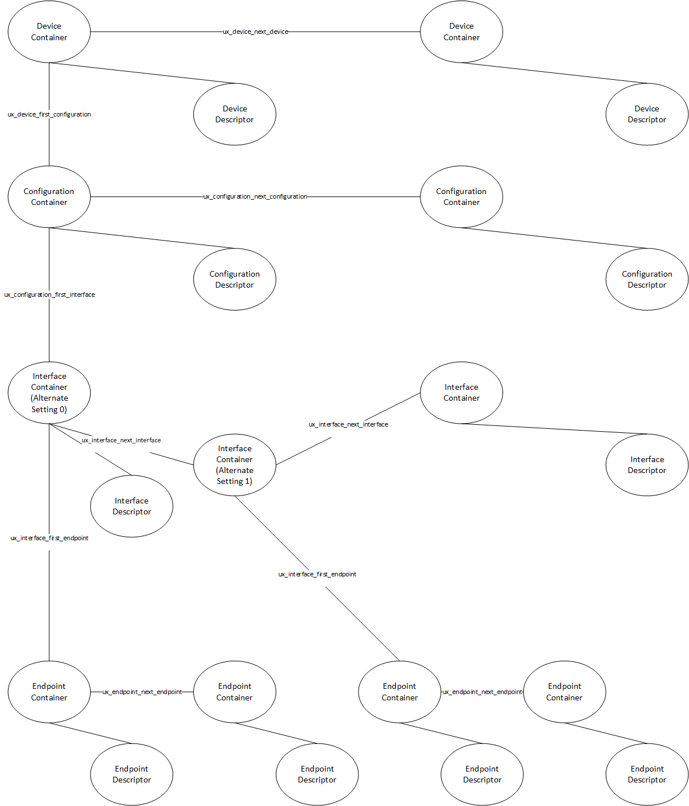

# Chapter 3 - Functional Components of USBX Host Stack

This chapter contains a description of the high performance USBX embedded USB host stack from a functional perspective.

## Execution Overview

USBX is composed of several components:

- Initialization
- Application interface calls
- Host Classes
- Hub Class
- USB Host Stack
- Host controller (with Root Hub)

The following diagram illustrates the USBX host stack.


### Initialization

In order to activate USBX, the function ***ux_system_initialize*** must be called. This function initializes the memory resources of USBX.

In order to activate USBX host facilities, the function ***ux_host_stack_initialize*** must be called. This function will in turn initialize all the resources used by the USBX host stack such as ThreadX threads, mutexes, and semaphores.

It is up to the application initialization to register one or more USB classes by function **ux_host_stack_class_register**. If Hub Class is registered, its ready to detect devices connected through hub port, otherwise, only devices connected to root hub ports are enumerated.

It is up to the application initialization to activate at least one USB host controller. When the host controller(s) initialization function has been called the bus is active and device discovery can start. If the root hub of the host controller detects an attached device, the USB enumeration thread, in charge of the USB topology, will be wake up and proceed to enumerate the device(s).

It is possible, due to the nature of the root hub and downstream hubs, that all attached USB devices may not have been configured completely when the host controller initialization function returns. It can take several seconds to enumerate all USB devices, especially if there are one or more hubs between the root hub and USB devices.

### Application Interface Calls

There are two levels of APIs in USBX.

- USB Host Stack APIs
- USB Host Class APIs

Normally, a USBX application should not have to call any of the USB host stack API functions. Most applications will only access the USB Class API functions.

### USB Host Stack

The host stack API functions are responsible for the registration of USBX components (host classes and host controllers), configuration of devices, and the transfer requests for available device endpoints.

### USB Host Classes

The Class APIs are very specific to each USB class. Most of the common API functions for USB classes provide services such as opening/closing a device and reading from and writing to a device.

#### CDC Class

The CDC class is in charge of enumerating and driving connected CDC devices. Currently two functionalities are supported:
* CDC-ACM, the serial converter, refer to CDC-ACM part in Chapter 5 for more details.
* CDC-ECM, the ethernet controller, refer to Chapter 6 for more details.

#### Storage Class

The Storage class is in charge of enumerating and driving connected mass storage devices. It is integrated with FileX, the Eclipse ThreadX file system support module, to offer services to operate the connected media through **FX_MEDIA** interface.

#### HID Class

The HID class is in charge of enumerating and driving connect HID devices. The following functionalities are supported by its client services:
* HID Keyboard
* HID Mouse
* HID Remote control
Refer to HID part in Chapter 5 for more details.

### Hub Class

The hub class is in charge of driving USB hubs. A USB hub can either be a stand-alone hub or as part of a compound device such as a keyboard or a monitor. A hub can be self-powered or bus-powered. Bus-powered hubs have a maximum of four downstream ports and can only allow for the connection of devices that are either self-powered or bus-powered devices that use less than 100mA of power. Hubs can be cascaded. Up to five hubs can be connected to one another.

#### Host controller
The USB host controller driver interoperates USB Host Stack operations to hardware actions. Normally, a USBX application should not have to call host controller APIs, except initialization function. When the host controller initialization function is called, the hardware is ready and the stack will reply to detect bus events and start communication with connected devices.

##### Root Hub
Each host controller instance has one or more USB root hubs. The number of root hubs is either determined by the nature of the controller or can be retrieved by reading specific registers from the controller.

### USB Host Stack

The USB host stack is the centerpiece of USBX. It has three main functions.

- Manage the topology of the USB.
- Bind a USB device to one or more classes.
- Provide an API to classes to perform device descriptor interrogation and USB transfers.

### Topology Manager

The USB stack topology thread is awakened when a new device is connected or when a device has been disconnected. Either the root hub or a regular hub can accept device connections. Once a device has been connected to the USB, the topology manager will retrieve the device descriptor. This descriptor will contain the number of possible configurations available for this device. Most devices have one configuration only. Some devices can operate differently according to the available power available on the port where it is connected. If this is the case, the device will have multiple configurations that can be selected depending on the available power. When the device is configured by the topology manager, it is then allowed to draw the amount of power specified in its configuration descriptor.

## USB Class Binding

When the device is configured, the topology manager will let the class manager continue the device discovery by looking at the device interface descriptors. A device can have one or more interface descriptors.

An interface represents a function in a device. For instance, a USB speaker has three interfaces, one for audio streaming, one for audio control, and one to manage the various speaker buttons.

The class manager has two mechanisms to join the device interface(s) to one or more classes. It can either use the combination of a PID/VID (product ID and vendor ID) found in the interface descriptor or the combination of Class/Subclass/Protocol.

The PID/VID combination is valid for interfaces that cannot be driven by a generic class. The Class/Subclass/Protocol combination is used by interfaces that belong to a USB-IF certified class such as a printer, hub, storage, audio, or HID.

The class manager contains a list of registered classes from the initialization of USBX. The class manager will call each class one at a time until one class accepts to manage the interface for that device. A class can only manage one interface. For the example of the USB audio speaker, the class manager will call all the classes for each of the interfaces.

Once a class accepts an interface, a new instance of that class is created. The class manager will then search for the default alternate setting for the interface. A device may have one or more alternate settings for each interface. The alternate setting 0 will be the on used by default until a class decides to change it.

For the default alternate setting, the class manager will mount all the endpoints contained in the alternate setting. If the mounting of each endpoint is successful, the class manager will complete its job by returning to the class that will finish the initialization of the interface.

### USBX APIs

The USB stack exports a certain number of APIs for the USB classes to perform interrogation on the device and USB transfers on specific endpoints. These API functions are described in detail in this reference manual.

### Host Controller

The host controller driver is responsible for driving a specific type of USB controller. A USB host controller can have multiple controllers inside. For instance, certain Intel PC chipset contain two UHCI controllers. Some USB 2.0 controllers contain multiple instances of an OHCI controller in addition to one instance of the EHCI controller.

The Host controller will manage multiple instance of the same controller only. In order to drive most USB 2.0 host controllers, it will be required to initialize both the OCHI controller and the EHCI controller during the initialization of USBX.

The host controller is responsible for managing the following.

- Root Hub
- Power Management
- Endpoints
- Transfers

### Root Hub

The root hub management is responsible for the powering up of each controller port and determining if there is a device inserted or not. This functionality is used by the USBX generic root hub to interrogate the controller downstream ports.

### Power Management

The power management processing provides for the handling of suspend/resume signals either in gang mode, therefore affecting all controller downstream ports at the same time, or individually if the controller offers this functionality.

### Endpoints

The endpoint management provides for the creation or destruction of physical endpoints to the controller. The physical endpoints are memory entities that are parsed by the controller if the controller supports master DMA or that are written in the controller. The physical endpoints contain transactions information to be performed by the controller.

### Transfers

Transfer management provides for a class to perform a transaction on each of the endpoints that have been created. Each logical endpoint contains a component called TRANSFER REQUEST for USB transfer requests. The TRANSFER REQUEST is used by the stack to describe the transaction. This TRANSFER REQUEST is then passed to the stack and to the controller, which may divide it into several sub transactions depending on the capabilities of the controller.

## USB Device Framework

A USB device is represented by a tree of descriptors. There are six main types of descriptors.

- Device descriptors
- Configuration descriptors
- Interface descriptors
- Endpoint descriptors
- String descriptors
- Functional descriptors

A USB device may have a very simple description and looks like this.


In the above illustration, the device has only one configuration. A single interface is attached to this configuration, indicating that the device has only one function, and it has one endpoint only. Attached to the device descriptor is a string descriptor providing a visible identification of the device.

However, a device may be more complex and may appear as follows.


In the above illustration, the device has two configuration descriptors attached to the device descriptor. This device may indicate that it has two power modes or can be driven by either standard classes or proprietary classes.

Attached to the first configuration are two interfaces indicating that the device has two logical functions. The first function has 3 endpoint descriptors and a functional descriptor. The functional descriptor may be used by the class responsible to drive the interface to obtain further information about this interface normally not found by a generic descriptor.

### Device Descriptors

Each USB device has one single device descriptor. This descriptor contains the device identification, the number of configurations supported, and the characteristics of the default control endpoint used for configuring the device.

| Offset | Field              | Size | Value    | Description                             |
| ------ | ------------------ | ---- | -------- | --------------------------------------- |
| 0      | BLength            | 1    | Number   | Size of this descriptor in bytes |
| 1      | bDescriptorType    | 1    | Constant | DEVICE Descriptor Type |
| 2      | bcdUSB             | 2    | BCD      | USB Specification Release Number in BinaryCoded Dec<br />Example: 2.10 is equivalent to 0x210. This field identifies the release of the USB Specification that the device and its descriptors are compliant with. |
| 4      | bDeviceClass       | 1    | Class    | Class code (assigned by USB-IF).<br />If this field is reset to 0, each interface within a configuration specifies its own class information and the various interfaces operate independently.<br />If this field is set to a value between 1 and 0xFE, the device supports different class specifications on different interfaces and the interfaces may not operate independently. This value identifies the class definition used for the aggregate interfaces.<br />If this field is set to 0xFF, the device class is vendor specific. |
| 5      | bDeviceSubClass    | 1    | SubClass | Subclass code (assigned by USB-IF).<br />These codes are qualified by the value of the bDeviceClass field. If the bDeviceClass field is reset to 0, this field must also be reset to 0. If the bDeviceClass field is not set to 0xFF, all values are reserved for assignment by USB. |
| 6      | bDeviceProtocol    | 1    | Protocol | Protocol code (assigned by USB-IF).<br />These codes are qualified by the value of the bDeviceClass and the bDeviceSubClass fields. If a device supports class-specific protocols on a device basis as opposed to an interface basis, this code identifies the protocols that the device uses as defined by the specification of the device class. If this field is reset to 0, the device does not use class specific protocols on a device basis.<br />However, it may use class specific protocols on an interface basis.<br />If this field is set to 0xFF, the device uses a vendor specific protocol on a device basis. |
| 7      | bMaxPacketSize0    | 1    | Number   | Maximum packet size for endpoint zero (only byte sizes of 8, 16, 32, or 64 are valid) |
| 8      | idVendor           | 2    | ID       | Vendor ID (assigned by USB-IF) |
| 10     | idProduct          | 2    | ID       | Product ID (assigned by the Manufacturer) |
| 12     | bcdDevice          | 2    | BCD      | Device release number in binary-coded decimal |
| 14     | iManufacturer      | 1    | Index    | Index of string descriptor describing manufacturer |
| 15     | iProduct           | 1    | Index    | Index of string descriptor describing product |
| 16     | iSerialNumber       | 1    | Index    | Index of string descriptor describing the device's serial number |
| 17     | bNumConfigurations | 1    | Number   | Number of possible configurations |

USBX defines a USB device descriptor as follows:

```c
typedef struct UX_DEVICE_DESCRIPTOR_STRUCT
{
    UINT      bLength;
    UINT      bDescriptorType;
    USHORT    bcdUSB;
    UINT      bDeviceClass;
    UINT      bDeviceSubClass;
    UINT      bDeviceProtocol;
    UINT      bMaxPacketSize0;
    USHORT    idVendor;
    USHORT    idProduct;
    USHORT    bcdDevice;
    UINT      iManufacturer;
    UINT      iProduct;
    UINT      iSerialNumber;
    UINT      bNumConfigurations;
} UX_DEVICE_DESCRIPTOR;
```

The USB device descriptor is part of a device container described as:

```c
typedef struct UX_DEVICE_STRUCT
{
    ULONG ux_device_handle;
    ULONG ux_device_type;
    ULONG ux_device_state;
    ULONG ux_device_address;
    ULONG ux_device_speed;
    ULONG ux_device_port_location;
    ULONG ux_device_max_power;
    ULONG ux_device_power_source;
    UINT ux_device_current_configuration;

    TX_SEMAPHORE ux_device_protection_semaphore;
    struct UX_DEVICE_STRUCT *ux_device_parent; 
    struct UX_HOST_CLASS_STRUCT *ux_device_class; 
    VOID *ux_device_class_instance;
    struct UX_HCD_STRUCT *ux_device_hcd;
    struct UX_CONFIGURATION_STRUCT *ux_device_first_configuration; 
    struct UX_DEVICE_STRUCT *ux_device_next_device;
    struct UX_DEVICE_DESCRIPTOR_STRUCT ux_device_descriptor;
    struct UX_ENDPOINT_STRUCT ux_device_control_endpoint;
    struct UX_HUB_TT_STRUCT ux_device_hub_tt[UX_MAX_TT];
} UX_DEVICE;
```

- **ux_device_handle**: Handle of the device. This is typically the address of the instance of this structure for the device.
- **ux_device_type**: Obsolete value. Unused.
- **ux_device_state**: Device State, which can have one of the following values:
    - **UX_DEVICE_RESET**                0
    - **UX_DEVICE_ATTACHED**             1
    - **UX_DEVICE_ADDRESSED**            2
    - **UX_DEVICE_CONFIGURED**           3
    - **UX_DEVICE_SUSPENDED**            4
    - **UX_DEVICE_RESUMED**              5
    - **UX_DEVICE_SELF_POWERED_STATE**   6
    - **UX_DEVICE_SELF_POWERED_STATE**   7
    - **UX_DEVICE_REMOTE_WAKEUP**        8
    - **UX_DEVICE_BUS_RESET_COMPLETED**  9
    - **UX_DEVICE_REMOVED**              10
    - **UX_DEVICE_FORCE_DISCONNECT**     11
- **ux_device_address**: Address of the device after the **SET_ADDRESS** command has been accepted (from 1 to 127).
- **ux_device_speed**: Speed of the device:
    - **UX_LOW_SPEED_DEVICE**      0
    - **UX_FULL_SPEED_DEVICE**     1
    - **UX_HIGH_SPEED_DEVICE**     2
- **ux_device_port_location**: Index of the port of the parent device (root hub or hub).
- **ux_device_max_power**: Maximum power in mA that the device may take in the selected configuration.
- **ux_device_power_source**: Can be one of the two following values:
    - **UX_DEVICE_BUS_POWERED**     1
    - **UX_DEVICE_SELF_POWERED**    2
- **ux_device_current_configuration**: Index of the current configuration being used by this device.
- **ux_device_parent**: Device container pointer of the parent of this device. If the pointer is null, the parent is the root hub of the controller.
- **ux_device_class**: Pointer to the class type that owns this device.
- **ux_device_class_instance**: Pointer to the instance of the class that owns this device.
- **ux_device_hcd**: USB Host Controller Instance where this device is attached.
- **ux_device_first_configuration**: Pointer to the first configuration container for this device.
- **ux_device_next_device**: Pointer to the next device in the list of device on any of the buses detected by USBX.
- **ux_device_descriptor**: USB device descriptor.
- **ux_device_control_endpoint**: Descriptor of the default control endpoint used by this device.
- **ux_device_hub_tt**: Array of Hub TTs for the device

### Configuration Descriptors

The configuration descriptor describes information about a specific device configuration. A USB device may contain one or more configuration descriptors. The **bNumConfigurations** field in the device descriptor indicates the number of configuration descriptors. The descriptor contains a **bConfigurationValue** field with a value that, when used as a parameter to the Set Configuration request, causes the device to assume the described configuration.

The descriptor describes the number of interfaces provided by the configuration. Each interface represents a logical function within the device and may operate independently. For instance a USB audio speaker may have three interfaces, one for audio streaming, one for audio control, and one HID interface to manage the speaker's buttons.

When the host issues a GET_DESCRIPTOR request for the configuration descriptor, all related interface and endpoint descriptors are returned.

| Offset | Field               | Size | Value    | Description                       |
| ------ | ------------------- | ---- | -------- | --------------------------------- |
| 0      | bLength             | 1    | Number   | Size of this descriptor in bytes. |
| 1      | bDescriptorType     | 1    | Constant | CONFIGURATION                     |
| 2      | wTotalLength        | 2    | Number   | Total length of data returned for this configuration. Includes the combined length of all descriptors (configuration, interface, endpoint, and class or vendor specific) returned for this configuration. |
| 4      | bNumInterfaces      | 1    | Number   | Number of interfaces supported by this configuration. |
| 5      | bConfigurationValue | 1    | Number   | Value to use as an argument to Set<br/>Configuration to select this configuration. |
| 6      | iConfiguration      | 1    | Index    | Index of string descriptor describing this configuration. |
| 7      | bMAttributes        | 1    | Bitmap   | Configuration characteristics D7 Bus Powered<br />D6 Self Powered<br />D5 Remote Wakeup<br />D4..0 Reserved (reset to 0)<br />A device configuration that uses power from the bus and a local source sets both D7 and D6. The actual power source at runtime may be determined using the Get Status device request.<br />If a device configuration supports remote wakeup, D5 is set to 1. |
| 8      | MaxPower            | 1    | mA       | Maximum power consumption of USB device from the bus in this specific configuration when the device is fully operational.<br />Expressed in 2 mA units (e.g., 50 = 100 mA).<br />Note: A device configuration reports whether the configuration is bus-powered or self-powered.<br />Device status reports whether the device is currently self-powered. If a device is disconnected from its external power source, it updates device status to indicate that it is no longer self-powered. |

USBX defines a USB configuration descriptor as follows.

```c
typedef struct UX_CONFIGURATION_DESCRIPTOR_STRUCT
{
    UINT bLength;
    UINT bDescriptorType;
    USHORT wTotalLength;
    UINT bNumInterfaces;
    UINT bConfigurationValue;
    UINT iConfiguration;
    UINT bmAttributes;
    UINT MaxPower;
} UX_CONFIGURATION_DESCRIPTOR;
```

The USB configuration descriptor is part of a configuration container described as shown below.

```c
typedef struct UX_CONFIGURATION_STRUCT
{
    ULONG ux_configuration_handle;
    ULONG ux_configuration_state;
    struct UX_CONFIGURATION_DESCRIPTOR_STRUCT ux_configuration_descriptor;
    struct UX_INTERFACE_STRUCT *ux_configuration_first_interface;
    struct UX_CONFIGURATION_STRUCT *ux_configuration_next_configuration;
    struct UX_DEVICE_STRUCT *ux_configuration_device;
} UX_CONFIGURATION;
```

- **ux_configuration_handle**: Handle of the configuration. This is typically the address of the instance of this structure for the configuration.
- **ux_configuration_state**: State of the configuration.
- **ux_configuration_descriptor**: USB device descriptor.
- **ux_configuration_first_interface**: Pointer to the first interface for this configuration.
- **ux_configuration_next_configuration**: Pointer to the next configuration for the same device.
- **ux_configuration_device**: Pointer to the device owner of this configuration.

### Interface Descriptors

The interface descriptor describes a specific interface within a configuration. An interface is a logical function within a USB device. A configuration provides one or more interfaces, each with zero or more endpoint descriptors describing a unique set of endpoints within the configuration. When a configuration supports more than one interface, the endpoint descriptors for a particular interface follow the interface descriptor in the data returned by the **GET_DESCRIPTOR** request for the specified configuration.

An interface descriptor is always returned as part of a configuration descriptor. An interface descriptor cannot be directly access by a GET_DESCRIPTOR request.

An interface may include alternate settings that allow the endpoints and/or their characteristics to be varied after the device has been configured. The default setting for an interface is always alternate setting zero. A class can select to change the current alternate setting to change the interface behavior and the characteristics of the associated endpoints. The SET_INTERFACE request is used to select an alternate setting or to return to the default setting.

Alternate settings allow a portion of the device configuration to be varied while other interfaces remain in operation. If a configuration has alternate settings for one or more of its interfaces, a separate interface descriptor and its associated endpoints are included for each setting.

If a device configuration contains a single interface with two alternate settings, the GET_DESCRIPTOR request for the configuration would return the configuration descriptor, then the interface descriptor with the **bInterfaceNumber** and **bAlternateSetting** fields set to zero and then the endpoint descriptors for that setting, followed by another interface descriptor and its associated endpoint descriptors. The second interface descriptor's **bInterfaceNumber** field would also be set to zero, but the **bAlternateSetting** field of the second interface descriptor would be set to 1 indicating that this alternate setting belongs to the first interface.

An interface may not have any endpoints associated with it, in which case only the default control endpoint is valid for that interface.

Alternate settings are used mainly to change the requested bandwidth for periodic endpoints associated with the interface. For example, a USB speaker streaming interface should have the first alternate setting with a 0 bandwidth demand on its isochronous endpoint. Other alternate settings may select different bandwidth requirements depending on the audio streaming frequency.

The USB descriptor for the interface is as follows:

| Offset | Field              | Size | Value     | Descriptor                              |
| ------ | ------------------ | ---- | --------- | --------------------------------------- |
| 0      | bLength            | 1    | Number    | Size of this descriptor in bytes.       |
| 1      | bDescriptorType    | 1    | Constant  | INTERFACE Descriptor Type               |
| 2      | bInterfaceNumber   | 1    | Number    | Number of interface. Zero-based value identifying the index in the array of concurrent interfaces supported by this configuration. |
| 3      | bAlternateSetting   | 1    | Number    | Value used to select alternate setting for the interface identified in the prior field. |
| 4      | bNumEndpoints      | 1    | Number    | Number of endpoints used by this interface (excluding endpoint zero). If this value is 0, this interface only uses endpoint zero. |
| 5      | bInterfaceClass    | 1    | Class     | Class code (assigned by USB)<br />If this field is reset to 0, the interface does not belong to any USB specified device class.<br />If this field is set to 0xFF, the interface class is vendor specific.<br />All other values are reserved for assignment by USB. |
| 6      | bInterfaceSubClass | 1    | SubClass  | Subclass code (assigned by USB).<br />These codes are qualified by the value of the bInterfaceClass field. If the bInterfaceClass field is reset to 0, this field must also be reset to 0. If the bInterfaceClass field is not set to 0xFF, all values are reserved for assignment by USB. |
| 7      | bInterfaceProtocol | 1    | Protocol  | Protocol code (assigned by USB). These codes are qualified by the value of the bInterfaceClass and the bInterfaceSubClass fields. If an interface supports class-specific requests, this code identifies the protocols that the device uses as defined by the specification of the device class.<br />If this field is reset to 0, the device does not use a class specific protocol on this interface. If this field is set to 0xFF, the device uses a vendor specific protocol for this interface. |
| 8      | iInterface         | 1    | Index     | Index of string descriptor describing this interface. |

USBX defines a USB interface descriptor as follows.

```c
typedef struct UX_INTERFACE_DESCRIPTOR_STRUCT
{
    UINT bLength;
    UINT bDescriptorType;
    UINT bInterfaceNumber;
    UINT bAlternateSetting;
    UINT bNumEndpoints;
    UINT bInterfaceClass
    UINT bInterfaceSubClass;
    UINT bInterfaceProtocol;
    UINT iInterface;
} UX_INTERFACE_DESCRIPTOR;
```

The USB interface descriptor is part of an interface container described as follows.

```c
typedef struct UX_INTERFACE_STRUCT
{
    ULONG ux_interface_handle;
    ULONG ux_interface_state;
    ULONG ux_interface_current_alternate_setting;
    struct UX_INTERFACE_DESCRIPTOR_STRUCT ux_interface_descriptor;
    struct UX_HOST_CLASS_STRUCT    *ux_interface_class;
    VOID    *ux_interface_class_instance;
    struct UX_ENDPOINT_STRUCT    *ux_interface_first_endpoint;
    struct UX_INTERFACE_STRUCT    *ux_interface_next_interface;
    struct UX_CONFIGURATION_STRUCT    *ux_interface_configuration;
} UX_INTERFACE;
```

- **ux_interface_handle**: Handle of the interface. This is typically the address of the instance of this structure for the interface.
- **ux_interface_state**: State of the interface.
- **ux_interface_descriptor**: USB interface descriptor.
- **ux_interface_class**: Pointer to the class type that owns this interface.
- **ux_interface_class_instance**: Pointer to the instance of the class that owns this interface.
- **ux_interface_first_endpoint**: Pointer to the first endpoint registered with this interface.
- **ux_interface_next_interface**: Pointer to the next interface associated with the configuration.
- **ux_interface_configuration**: Pointer to the configuration owner of this interface.

### Endpoint Descriptors

Each endpoint associated with an interface has its own endpoint descriptor. This descriptor contains the information required by the host stack to determine the bandwidth requirements of each endpoint, the maximum payload associated with the endpoint, its periodicity, and its direction. An endpoint descriptor is always returned by a GET_DESCRIPTOR command for the configuration.

The default control endpoint associated with the device descriptor is not counted as part of the endpoint(s) associated with the interface and therefore not returned in this descriptor.

When the host software requests a change of the alternate setting for an interface, all the associated endpoints and their USB resources are modified according to the new alternate setting.

Except for the default control endpoints, endpoints cannot be share between interfaces.

| Offset | Field            | Size | Value    | Description                       |
| ------ | ---------------- | ---- | -------- | --------------------------------- |
| 0      | bLength          | 1    | Number   | Size of this descriptor in bytes. |
| 1      | bDescriptorType  | 1    | Constant | ENDPOINT Descriptor Type. |
| 2      | bEndpointAddress | 1    | Endpoint | The address of the endpoint on the USB device described by this descriptor. The address is encoded as follows:<br />Bit 3...0: The endpoint number<br />Bit 6...4: Reserved, reset to zero<br />Bit 7: Direction, ignored for control endpoints<br />0 = OUT endpoint<br />1 = IN endpoint |
| 3      | bmAttributes     | 1    | Bitmap   | This field describes the endpoint's attributes when it is configured using the **bConfigurationValue** field. Bits 1..0: Transfer Type<br />00 = Control<br />01 = Isochronous<br />10 = Bulk<br />11 = Interrupt<br />If not an isochronous endpoint, bits 5..2 are reserved and must be set to zero. If isochronous, they are defined as follows:<br />Bits 3..2: Synchronization Type<br />00 = No Synchronization<br />01 = Asynchronous<br />10 = Adaptive<br />11 = Synchronous<br />Bits 5..4: Usage Type<br />00 = Data endpoint<br />01 = Feedback endpoint<br />10 = Implicit feedback data endpoint<br />11 = Reserved |
| 4      | wMaxPacketSize   | 2    | Number   | Maximum packet size this endpoint is capable of sending or receiving when this configuration is selected.<br />For isochronous endpoints, this value is used to reserve the bus time in the schedule, required for the per-(micro)frame data payloads. The pipe may, on an ongoing basis, actually use less bandwidth than that reserved. The device reports, if necessary, the actual bandwidth used via its normal, non-USB defined mechanisms.<br />For all endpoints, bits 10..0 specify the maximum packet size (in bytes).<br />For high-speed isochronous and interrupt endpoints:<br />Bits 12..11 specify the number of additional transaction opportunities per microframe: 00 = None (1 transaction per microframe)<br />01 = 1 additional (2 per microframe)<br />10 = 2 additional (3 per microframe)<br />11 = Reserved<br />Bits 15..13 are reserved and must be set to zero. |
| 6      | bInterval        | 1     | Number   | Number interval for polling endpoint for data transfers.<br />Expressed in frames or microframes depending on the device operating speed (i.e., either 1 millisecond or 125 µs units).<br />For full-/high-speed isochronous endpoints, this value must be in the range from 1 to 16. The **bInterval** is used as the exponent for a 2bInterval-1 value; e.g., a **bInterval** 4 means a period of 8 (24-1).<br />For full-/low-speed interrupt endpoints, the value of this field may be from 1 to 255.<br />For high-speed interrupt endpoints, the **bInterval** is used as the exponent for a 2bInterval-1 value; e.g., a **bInterval** 4 means a period of 8 (24-1). This value must be from 1 to 16.<br />For high-speed bulk/control OUT endpoints, the **bInterval** specify the maximum NAK rate of the endpoint. A value of 0 indicates the endpoint never NAKs. Other values indicate at most one NAK each **bInterval** of microframes.<br />This value must be in the range from 0 to 255. |

USBX defines a USB endpoint descriptor as follows:

```c
typedef struct UX_ENDPOINT_DESCRIPTOR_STRUCT
{
    UINT bLength;
    UINT bDescriptorType;
    UINT bEndpointAddress;
    UINT bmAttributes;
    USHORT wMaxPacketSize;
    UINT bInterval;
} UX_ENDPOINT_DESCRIPTOR;
```

The USB endpoint descriptor is part of an endpoint container, which is described as follows.

```c
typedef struct UX_ENDPOINT_STRUCT {
    ULONG    ux_endpoint_handle;
    ULONG    ux_endpoint_state;
    VOID    *ux_endpoint_ed;
    struct UX_ENDPOINT_DESCRIPTOR_STRUCT    ux_endpoint_descriptor;
    struct UX_ENDPOINT_STRUCT    *ux_endpoint_next_endpoint;
    struct UX_INTERFACE_STRUCT    *ux_endpoint_interface;
    struct UX_DEVICE_STRUCT    *ux_endpoint_device;
    struct UX_TRANSFER REQUEST_STRUCT    ux_endpoint_transfer request;
} UX_ENDPOINT;

```

- **ux_endpoint_handle**: Handle of the endpoint. This is typically the address of the instance of this structure for the endpoint.
- **ux_endpoint_state**: State of the endpoint.
- **ux_endpoint_ed**: Pointer to the physical endpoint at the host controller layer.
- **ux_endpoint_descriptor**: USB endpoint descriptor.
- **ux_endpoint_next_endpoint**: Pointer to the next endpoint that belongs to the same interface.
- **ux_endpoint_interface**: Pointer to the interface that owns this endpoint interface.
- **ux_endpoint_device**: Pointer to the parent device container.
- **ux_endpoint_transfer request**: USB transfer request used to send/receive data from to/from the device.

### String descriptors

String descriptors are optional. If a device does not support string descriptors, all references to string descriptors within device, configuration, and interface descriptors must be reset to zero.

String descriptors use UNICODE encoding, thus allowing the support for several character sets. The strings in a USB device may support multiple languages. When requesting a string descriptor, the requester specifies the desired language using a language ID defined by the USB-IF. The list of currently defined USB LANGIDs can be found in the USBX appendix ??.
String index zero for all languages returns a string descriptor that contains an array of two-byte LANGID codes supported by the device. It should be noted that the UNICODE string is not 0 terminated. Instead, the size of the string array is computed by subtracting two from the size of the array contained in the first byte of the descriptor.

The USB string descriptor 0 is encoded as follows.

| Offset | Field           | Size | Value    | Description                      |
| ------ | --------------- | ---- | -------- | -------------------------------- |
| 0      | bLength         | 1    | N+2      | Size of this descriptor in bytes |
| 1      | bDescriptorType | 1    | Constant | STRING Descriptor Type           |
| 2      | wLANGID[0]      | 2    | Number   | LANGID code 0                    |
| ...    | ...]            | ...  | ...      | ...                              |
| N      | wLANGID[n]      | 2    | Number   | LANGID code n                    |

Other USB string descriptors are encoded as follows.

| Offset | Field           | Size | Value    | Description                      |
| ------ | --------------- | ---- | -------- | -------------------------------- |
| 0      | bLength         | 1    | Number   | Size of this descriptor in bytes |
| 1      | bDescriptorType | 1    | Constant | STRING Descriptor Type           |
| 2      | bString         | n    | Number   | UNICODE encoded string           |

USBX defines a non-zero length USB string descriptor as follows:

```c
typedef struct UX_STRING_DESCRIPTOR_STRUCT
{
    UINT bLength;
    UINT bDescriptorType;
    USHORT bString[1];
} UX_STRING_DESCRIPTOR;
```

### Functional Descriptors

Functional descriptors are also known as class-specific descriptors. They normally use the same basic structures as generic descriptors and allow for additional information to be available to the class. For example, in the case of the USB audio speaker, class specific descriptors allow the audio class to retrieve for each alternate setting the type of audio frequency supported.

### USBX Device Descriptor Framework in Memory

USBX maintains most device descriptors in memory, that is, all descriptors except the string and functional descriptors. The following diagram shows how these descriptors are stored and related.


